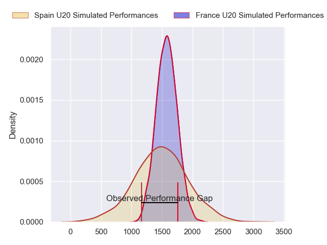
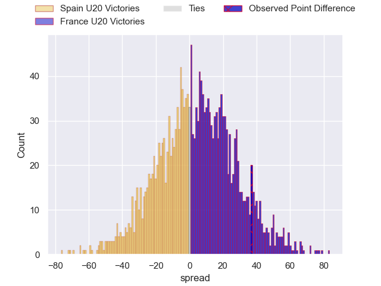
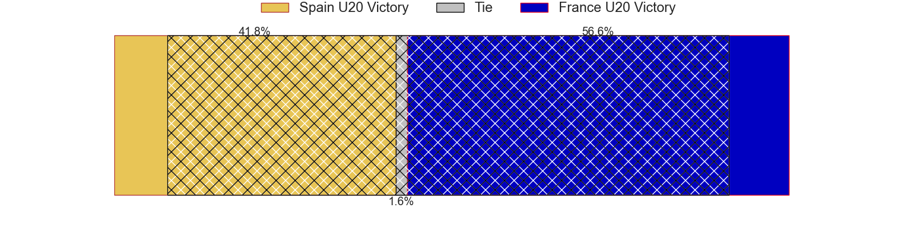
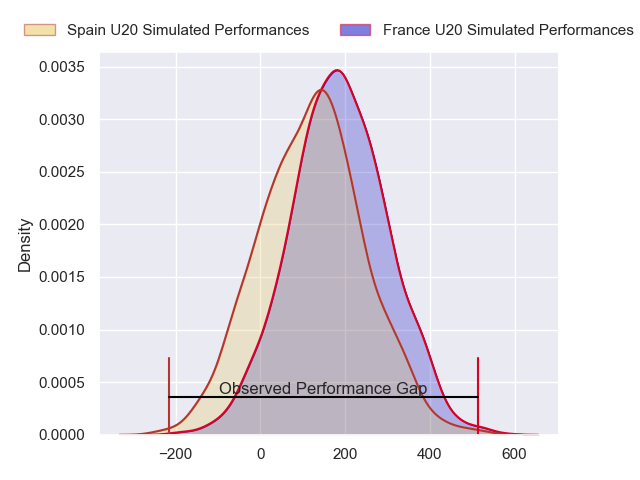
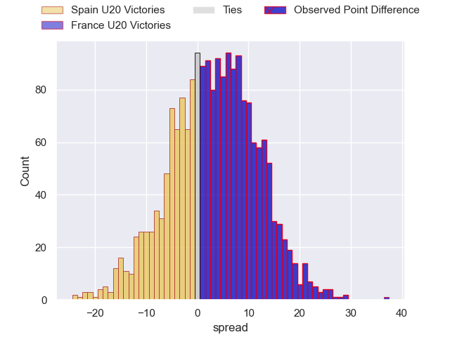
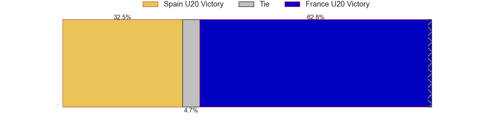

---  
layout: page  
title: Spain U20 at France U20; 12-49  
date: 2024-06-29 18:00:00 -0500  
categories: "World Rugby U20 Championship 2024" match review  
---
# Spain U20 at France U20; 12-49

# Club Level Predictions

The first set of predictions treats a club as the smallest object, as the club develops its members, organizes a gameplan, and deploys its players as needed for each match. This club model has a prediction of 0.566, which translates to predicting France U20 to win by 4.0.

Our Over/Under is 53.5 - and combined with the spread above, we have a predicted scoreline of 25 to 29

Each club has a rating and a rating deviation (similar to a Glicko rating), and expected performances can be generated. This allows for simulated matches and spreads like the ones below.
## Projected Performances - Club Model

## Projected Spreads - Club Model

## Projected Results - Club Model

# Player Level Predictions

Treating teams instead as an entity made up of the currently active players, I have ratings for each player in an altogether different system. These can be combined to form team ratings once teamsheets are announced, weighting starters a bit higher than the reserves. After the match is played, players can be weighted by their minutes on the field, allowing for an accurate measure of the team's composition. With these compiled team ratings, we can make predictions, measure inaccuracy, and update the individual player ratings.
## Prediction without Player Minutes: France U20 by 3.1

France U20 by 0.9 on a neutral pitch

## Projected Performances - Player Model

## Projected Spreads - Player Model

## Projected Results - Player Model

|   Away Minutes | Away Player          |   Away Percentile |   Number |   Home Percentile | Home Player             |   Home Minutes |
|---------------:|:---------------------|------------------:|---------:|------------------:|:------------------------|---------------:|
|             50 | Hugo González        |             30.9  |        1 |             34.89 | Lino Julien             |             40 |
|             50 | Diego González       |             30.9  |        2 |             39.94 | Barnabé Massa           |             40 |
|             50 | Guido Reyes          |             30.9  |        3 |             63.57 | Zinédine Aouad          |             40 |
|             50 | Martin Serrano       |             32.71 |        4 |             66.11 | Antonin Corso           |             80 |
|             65 | Manex Ariceta        |             33.4  |        5 |             62.24 | Charles Kanté-Samba     |             72 |
|             80 | Nicolás Moleti       |             23.61 |        6 |             72.12 | Joé Quere-Karaba        |             80 |
|             80 | Pablo Guirao         |             23.61 |        7 |             72.02 | Geoffrey Malaterre      |             64 |
|             80 | Jokin Zolezzi        |             25.1  |        8 |             51.46 | Brent Liufau            |             50 |
|             47 | Nicolás Infer        |             32.41 |        9 |             56.72 | Léo Carbonneau          |             40 |
|             64 | Gonzalo Otamendi     |             30.04 |       10 |             60.48 | Hugo Reus               |             80 |
|             80 | Javier Guillermo     |             27.13 |       11 |             58.95 | Hoani Bosmorin          |             80 |
|             53 | Alberto Carmona      |             56.49 |       12 |             70.82 | Mathys Belaubre         |             80 |
|             80 | Hugo Pichardie       |             24.61 |       13 |             72.79 | Fabien Brau-Boirie      |             80 |
|             80 | Julien Burguillos    |             27.13 |       14 |             35.12 | Mathis Ferté            |             40 |
|             80 | Lucien Richardis     |             22.29 |       15 |             82.92 | Axel Desperes           |             61 |
|             30 | David Gallego        |            nan    |       16 |            nan    | Thomas Lacombre         |             40 |
|             30 | Alberto Gómez        |            nan    |       17 |            nan    | Lorencio Boyer Gallardo |             40 |
|             30 | Aniol Franch         |            nan    |       18 |            nan    | Thomas Duchêne          |             40 |
|             15 | Adam Llinares        |            nan    |       19 |             50.1  | Sialevailea Tolofua     |             24 |
|             30 | Valentino Rizzo      |            nan    |       20 |            nan    | Alexis Caumel           |             30 |
|             33 | Javier López De Haro |            nan    |       21 |             73.62 | Thomas Souverbie        |             40 |
|             27 | Unax Zuriarrain      |            nan    |       22 |             64.11 | Nathan Bollengier       |             40 |
|             16 | Gabriel Rocaries     |            nan    |       23 |             65.21 | Xan Mousques            |             19 |
|            nan | nan                  |            nan    |       24 |             41.36 |                         |              0 |

