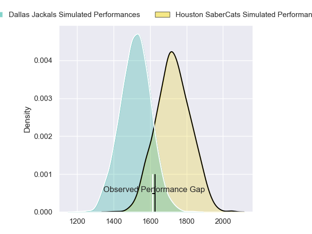
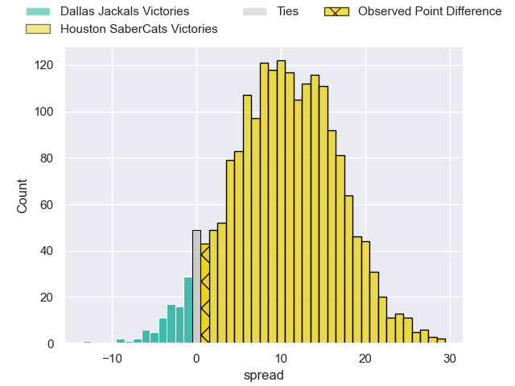
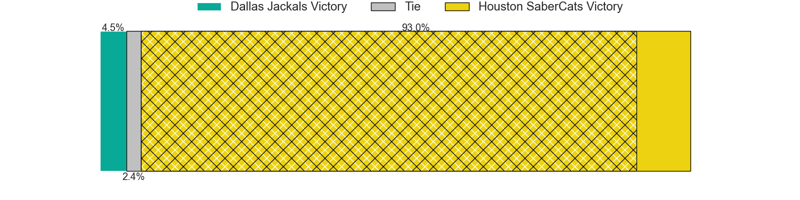
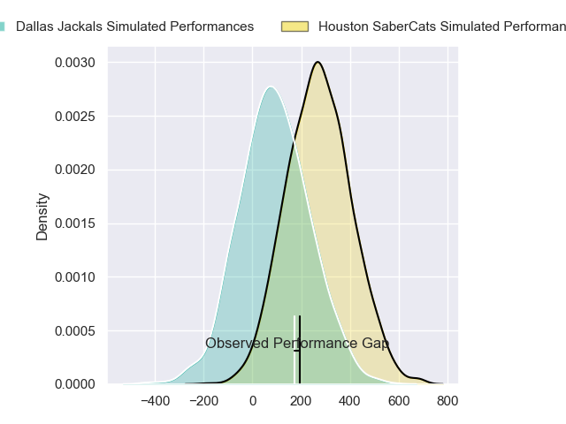
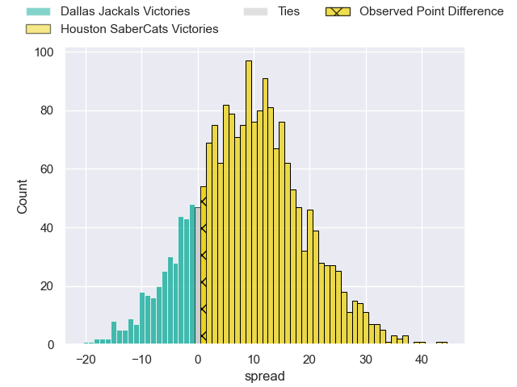
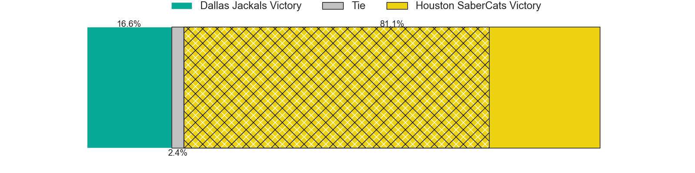

---  
layout: page  
title: Dallas Jackals at Houston SaberCats; 28-29  
date: 2024-06-29 18:00:00 -0500  
categories: "Major League Rugby 2024" match review  
---
# Dallas Jackals at Houston SaberCats; 28-29

# Club Level Predictions

The first set of predictions treats a club as the smallest object, as the club develops its members, organizes a gameplan, and deploys its players as needed for each match. This club model has a prediction of 0.759, which translates to predicting Houston SaberCats to win by 10.3.

Our Over/Under is 52.5 - and combined with the spread above, we have a predicted scoreline of 21 to 32

Each club has a rating and a rating deviation (similar to a Glicko rating), and expected performances can be generated. This allows for simulated matches and spreads like the ones below.
## Projected Performances - Club Model

## Projected Spreads - Club Model

## Projected Results - Club Model

# Player Level Predictions

Treating teams instead as an entity made up of the currently active players, I have ratings for each player in an altogether different system. These can be combined to form team ratings once teamsheets are announced, weighting starters a bit higher than the reserves. After the match is played, players can be weighted by their minutes on the field, allowing for an accurate measure of the team's composition. With these compiled team ratings, we can make predictions, measure inaccuracy, and update the individual player ratings.
## Prediction without Player Minutes: Houston SaberCats by 9.4

Houston SaberCats by 6.7 on a neutral pitch

## Projected Performances - Player Model

## Projected Spreads - Player Model

## Projected Results - Player Model

|   Away Minutes | Away Player           |   Away Percentile |   Number |   Home Percentile | Home Player        |   Home Minutes |
|---------------:|:----------------------|------------------:|---------:|------------------:|:-------------------|---------------:|
|             80 | Liam Murray           |              0.08 |        1 |             63    | Rob Cobb           |             80 |
|             80 | Tomás Bekerman        |             62.44 |        2 |             20.13 | Pita Anae Ah-Sue   |             80 |
|             80 | Franco Palillo        |             57.03 |        3 |             18.01 | Pono Davis         |             80 |
|             80 | Lucas Bur             |             67.39 |        4 |             28.34 | Justin Basson      |             80 |
|             80 | Javon Camp-Villalovos |             52.43 |        5 |             67.2  | Johan Momsen       |             80 |
|             80 | Sam Golla             |             82.5  |        6 |             39.62 | Marno Redelinghuys |             80 |
|             80 | Ben Fry               |             48.65 |        7 |             30.77 | Keni Nasoqeqe      |             80 |
|             80 | Marques Fuala'Au      |             49.79 |        8 |             63.18 | Ronan Murphy       |             80 |
|             80 | Juan-Dee Oliver       |             62.93 |        9 |             50.69 | André Riaan Warner |             80 |
|             80 | Connor Winchester     |             49.8  |       10 |             55.04 | Aj Alatimu         |             80 |
|             80 | Nic Benn              |             66.89 |       11 |             42.11 | Jeremy Misailegalu |             80 |
|             80 | Tomás Cubilla         |             41.43 |       12 |             34.37 | Sam Hill           |             80 |
|             80 | Manuel Covella        |             45.38 |       13 |             36.03 | Tautalatasi Tasi   |             80 |
|             80 | Jason Tidwell         |             68.23 |       14 |             94.83 | Christian Dyer     |             80 |
|             80 | Tomy Malanos          |             57.71 |       15 |             34.38 | David Coetzer      |             80 |
|              0 | Joaquín Horcada       |             66.72 |       16 |             67.67 | Tiaan Erasmus      |              0 |
|              0 | Dewald Kotze          |             45.17 |       17 |            nan    | Larome White       |              0 |
|              0 | Kyle Steeves          |             54.12 |       18 |            nan    | Val Lee-Lo         |              0 |
|              0 | Kyle Breytenbach      |             43.31 |       19 |             58.27 | Emmanuel Albert    |              0 |
|              0 | Jero Gomez Vara       |             53.46 |       20 |            nan    | Drake Davis        |              0 |
|              0 | Brock Gallagher       |            nan    |       21 |            nan    | Carlo De Nysschen  |              0 |
|              0 | Ronnie Mcelligott     |            nan    |       22 |            nan    | Max Schumacher     |              0 |
|              0 | Joeli Tikoisuva       |            nan    |       23 |             60.86 | Line Latu          |              0 |

