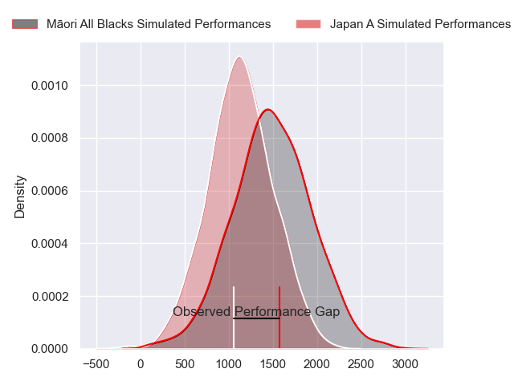
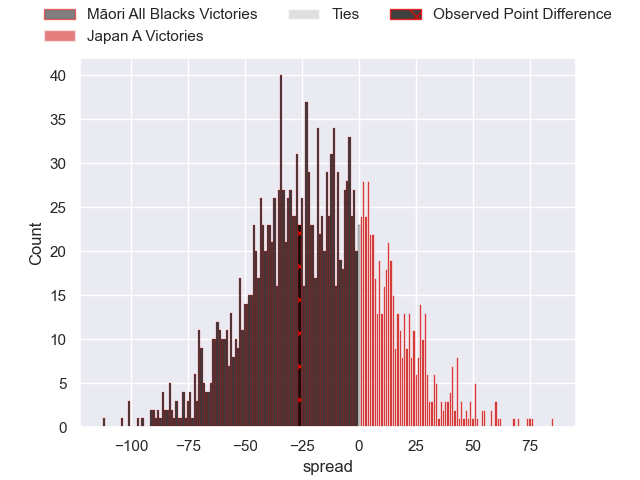
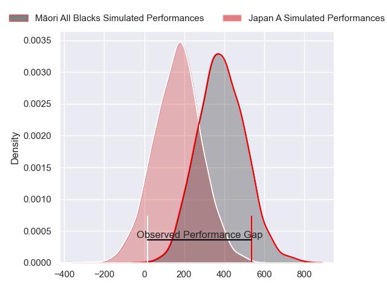
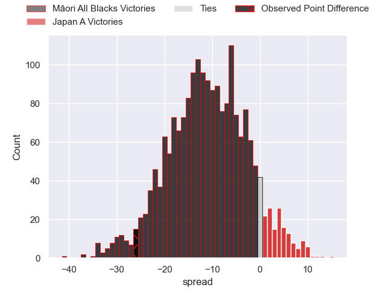
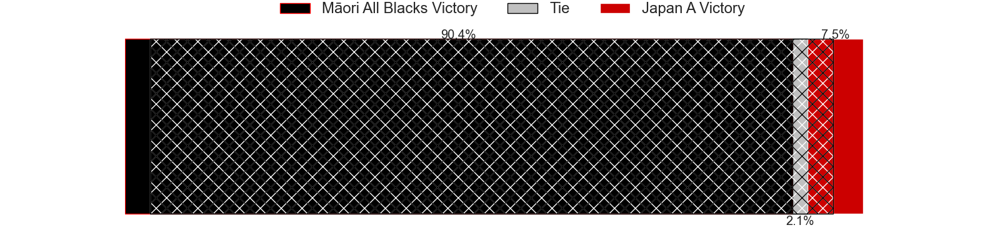

---  
layout: page  
title: Maori All Blacks at Japan A; 36-10  
date: 2024-06-29 18:00:00 -0500  
categories: "Tests Matchs 2023" match review  
---
# Maori All Blacks at Japan A; 36-10

# Club Level Predictions

The first set of predictions treats a club as the smallest object, as the club develops its members, organizes a gameplan, and deploys its players as needed for each match. This club model has a prediction of 0.221, which translates to predicting Māori All Blacks to win by 18.8.

Our Over/Under is 37.5 - and combined with the spread above, we have a predicted scoreline of 28 to 9

Each club has a rating and a rating deviation (similar to a Glicko rating), and expected performances can be generated. This allows for simulated matches and spreads like the ones below.
## Projected Performances - Club Model

## Projected Spreads - Club Model

## Projected Results - Club Model

# Player Level Predictions

Treating teams instead as an entity made up of the currently active players, I have ratings for each player in an altogether different system. These can be combined to form team ratings once teamsheets are announced, weighting starters a bit higher than the reserves. After the match is played, players can be weighted by their minutes on the field, allowing for an accurate measure of the team's composition. With these compiled team ratings, we can make predictions, measure inaccuracy, and update the individual player ratings.
## Prediction without Player Minutes: Māori All Blacks by 11.1

Māori All Blacks by 13.3 on a neutral pitch

## Projected Performances - Player Model

## Projected Spreads - Player Model

## Projected Results - Player Model

|   Away Minutes | Away Player            |   Away Percentile |   Number |   Home Percentile | Home Player      |   Home Minutes |
|---------------:|:-----------------------|------------------:|---------:|------------------:|:-----------------|---------------:|
|             50 | Ollie Norris           |             89.82 |        1 |             38.77 | Shogo Miura      |             44 |
|             50 | Kurt Eklund            |             92.55 |        2 |             29.32 | Mamoru Harada    |             62 |
|             62 | Marcel Renata          |             89.42 |        3 |             35.06 | Keijiro Tamefusa |             67 |
|             80 | Isaia Walker-Leawere   |             97.72 |        4 |             34.39 | Eishin Kuwano    |             80 |
|             55 | Laghlan McWhannell     |             97.82 |        5 |             39.25 | Naohiro Kotaki   |             44 |
|             80 | Cameron Suafoa         |             72.4  |        6 |             70.38 | Kanji Shimokawa  |             80 |
|             80 | Billy Harmon           |             84.81 |        7 |             32.4  | Kai Yamamoto     |             62 |
|             62 | Cullen Grace           |             86.4  |        8 |             57.74 | Amanaki Saumaki  |             80 |
|             57 | Sam Nock               |             85    |        9 |             38.45 | Taiki Koyama     |             46 |
|             80 | Rivez Reihana          |             57.86 |       10 |             34.48 | Takuya Yamasawa  |             67 |
|             58 | Bailyn Sullivan        |             45.36 |       11 |             27.56 | Koga Nezuka      |             80 |
|             80 | Quinn Tupaea           |             94.6  |       12 |             27.52 | Samisoni Tua     |             55 |
|             24 | Daniel Rona            |             88.37 |       13 |             62.31 | Tomoki Osada     |             80 |
|             80 | Joshua Moorby          |             90.53 |       14 |             34.64 | Viliame Tuidraki |             80 |
|             80 | Cole Forbes            |             80.42 |       15 |             24.17 | Yoshitaka Yazaki |             80 |
|             30 | Tyrone Thompson        |             69.73 |       16 |            nan    | Kenji Sato       |             18 |
|             30 | Pouri Rakete-Stones    |             87    |       17 |            nan    | Takato Okabe     |             36 |
|             18 | Benet Kumeroa          |            nan    |       18 |            nan    | Tsubasa Moriyama |             13 |
|             25 | Max Hicks              |             22.98 |       19 |             35.38 | Junior Waqa      |             36 |
|             18 | TK Howden              |              0.96 |       20 |            nan    | Takuma Motohashi |             18 |
|             23 | Te Toiroa Tahuriorangi |             70.34 |       21 |              9.83 | Naoto Saito      |             34 |
|             56 | Rameka Poihipi         |             82.76 |       22 |            nan    | Mikiya Takamoto  |             13 |
|             22 | Tana Tuhakaraina       |            nan    |       23 |            nan    | Nik Mccurran     |             25 |

