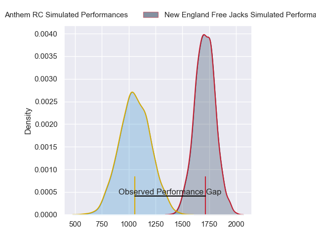
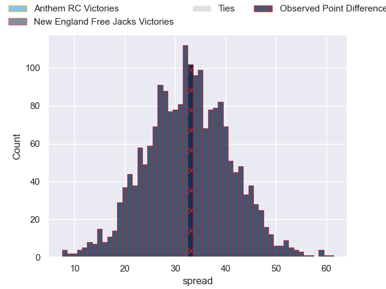
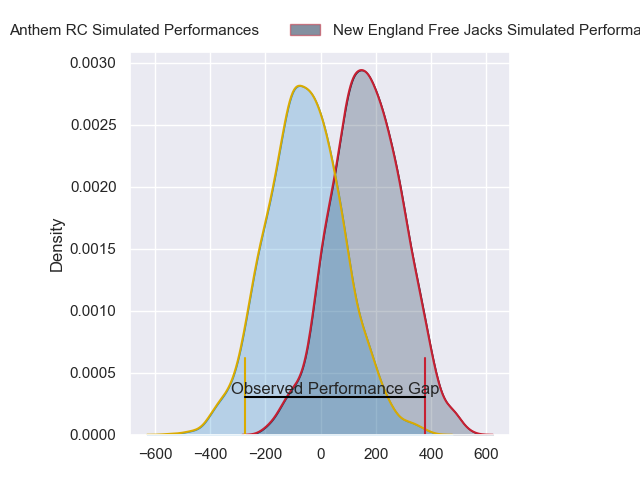
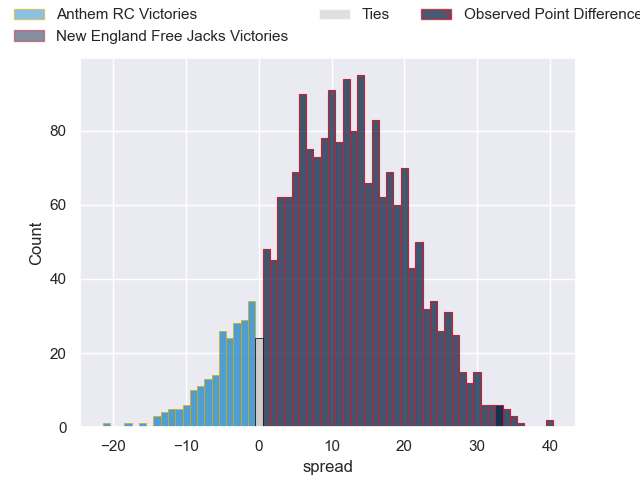
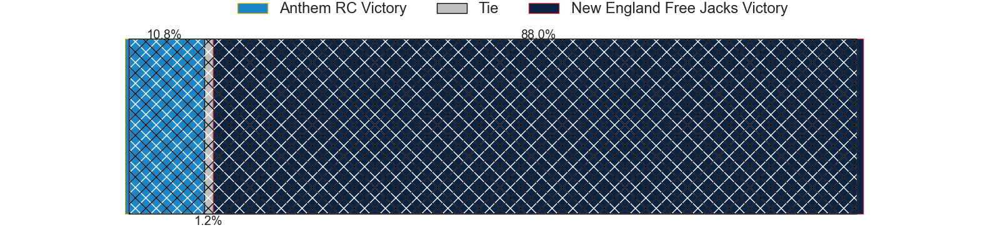

---  
layout: page  
title: Anthem RC at New England Free Jacks; 7-40  
date: 2024-06-29 18:00:00 -0500  
categories: "Major League Rugby 2024" match review  
---
# Anthem RC at New England Free Jacks; 7-40

# Club Level Predictions

The first set of predictions treats a club as the smallest object, as the club develops its members, organizes a gameplan, and deploys its players as needed for each match. This club model has a prediction of 0.969, which translates to predicting New England Free Jacks to win by 33.1.

Our Over/Under is 71.5 - and combined with the spread above, we have a predicted scoreline of 19 to 52

Each club has a rating and a rating deviation (similar to a Glicko rating), and expected performances can be generated. This allows for simulated matches and spreads like the ones below.
## Projected Performances - Club Model

## Projected Spreads - Club Model

## Projected Results - Club Model

# Player Level Predictions

Treating teams instead as an entity made up of the currently active players, I have ratings for each player in an altogether different system. These can be combined to form team ratings once teamsheets are announced, weighting starters a bit higher than the reserves. After the match is played, players can be weighted by their minutes on the field, allowing for an accurate measure of the team's composition. With these compiled team ratings, we can make predictions, measure inaccuracy, and update the individual player ratings.
## Prediction without Player Minutes: New England Free Jacks by 11.2

New England Free Jacks by 8.7 on a neutral pitch

## Projected Performances - Player Model

## Projected Spreads - Player Model

## Projected Results - Player Model

|   Away Minutes | Away Player           |   Away Percentile |   Number |   Home Percentile | Home Player             |   Home Minutes |
|---------------:|:----------------------|------------------:|---------:|------------------:|:------------------------|---------------:|
|             80 | Dan Hanson            |             11.94 |        1 |             41.85 | Kyle Ciquera            |             80 |
|             80 | Connor Robinson       |              2.54 |        2 |             43.42 | Andrew Quattrin         |             80 |
|             80 | Joe Apikotoa          |              1.77 |        3 |             84.76 | Kaleb Geiger            |             80 |
|             80 | James Rivers          |              8.11 |        4 |             53.21 | Kyle Baillie            |             80 |
|             80 | Lucas Gramlick        |              7.52 |        5 |             75.47 | Conor Keys              |             80 |
|             80 | Joe Basser            |              9.9  |        6 |             49.23 | Piers Von Dadelszen     |             80 |
|             80 | Albert O'Shannessey   |              9.13 |        7 |             56.35 | Jed Melvin              |             80 |
|             80 | Shneil Singh          |              8.58 |        8 |             44.77 | Seta Baker              |             80 |
|             80 | Sean Yacoubian        |             16.01 |        9 |             12.56 | Oscar Lennon            |             80 |
|             80 | Oscar Koller          |             16.67 |       10 |             58.63 | Jayson Potroz           |             80 |
|             80 | Te Rangatira Waitokia |              4.97 |       11 |             48.37 | Paula Balekana          |             80 |
|             80 | Junior Gafa           |              3.73 |       12 |             87.86 | Le Roux Malan           |             80 |
|             80 | Mateo Gadsden         |             27.07 |       13 |             59.44 | Wayne Van Der Bank      |             80 |
|             80 | Cael Hodgson          |             10.71 |       14 |             48.85 | Toby Fricker            |             80 |
|             80 | Tomasi Alosio         |              6.25 |       15 |             61.04 | Reece Macdonald         |             80 |
|              0 | Jack Manzo            |             39.78 |       16 |             52.46 | Foster Dewitt           |              0 |
|              0 | Ivan Pula             |            nan    |       17 |             47.42 | Malakai Hala            |              0 |
|              0 | Stephan Bernal-Wendt  |            nan    |       18 |             39.19 | Cole Keith              |              0 |
|              0 | Sione Latu            |             41.54 |       19 |             37.29 | Josh Larsen             |              0 |
|              0 | Logan Weidner         |             38.97 |       20 |             21.54 | Ethan Fryer             |              0 |
|              0 | Shane Barry           |            nan    |       21 |             40.96 | Cameron Nordli-Kelemeti |              0 |
|              0 | Sebastian Zaridze     |             30.6  |       22 |             73.76 | Ben LeSage              |              0 |
|              0 | Josh Shetler          |             24.76 |       23 |             94.65 | Mitch Wilson            |              0 |

