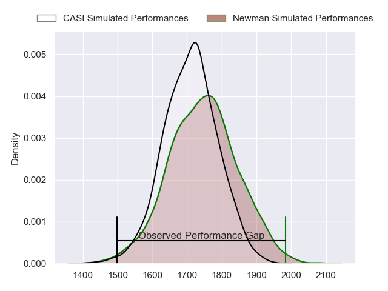
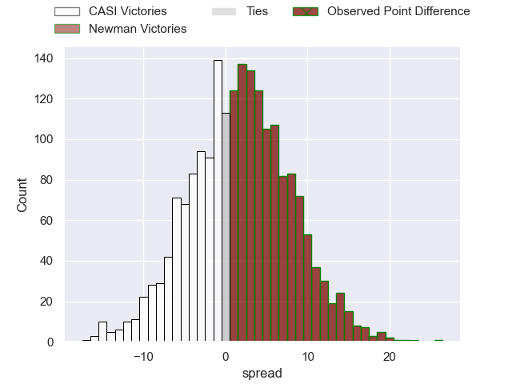
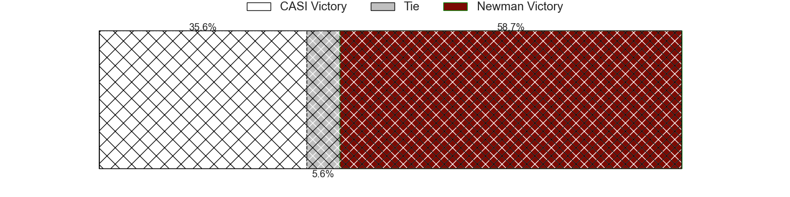
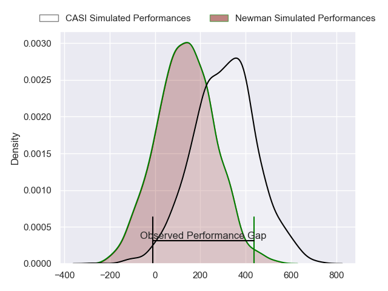
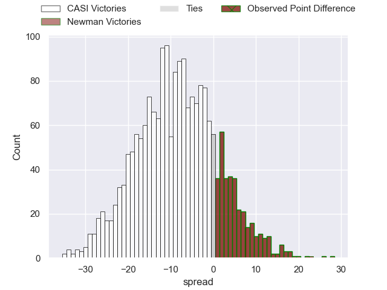
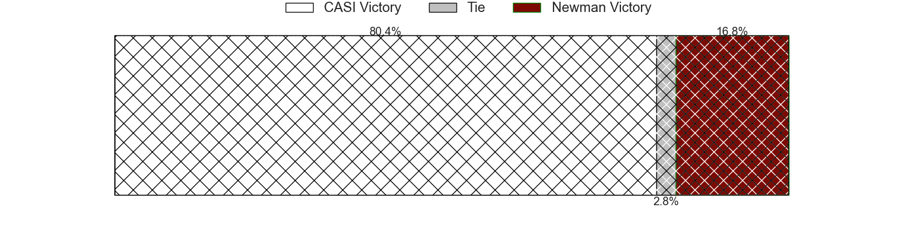

---  
layout: page  
title: CASI at Newman; 14-37  
date: 2024-06-29 18:00:00 -0500  
categories: "URBA Top 12 2024" match review  
---
# CASI at Newman; 14-37

# Club Level Predictions

The first set of predictions treats a club as the smallest object, as the club develops its members, organizes a gameplan, and deploys its players as needed for each match. This club model has a prediction of 0.545, which translates to predicting Newman to win by 1.6.

Our Over/Under is 55.5 - and combined with the spread above, we have a predicted scoreline of 27 to 29

Each club has a rating and a rating deviation (similar to a Glicko rating), and expected performances can be generated. This allows for simulated matches and spreads like the ones below.
## Projected Performances - Club Model

## Projected Spreads - Club Model

## Projected Results - Club Model

# Player Level Predictions

Treating teams instead as an entity made up of the currently active players, I have ratings for each player in an altogether different system. These can be combined to form team ratings once teamsheets are announced, weighting starters a bit higher than the reserves. After the match is played, players can be weighted by their minutes on the field, allowing for an accurate measure of the team's composition. With these compiled team ratings, we can make predictions, measure inaccuracy, and update the individual player ratings.
## Prediction without Player Minutes: CASI by 7.6

CASI by 11.8 on a neutral pitch

## Projected Performances - Player Model

## Projected Spreads - Player Model

## Projected Results - Player Model

|   Away Minutes | Away Player                |   Away Percentile |   Number |   Home Percentile | Home Player               |   Home Minutes |
|---------------:|:---------------------------|------------------:|---------:|------------------:|:--------------------------|---------------:|
|             80 | Facundo Scaiano            |             31.7  |        1 |             89.22 | Miguel Prince             |             80 |
|             80 | Juan Torres Obeid          |             78.23 |        2 |             91.17 | Marcelo Brandi            |             80 |
|             80 | Juan Ignacio Nieto Sanchez |             77.55 |        3 |             93.48 | Bautista Bosch            |             80 |
|             80 | Agustin Posleman           |             42.5  |        4 |             89.55 | Jeronimo Ureta            |             80 |
|             80 | Leo Mazzini                |             73.08 |        5 |             77.32 | Alejandro Urtubey         |             80 |
|             80 | Benjamin Rocca Rivarola    |             39.85 |        6 |             83.52 | Joaquin de la Vega        |             80 |
|             80 | Joaquin Saenz de Miera     |             75.1  |        7 |             83.24 | Mateo Montoya             |             80 |
|             80 | Luis Briatore              |             51.88 |        8 |             90.62 | Rodrigo Diaz de Vivar     |             80 |
|             80 | Luca Canzani               |             71.31 |        9 |             91.75 | Lucas Marguery            |             80 |
|             80 | Felipe Hileman             |             64.26 |       10 |             86.75 | Gonzalo Guiterrez Taboada |             80 |
|             80 | Felipe Probaos             |             20.95 |       11 |             94.48 | Justo Ortiz Basualdo      |             80 |
|             80 | Bruno Devoto               |             68.61 |       12 |             87.07 | Tomas Keena               |             80 |
|             80 | Jeronimo Solveyra          |             68.61 |       13 |             59.57 | Benjamin Lanfranco        |             80 |
|             80 | Santiago David             |             73.14 |       14 |             88.1  | Leandro Leivas            |             80 |
|             80 | Juan Akemeier              |             68.26 |       15 |             87.76 | Santiago Marolda          |             80 |
|              0 | Facundo Andreotti          |            nan    |       16 |             58.68 | Rodrigo Pueyrredon        |              0 |
|              0 | Joaquin Britto             |             82.3  |       17 |            nan    | Isidro Bosch              |              0 |
|              0 | Hugo Garcia                |            nan    |       18 |            nan    | Manuel Lozano             |              0 |
|              0 | Bautista Belleze           |            nan    |       19 |             92.31 | Pablo Cardinal            |              0 |
|              0 | Away Team 20               |            nan    |       20 |            nan    | Faustino Santarelli       |              0 |
|              0 | Tomas Phelan               |            nan    |       21 |             29.9  | Felix Branca              |              0 |
|              0 | Jeronimo Tumbarello        |             73.43 |       22 |            nan    | Carlos Mendez Beherty     |              0 |
|              0 | Tobias Casaurang           |            nan    |       23 |             73.01 | Silvestre Casa            |              0 |

