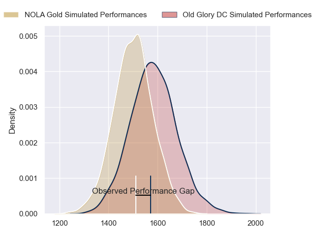
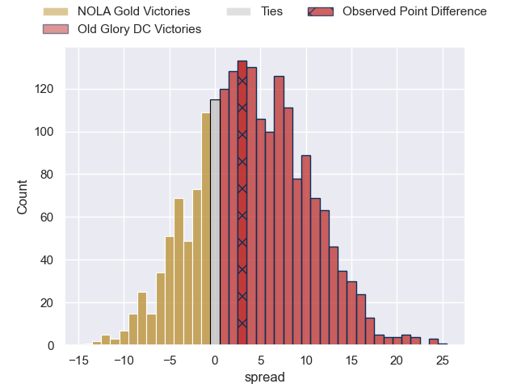
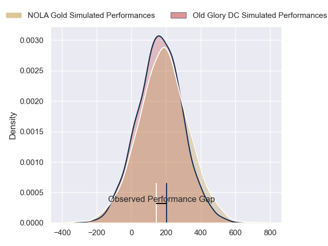
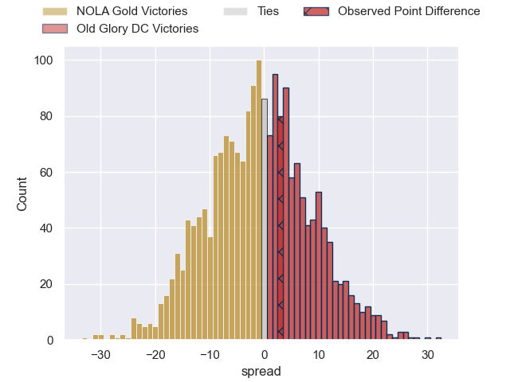

---  
layout: page  
title: NOLA Gold at Old Glory DC; 24-27  
date: 2024-06-29 18:00:00 -0500  
categories: "Major League Rugby 2024" match review  
---
# NOLA Gold at Old Glory DC; 24-27

# Club Level Predictions

The first set of predictions treats a club as the smallest object, as the club develops its members, organizes a gameplan, and deploys its players as needed for each match. This club model has a prediction of 0.612, which translates to predicting Old Glory DC to win by 4.1.

Our Over/Under is 55.5 - and combined with the spread above, we have a predicted scoreline of 26 to 30

Each club has a rating and a rating deviation (similar to a Glicko rating), and expected performances can be generated. This allows for simulated matches and spreads like the ones below.
## Projected Performances - Club Model

## Projected Spreads - Club Model

## Projected Results - Club Model

# Player Level Predictions

Treating teams instead as an entity made up of the currently active players, I have ratings for each player in an altogether different system. These can be combined to form team ratings once teamsheets are announced, weighting starters a bit higher than the reserves. After the match is played, players can be weighted by their minutes on the field, allowing for an accurate measure of the team's composition. With these compiled team ratings, we can make predictions, measure inaccuracy, and update the individual player ratings.
## Prediction without Player Minutes: Old Glory DC by 0.1

NOLA Gold by 2.5 on a neutral pitch

## Projected Performances - Player Model

## Projected Spreads - Player Model

## Projected Results - Player Model

|   Away Minutes | Away Player         |   Away Percentile |   Number |   Home Percentile | Home Player           |   Home Minutes |
|---------------:|:--------------------|------------------:|---------:|------------------:|:----------------------|---------------:|
|             80 | Matt Harmon         |             73.05 |        1 |             50.93 | Cali Martinez         |             80 |
|             80 | Pat O'Toole         |             74.76 |        2 |             53    | Martín Vaca           |             80 |
|             80 | Sean Paranihi       |             51.09 |        3 |             79.73 | Stevie Longwell       |             80 |
|             80 | Callum Botchar      |             80.28 |        4 |             64.6  | Rob Harley            |             80 |
|             80 | Fintan Coleman      |             42.41 |        5 |             65.19 | Tevita Naqali         |             80 |
|             80 | Moni Tonga'Uiha     |             86.3  |        6 |             49.71 | Collin Grosse         |             80 |
|             80 | Jonah Mau'U         |             69.73 |        7 |             62.74 | Cory Gilliland-Daniel |             80 |
|             80 | Tom Florence        |             58.75 |        8 |             57.5  | Lautaro Bavaro        |             80 |
|             80 | Damian Stevens      |              8.08 |        9 |             62.03 | Ethan Mcveigh         |             80 |
|             80 | Rodney Iona         |             76.51 |       10 |             48.59 | Jason Robertson       |             80 |
|             80 | Julian Roberts      |             55.33 |       11 |             62.62 | Axel Muller           |             80 |
|             80 | Jp Du Plessis       |             74.77 |       12 |              3.62 | Tommaso Boni          |             80 |
|             80 | Ross Depperschmidt  |             62.87 |       13 |             59.98 | John Powers           |             80 |
|             80 | Taniela Filimone    |             86.29 |       14 |             62.62 | Perry Humphreys       |             80 |
|             80 | Jordan Jackson-Hope |             72.61 |       15 |             54.15 | Damien Hoyland        |             80 |
|              0 | Diego Fortuny       |            nan    |       16 |            nan    | Koikoi Nelligan       |              0 |
|              0 | Bart Vermeulen      |            nan    |       17 |             46.9  | Quentin Newcomer      |              0 |
|              0 | Trent Rogers        |            nan    |       18 |            nan    | Tyler Rowland         |              0 |
|              0 | Maciu Koroi         |            nan    |       19 |             46.06 | Bill Whiteside        |              0 |
|              0 | Osaiasi Tonga'Uiha  |            nan    |       20 |             43.58 | Brady Daniel          |              0 |
|              0 | Sebastiano Villani  |            nan    |       21 |             48.28 | Connor Buckley        |              0 |
|              0 | Jack Webster        |            nan    |       22 |             56.22 | Gradyn Bowd           |              0 |
|              0 | Reece Botha         |             75.7  |       23 |             42.4  | Willie Talataina-Mu   |              0 |

