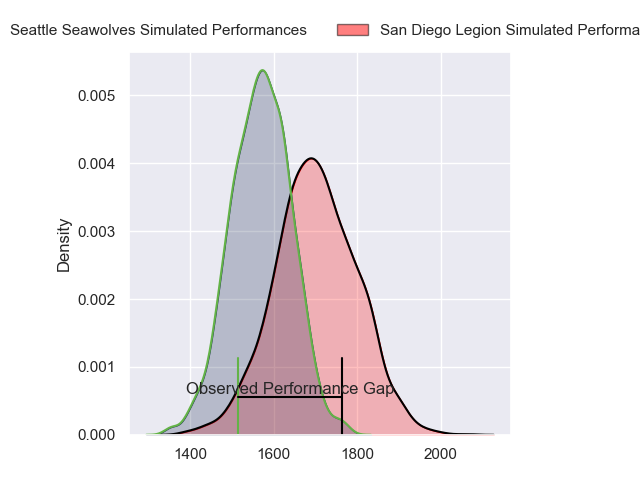
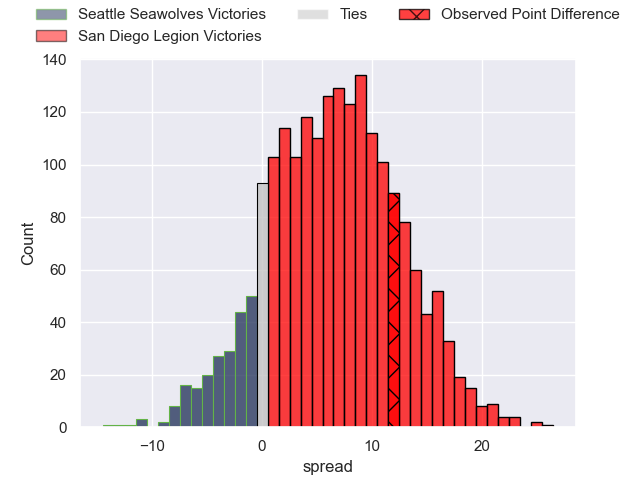
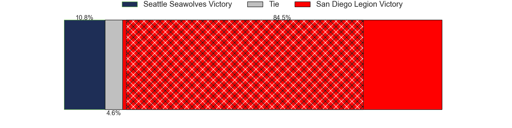
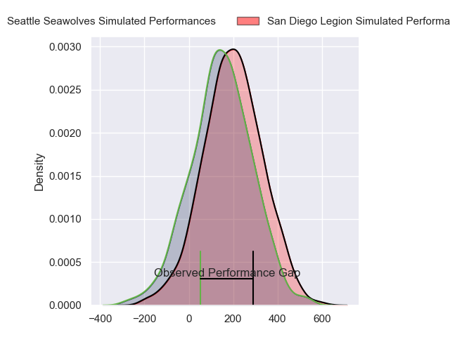
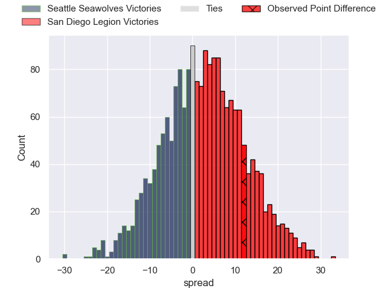
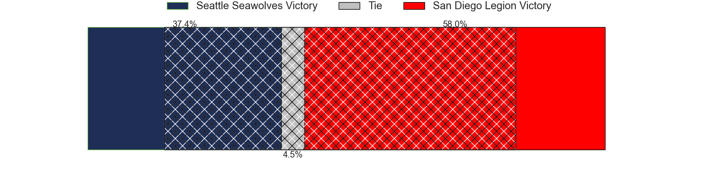

---  
layout: page  
title: Seattle Seawolves at San Diego Legion; 33-45  
date: 2024-06-29 18:00:00 -0500  
categories: "Major League Rugby 2024" match review  
---
# Seattle Seawolves at San Diego Legion; 33-45

# Club Level Predictions

The first set of predictions treats a club as the smallest object, as the club develops its members, organizes a gameplan, and deploys its players as needed for each match. This club model has a prediction of 0.676, which translates to predicting San Diego Legion to win by 6.6.

Our Over/Under is 48.5 - and combined with the spread above, we have a predicted scoreline of 21 to 28

Each club has a rating and a rating deviation (similar to a Glicko rating), and expected performances can be generated. This allows for simulated matches and spreads like the ones below.
## Projected Performances - Club Model

## Projected Spreads - Club Model

## Projected Results - Club Model

# Player Level Predictions

Treating teams instead as an entity made up of the currently active players, I have ratings for each player in an altogether different system. These can be combined to form team ratings once teamsheets are announced, weighting starters a bit higher than the reserves. After the match is played, players can be weighted by their minutes on the field, allowing for an accurate measure of the team's composition. With these compiled team ratings, we can make predictions, measure inaccuracy, and update the individual player ratings.
## Prediction without Player Minutes: San Diego Legion by 3.4

San Diego Legion by 0.7 on a neutral pitch

## Projected Performances - Player Model

## Projected Spreads - Player Model

## Projected Results - Player Model

|   Away Minutes | Away Player       |   Away Percentile |   Number |   Home Percentile | Home Player          |   Home Minutes |
|---------------:|:------------------|------------------:|---------:|------------------:|:---------------------|---------------:|
|             80 | Cameron Orr       |             79.57 |        1 |             81.34 | Payton Telea-Ilalio  |             80 |
|             80 | Daquan Perry      |             44.16 |        2 |             65.46 | Hugh Roach           |             80 |
|             80 | Sam Matenga       |             75.3  |        3 |             78.36 | Luke Green           |             80 |
|             80 | Isaia Lotawa      |             37.08 |        4 |             66.67 | Jay Tuivaiti         |             80 |
|             80 | Mahonri Ngakuru   |             51.78 |        5 |             59.17 | Charlie Hewitt       |             80 |
|             80 | Devin Short       |             69.06 |        6 |             80.56 | Vili Helu            |             80 |
|             80 | Monate Akuei      |             69.44 |        7 |             59.77 | Blair Cowan          |             80 |
|             80 | Huw Taylor        |             71.46 |        8 |             76.04 | Tupou Ma'Afu-Afungia |             80 |
|             80 | Ryan Rees         |             40.72 |        9 |             57.56 | Danny Christensen    |             80 |
|             80 | Mack Mason        |             70.48 |       10 |             69.28 | Matt Giteau          |             80 |
|             80 | Lauina Futi       |             58.1  |       11 |             76.71 | Ryan James           |             80 |
|             80 | Tavite Lopeti     |             91.73 |       12 |             71.56 | Ma'A Nonu            |             80 |
|             80 | Divan Rossouw     |             35.26 |       13 |             51.71 | Filimoni Waqainabete |             80 |
|             80 | Jeremiah Sio      |             34.95 |       14 |             76.71 | Tomas Aoake          |             80 |
|             80 | Duncan Matthews   |             49.17 |       15 |             52.7  | Mikey Te'O           |             80 |
|              0 | Jackson Zabierek  |             61.04 |       16 |             57.26 | Cyrille Cama         |              0 |
|              0 | Dewald Donald     |             56.94 |       17 |            nan    | Faka'Osi Pifeleti    |              0 |
|              0 | Chance Wenglewski |            nan    |       18 |             57.6  | Darcy Breen          |              0 |
|              0 | Taylor Krumrei    |             51.87 |       19 |             62.82 | Brandon Harvey       |              0 |
|              0 | Pago Haini        |             42.08 |       20 |             93.97 | Paddy Ryan           |              0 |
|              0 | Jp Smith          |             76.12 |       21 |             47.71 | Tevita Tameilau      |              0 |
|              0 | Sam Windsor       |             50.6  |       22 |            nan    | Nick Boyer           |              0 |
|              0 | Rhys Jones        |            nan    |       23 |             52.61 | Lincoln Mcclutchie   |              0 |

