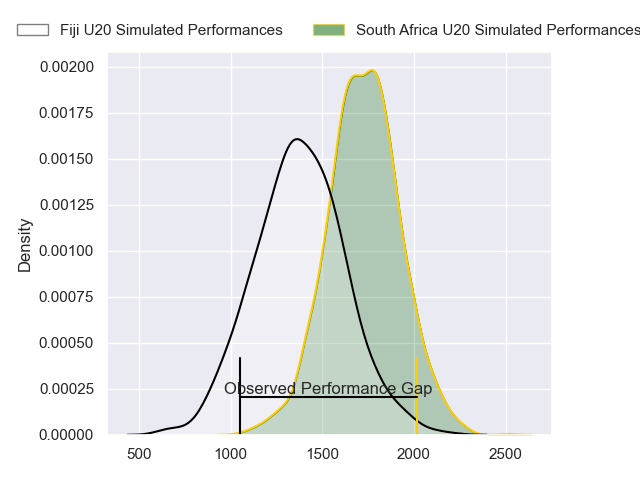
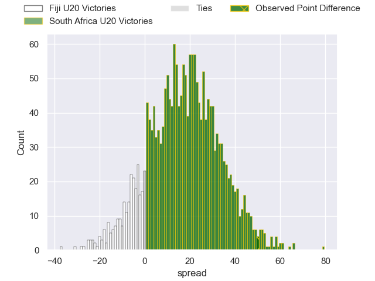
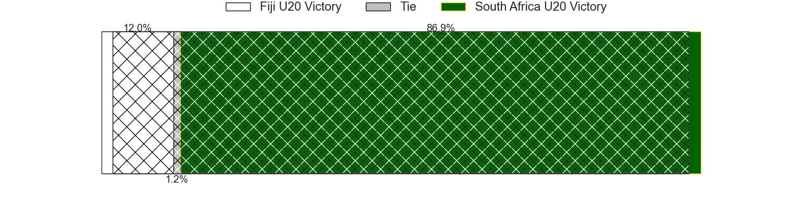
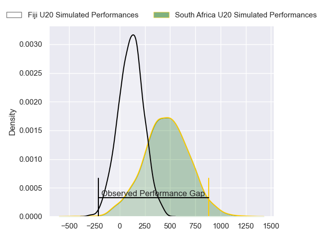
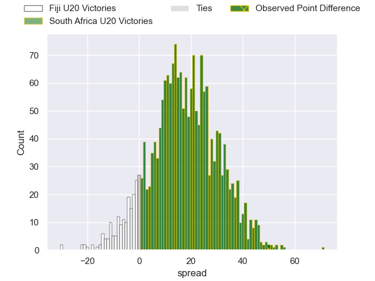
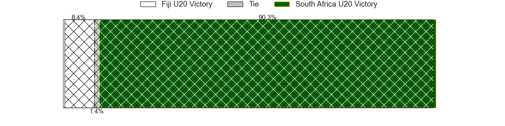

---  
layout: page  
title: Fiji U20 at South Africa U20; 7-57  
date: 2024-06-29 18:00:00 -0500  
categories: "World Rugby U20 Championship 2024" match review  
---
# Fiji U20 at South Africa U20; 7-57

# Club Level Predictions

The first set of predictions treats a club as the smallest object, as the club develops its members, organizes a gameplan, and deploys its players as needed for each match. This club model has a prediction of 0.827, which translates to predicting South Africa U20 to win by 17.3.

Our Over/Under is 52.5 - and combined with the spread above, we have a predicted scoreline of 18 to 35

Each club has a rating and a rating deviation (similar to a Glicko rating), and expected performances can be generated. This allows for simulated matches and spreads like the ones below.
## Projected Performances - Club Model

## Projected Spreads - Club Model

## Projected Results - Club Model

# Player Level Predictions

Treating teams instead as an entity made up of the currently active players, I have ratings for each player in an altogether different system. These can be combined to form team ratings once teamsheets are announced, weighting starters a bit higher than the reserves. After the match is played, players can be weighted by their minutes on the field, allowing for an accurate measure of the team's composition. With these compiled team ratings, we can make predictions, measure inaccuracy, and update the individual player ratings.
## Prediction without Player Minutes: South Africa U20 by 7.2

South Africa U20 by 5.0 on a neutral pitch

## Projected Performances - Player Model

## Projected Spreads - Player Model

## Projected Results - Player Model

|   Away Minutes | Away Player             |   Away Percentile |   Number |   Home Percentile | Home Player       |   Home Minutes |
|---------------:|:------------------------|------------------:|---------:|------------------:|:------------------|---------------:|
|             62 | Anare Caginavanua       |             39.42 |        1 |             69.31 | Ruan Swart        |             64 |
|             52 | Moses Armstrong-Ravula  |             39.46 |        2 |             63.23 | Luca Bakkes       |             51 |
|             53 | Breyton Legge           |             40.06 |        3 |             69.14 | Zachary Porthen   |             60 |
|             80 | Iliesa Erenavula        |             37.76 |        4 |             63.73 | Batho Hlekani     |             51 |
|             60 | Nalani May              |             40.44 |        5 |             54.81 | JF van Heerden    |             60 |
|             80 | Ebenezer Tuidraki       |             34.18 |        6 |             67.88 | Sibabalwe Mahashe |             80 |
|             80 | Ronald Sharma           |             34.18 |        7 |             65.96 | Thabang Mphafi    |             80 |
|             80 | Simon Koroiyadi         |             32.01 |        8 |             64.02 | Tiaan Jacobs      |             80 |
|             53 | Aisea Nawai             |             40.34 |        9 |             67.07 | Asad Moos         |             80 |
|             49 | Bogi Kikau              |             37.9  |       10 |             57.06 | Liam Koen         |             51 |
|             80 | Avakuki Niusalelekitoga |             37.18 |       11 |             67.56 | Litelihle Bester  |             80 |
|             37 | Isikeli Rabitu          |             34.58 |       12 |             61.27 | Joshua Boulle     |             80 |
|             80 | Sivaniolo Kalaveti      |             34.27 |       13 |             62.51 | Jurenzo Julius    |             80 |
|             80 | Waisake Salabiau        |             37.18 |       14 |             66.22 | Joel Leotlela     |             64 |
|             64 | Isikeli Basiyalo        |             34.79 |       15 |             58.13 | Michail Damon     |             57 |
|             28 | Joshua Uluibau          |            nan    |       16 |             47.7  | Juan Smal         |             29 |
|             18 | Mataiasi Tuisireli      |            nan    |       17 |            nan    | Liyema Ntshanga   |             16 |
|             39 | Luke Nasau              |            nan    |       18 |            nan    | Casper Badenhorst |             20 |
|             16 | Ratu Nemani Kurucake    |            nan    |       19 |             40.96 | Keanu Coetsee     |             29 |
|             20 | Malakai Masi            |            nan    |       20 |             41.44 | Divan Fuller      |             20 |
|             27 | Pauliasi Korobiau       |            nan    |       21 |            nan    | Ezekiel Ngobeni   |             10 |
|             19 | Ponipate Tuberi         |            nan    |       22 |             44.56 | Tylor Sefoor      |             29 |
|             43 | Josefa Ubitau           |            nan    |       23 |            nan    | Likhona Finca     |             29 |

