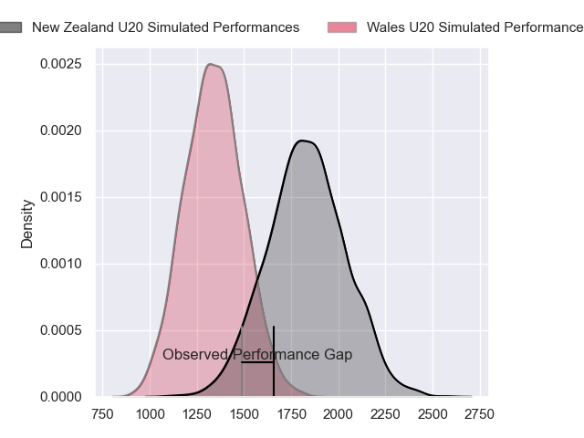
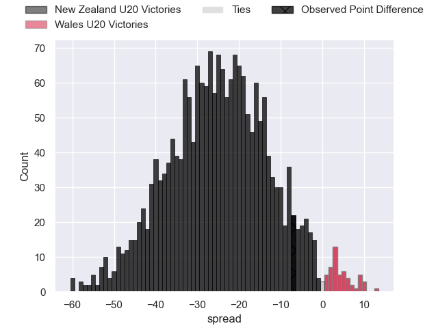
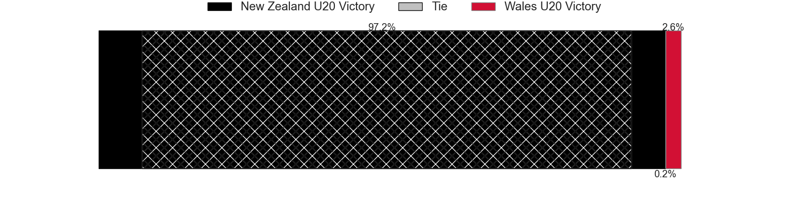
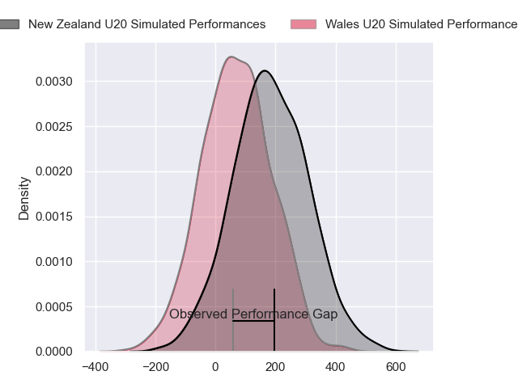
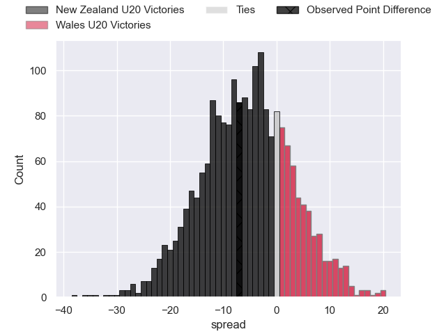

---  
layout: page  
title: New Zealand U20 at Wales U20; 41-34  
date: 2024-06-29 18:00:00 -0500  
categories: "World Rugby U20 Championship 2024" match review  
---
# New Zealand U20 at Wales U20; 41-34

# Club Level Predictions

The first set of predictions treats a club as the smallest object, as the club develops its members, organizes a gameplan, and deploys its players as needed for each match. This club model has a prediction of 0.085, which translates to predicting New Zealand U20 to win by 24.6.

Our Over/Under is 47.5 - and combined with the spread above, we have a predicted scoreline of 36 to 11

Each club has a rating and a rating deviation (similar to a Glicko rating), and expected performances can be generated. This allows for simulated matches and spreads like the ones below.
## Projected Performances - Club Model

## Projected Spreads - Club Model

## Projected Results - Club Model

# Player Level Predictions

Treating teams instead as an entity made up of the currently active players, I have ratings for each player in an altogether different system. These can be combined to form team ratings once teamsheets are announced, weighting starters a bit higher than the reserves. After the match is played, players can be weighted by their minutes on the field, allowing for an accurate measure of the team's composition. With these compiled team ratings, we can make predictions, measure inaccuracy, and update the individual player ratings.
## Prediction without Player Minutes: New Zealand U20 by 5.9

New Zealand U20 by 8.1 on a neutral pitch

## Projected Performances - Player Model

## Projected Spreads - Player Model

## Projected Results - Player Model

|   Away Minutes | Away Player           |   Away Percentile |   Number |   Home Percentile | Home Player       |   Home Minutes |
|---------------:|:----------------------|------------------:|---------:|------------------:|:------------------|---------------:|
|             52 | Will Martin           |             73.77 |        1 |             41.75 | Josh Morse        |        33      |
|             52 | Vernon Bason          |             74.45 |        2 |             43.22 | Isaac Young       |        50      |
|             47 | Josh Smith            |             47.55 |        3 |             21.32 | Sam Scott         |        50      |
|             50 | Tom Allen             |             68.74 |        4 |             22.29 | Jonny Green       |        68      |
|             80 | Liam Jack             |             73.67 |        5 |             22.39 | Osian Thomas      |        35.3333 |
|             80 | Tai Cribb             |             46.74 |        6 |             32.28 | Ryan Woodman      |        80      |
|             80 | Matt Lowe             |             61.11 |        7 |             12.64 | Lucas De La Rua   |        80      |
|             52 | Johnny Lee            |             60.42 |        8 |             59.58 | Morgan Morse      |        33      |
|             52 | Dylan Pledger         |             71.82 |        9 |             12.71 | Ieuan Davies      |        66      |
|             61 | Rico Simpson          |             68.47 |       10 |             26.91 | Harri Wilde       |        57      |
|             80 | Stanley Solomon       |             62.76 |       11 |             19.9  | Aidan Boshoff     |        80      |
|             80 | Xavi Taele            |             70.84 |       12 |             20.58 | Louie Hennessey   |        80      |
|             80 | Aki Tuivailala        |             50.57 |       13 |             24.3  | Macs Page         |        80      |
|             47 | Frank Vaenuku         |             59.43 |       14 |             13.05 | Harry Rees-Weldon |        61      |
|             80 | Sam Coles             |             64.94 |       15 |              9.54 | Huw Anderson      |        80      |
|             28 | A-One Lolofie         |            nan    |       16 |             32.18 | Harry Thomas      |        35.3333 |
|             28 | Sika Pole             |            nan    |       17 |             51.17 | Jordan Morris     |        22      |
|             33 | Logan Wallace         |            nan    |       18 |             32.98 | Kian Hire         |        30      |
|             30 | Cam Christie          |            nan    |       19 |             25.94 | Nick Thomas       |        35.3333 |
|             28 | Jeremiah Avei-Collins |            nan    |       20 |            nan    | Harry Beddall     |        40      |
|             28 | Riley Williams        |            nan    |       21 |            nan    | Lucca Setaro      |        14      |
|             19 | Cooper Grant          |             41.37 |       22 |             22.69 | Harri Ford        |        23      |
|             33 | Xavier Tito-Harris    |            nan    |       23 |            nan    | Steffan Emanuel   |        19      |
|            nan | nan                   |            nan    |       24 |             41.35 |                   |         0      |

