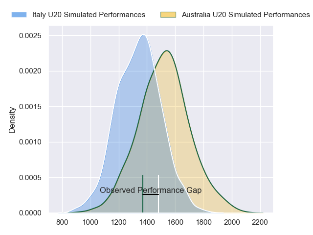
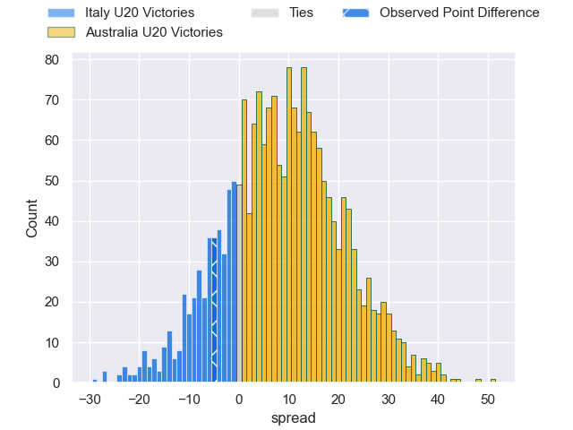
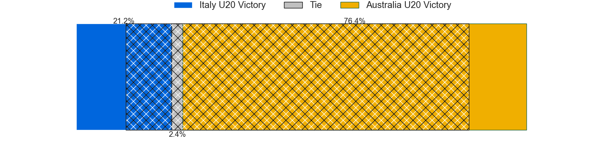
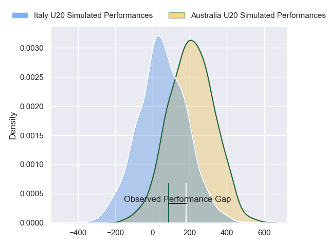
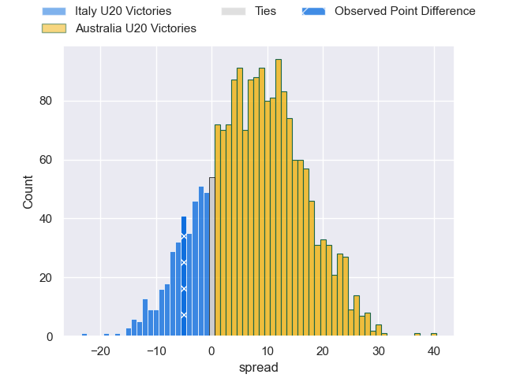
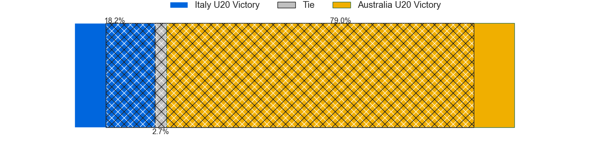

---  
layout: page  
title: Italy U20 at Australia U20; 17-12  
date: 2024-07-04 18:00:00 -0500  
categories: "worldcupunder20 2024" match review  
---
# Italy U20 at Australia U20; 17-12

# Club Level Predictions

The first set of predictions treats a club as the smallest object, as the club develops its members, organizes a gameplan, and deploys its players as needed for each match. This club model has a prediction of 0.71, which translates to predicting Australia U20 to win by 8.7.

Our Over/Under is 43.5 - and combined with the spread above, we have a predicted scoreline of 18 to 26

Each club has a rating and a rating deviation (similar to a Glicko rating), and expected performances can be generated. This allows for simulated matches and spreads like the ones below.
## Projected Performances - Club Model

## Projected Spreads - Club Model

## Projected Results - Club Model

# Player Level Predictions

Treating teams instead as an entity made up of the currently active players, I have ratings for each player in an altogether different system. These can be combined to form team ratings once teamsheets are announced, weighting starters a bit higher than the reserves. After the match is played, players can be weighted by their minutes on the field, allowing for an accurate measure of the team's composition. With these compiled team ratings, we can make predictions, measure inaccuracy, and update the individual player ratings.
## Prediction without Player Minutes: Australia U20 by 7.9

Australia U20 by 5.7 on a neutral pitch

## Projected Performances - Player Model

## Projected Spreads - Player Model

## Projected Results - Player Model

|   Away Minutes | Away Player         |   Away Percentile |   Number |   Home Percentile | Home Player               |   Home Minutes |
|---------------:|:--------------------|------------------:|---------:|------------------:|:--------------------------|---------------:|
|             80 | Sergio Pellicciolli |             42.1  |        1 |             28.84 | Lington Ieli              |             80 |
|             63 | Valerio Siciliano   |             52.52 |        2 |             42.9  | Ottavio Tuipulotu         |             46 |
|             58 | Federico Pisani     |             40.71 |        3 |             38.01 | Trevor King               |             30 |
|             53 | Samuele Mirenzi     |             51.09 |        4 |             55.76 | Toby McPherson            |             65 |
|             80 | Piero Gritti        |             54.61 |        5 |             36.16 | Ollie McCrea              |             57 |
|             46 | Nelson Casartelli   |             47.77 |        6 |             50.05 | Aden Ekanayake            |             80 |
|             80 | Luca Bellucci       |             39.8  |        7 |             50.05 | Dane Sawers               |             80 |
|             80 | Giacomo Milano      |             30.89 |        8 |             44.38 | Jack Harley               |             80 |
|             80 | Lorenzo Casilio     |             50.08 |        9 |             52.07 | Daniel Nelson             |             80 |
|             80 | Simone Brisighella  |             41.81 |       10 |             65.13 | Harry McLaughlin-Phillips |             70 |
|             80 | Lorenzo Elettri     |             41.7  |       11 |             33.94 | Angus Staniforth          |             80 |
|             80 | Patrick De Villiers |             43.23 |       12 |             47.34 | Jarrah McLeod             |             70 |
|             80 | Nicola Bozzo        |             35.01 |       13 |             42.63 | Kadin Pritchard           |             80 |
|             64 | Francesco Imberti   |             57.12 |       14 |             67.97 | Ronan Leahy               |             80 |
|             80 | Mirko Belloni       |             25.81 |       15 |             45.77 | Shane Wilcox              |             80 |
|             34 | Jacopo Botturi      |             22.69 |       16 |             53.28 | Nick Bloomfield           |             50 |
|             27 | Mattia Midena       |             25.88 |       17 |             60.46 | Bryn Edwards              |             34 |
|             22 | Davide Ascari       |             29.38 |       18 |            nan    | Eamon Doyle               |             23 |
|             17 | Nicholas Gasperini  |             22.9  |       19 |            nan    | Dom Thygesen              |             15 |
|             16 | Marco Scalabrini    |             24.64 |       20 |            nan    | Joseph Dillon             |             10 |
|            nan | nan                 |            nan    |       21 |            nan    | Frankie Goldsbrough       |             10 |

