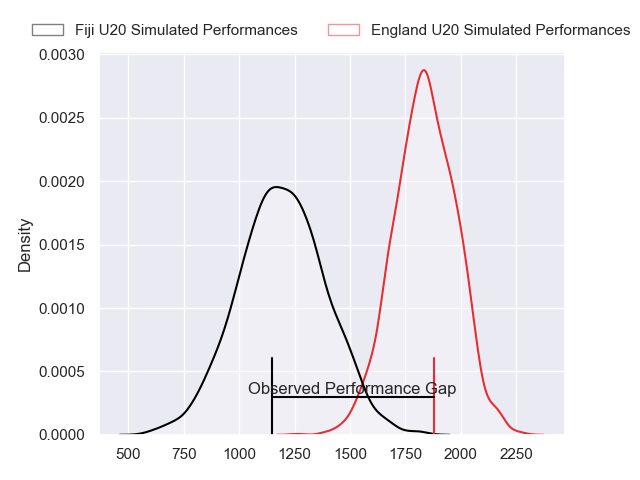
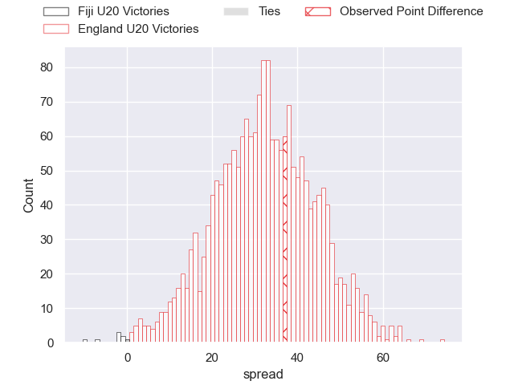
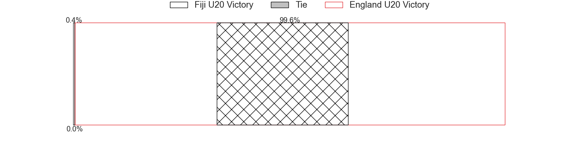
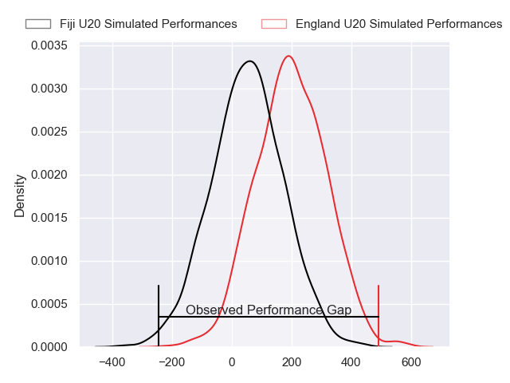
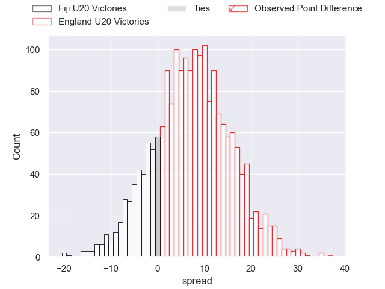
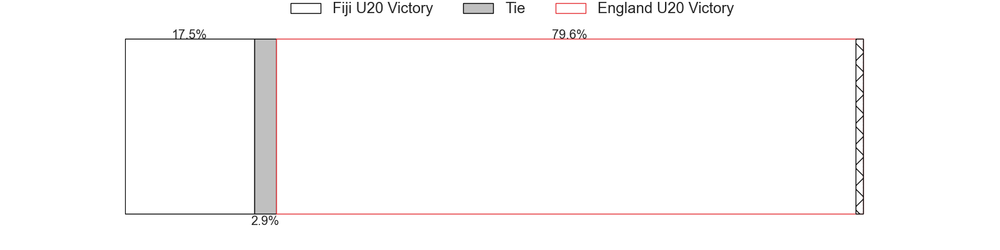

---  
layout: page  
title: Fiji U20 at England U20; 11-48  
date: 2024-07-04 18:00:00 -0500  
categories: "World Rugby U20 Championship 2024" match review  
---
# Fiji U20 at England U20; 11-48

# Club Level Predictions

The first set of predictions treats a club as the smallest object, as the club develops its members, organizes a gameplan, and deploys its players as needed for each match. This club model has a prediction of 0.957, which translates to predicting England U20 to win by 32.0.

Our Over/Under is 65.5 - and combined with the spread above, we have a predicted scoreline of 17 to 49

Each club has a rating and a rating deviation (similar to a Glicko rating), and expected performances can be generated. This allows for simulated matches and spreads like the ones below.
## Projected Performances - Club Model

## Projected Spreads - Club Model

## Projected Results - Club Model

# Player Level Predictions

Treating teams instead as an entity made up of the currently active players, I have ratings for each player in an altogether different system. These can be combined to form team ratings once teamsheets are announced, weighting starters a bit higher than the reserves. After the match is played, players can be weighted by their minutes on the field, allowing for an accurate measure of the team's composition. With these compiled team ratings, we can make predictions, measure inaccuracy, and update the individual player ratings.
## Prediction without Player Minutes: England U20 by 7.7

England U20 by 5.5 on a neutral pitch

## Projected Performances - Player Model

## Projected Spreads - Player Model

## Projected Results - Player Model

|   Away Minutes | Away Player             |   Away Percentile |   Number |   Home Percentile | Home Player          |   Home Minutes |
|---------------:|:------------------------|------------------:|---------:|------------------:|:---------------------|---------------:|
|             52 | Mataiasi Tuisireli      |             17.27 |        1 |             56.25 | Cameron Miell        |             40 |
|             68 | Moses Armstrong-Ravula  |             10.94 |        2 |             63.22 | James Isaacs         |             80 |
|             52 | Elroy Macomber          |             33.23 |        3 |             59.48 | Jimmy Halliwell      |             64 |
|             80 | Nalani May              |             12.87 |        4 |             60.93 | Harvey Cuckson       |             78 |
|             62 | Iliesa Erenavula        |             13.81 |        5 |             54.59 | Olamide Sodeke       |             80 |
|             80 | Ebernezer Tuidraki      |              9.6  |        6 |             90.21 | Finn Carnduff        |             40 |
|             40 | Ronald Paull Sharma     |             18.28 |        7 |             61.77 | Kane James           |             80 |
|             80 | Simon Koroiyadi         |             11.38 |        8 |             45.51 | Arthur Green         |             23 |
|             47 | Aisea Nawai             |             14.45 |        9 |             67.11 | Ollie Allan          |             40 |
|             52 | Bogidrau Kikau          |             21.07 |       10 |             62.84 | Benjamin Coen        |             68 |
|             80 | Sivaniolo Kalaveti      |             10.39 |       11 |             59.5  | Angus Hall           |             80 |
|             80 | Joseva Ubitau           |             20.88 |       12 |             80.82 | Oliver Spencer       |             80 |
|             80 | Harry Valevatu          |             17.28 |       13 |             42.26 | Ben Waghorn          |             57 |
|             80 | Avakuki Niusalelekitoga |             16.91 |       14 |             59.5  | Toby Cousins         |             80 |
|             57 | Isikeli Basiyalo        |              9.24 |       15 |             64.46 | Ioan Jones           |             80 |
|             40 | Ratu Nemani Kurucake    |             19.02 |       16 |             80.06 | Henry Pollock        |             57 |
|             33 | Samuela Ledua           |             24.46 |       17 |            nan    | Lucas Friday         |             40 |
|             28 | Breyton Legge           |             27.74 |       18 |            nan    | Afolabi Fasogbon     |             40 |
|             28 | Luke Nasau              |             20.57 |       19 |             71.9  | Junior Kpoku         |             40 |
|             28 | Ponipate Tuberi         |            nan    |       20 |             91.09 | Arron Reed           |             23 |
|             23 | Benjiman Naivalu        |            nan    |       21 |             90.71 | Asher Opoku-Fordjour |             16 |
|             18 | Malakai Masi            |            nan    |       22 |             52.3  | Josh Bellamy         |             12 |
|             12 | Iowane Vakadrigi        |            nan    |       23 |             65.65 | Craig Wright         |              2 |

