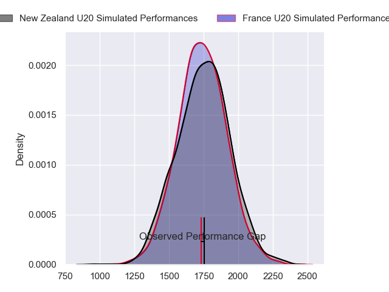
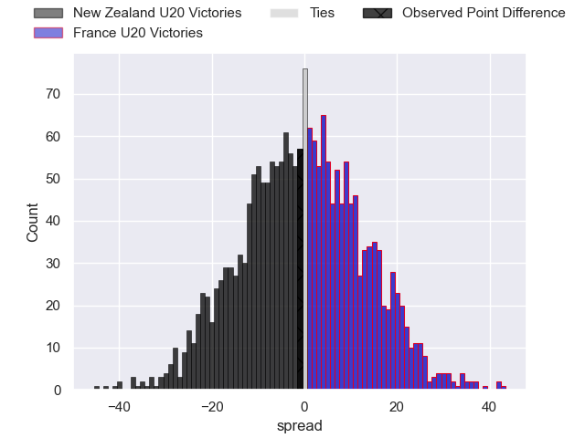
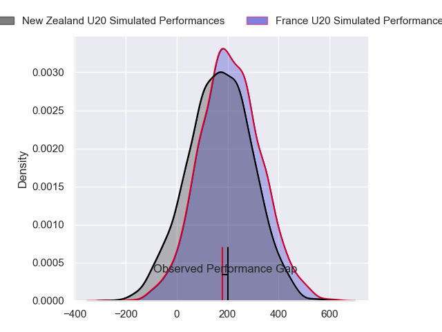
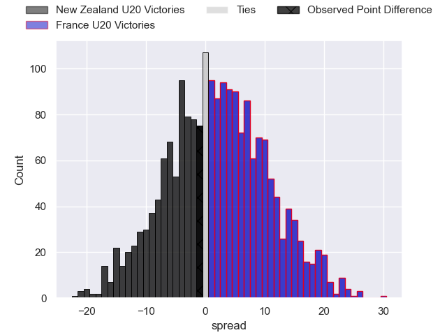
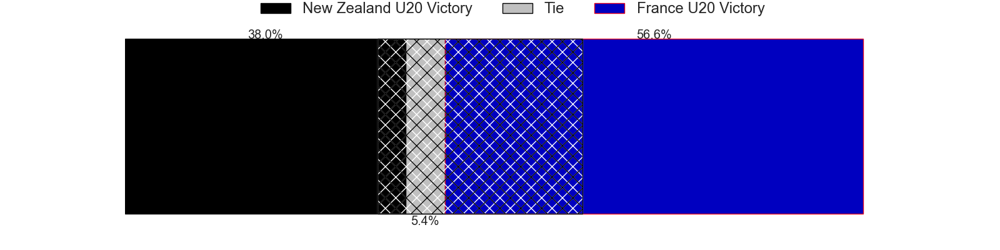

---  
layout: page  
title: New Zealand U20 at France U20; 27-26  
date: 2024-07-04 18:00:00 -0500  
categories: "worldcupunder20 2024" match review  
---
# New Zealand U20 at France U20; 27-26

# Club Level Predictions

The first set of predictions treats a club as the smallest object, as the club develops its members, organizes a gameplan, and deploys its players as needed for each match. This club model has a prediction of 0.469, which translates to predicting New Zealand U20 to win by 1.3.

Our Over/Under is 61.5 - and combined with the spread above, we have a predicted scoreline of 31 to 30

Each club has a rating and a rating deviation (similar to a Glicko rating), and expected performances can be generated. This allows for simulated matches and spreads like the ones below.
## Projected Performances - Club Model

## Projected Spreads - Club Model

## Projected Results - Club Model

# Player Level Predictions

Treating teams instead as an entity made up of the currently active players, I have ratings for each player in an altogether different system. These can be combined to form team ratings once teamsheets are announced, weighting starters a bit higher than the reserves. After the match is played, players can be weighted by their minutes on the field, allowing for an accurate measure of the team's composition. With these compiled team ratings, we can make predictions, measure inaccuracy, and update the individual player ratings.
## Prediction without Player Minutes: France U20 by 3.7

France U20 by 1.5 on a neutral pitch

## Projected Performances - Player Model

## Projected Spreads - Player Model

## Projected Results - Player Model

|   Away Minutes | Away Player          |   Away Percentile |   Number |   Home Percentile | Home Player             |   Home Minutes |
|---------------:|:---------------------|------------------:|---------:|------------------:|:------------------------|---------------:|
|             61 | Will Martin          |             59.98 |        1 |             53.89 | Lino Julien             |             47 |
|             61 | Vernon Bason         |             21.22 |        2 |             84.27 | Barnabé Massa           |             47 |
|             47 | Logan Watson-Wallace |             55.2  |        3 |             55.59 | Zinedine Aouad          |             17 |
|             48 | Tom Allen            |             73.45 |        4 |             49.57 | Corentin Mezou          |             65 |
|             80 | Liam Jack            |             64.51 |        5 |             61.56 | Charles Kante-Samba     |             80 |
|             80 | Andrew Smith         |             65.12 |        6 |             65.03 | Joe Quere Karaba        |             80 |
|             80 | Johnny Lee           |             58.53 |        7 |             54.08 | Geoffrey Malaterre      |             80 |
|             69 | Mosese Bason         |             59.24 |        8 |             73.09 | Mathis Castro           |             53 |
|             80 | Dylan Pledger        |             59.7  |        9 |             68.82 | Leo Carbonneau          |             80 |
|             80 | Rico Simpson         |             57.23 |       10 |             63.78 | Hugo Reus               |             80 |
|             80 | Stanley Solomon      |             62.14 |       11 |             78.02 | Mathis Ferté            |             80 |
|             80 | Mark Tele'a          |             89.57 |       12 |             54.46 | Mathys Belaubre         |             80 |
|             80 | Aki Tuivailala       |             69.31 |       13 |             62.89 | Fabien Brau-Boirie      |             80 |
|             56 | Xavier TIto-Harris   |             71.92 |       14 |             46.99 | Nathan Bollengier       |             80 |
|             58 | Isaac Hutchinson     |             58.67 |       15 |             39.11 | Xan Mousques            |             70 |
|             19 | Manumaua Letiu       |            nan    |       16 |            nan    | Lorencio Boyer Gallardo |             33 |
|             19 | Sika Uamaki          |            nan    |       17 |             61.98 | Thomas Lacombre         |             33 |
|             33 | Joshua Smith         |             72.86 |       18 |             59.68 | Thomas Duchene          |             63 |
|             32 | Cameron Christie     |             65.75 |       19 |             59.83 | Sialevailea Tolofua     |             15 |
|             11 | Matt Lowe            |             69.2  |       20 |             52.55 | Maxence Biasotto        |             27 |
|             22 | Sam Coles            |             51.61 |       21 |             83.27 | Axel Desperes           |             10 |
|             24 | King Maxwell         |             61.68 |       22 |            nan    | nan                     |            nan |

