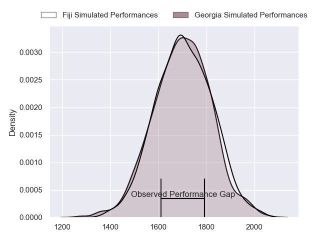
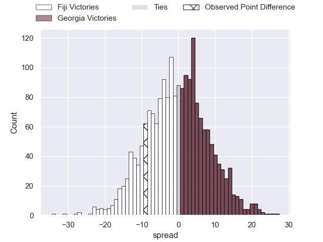
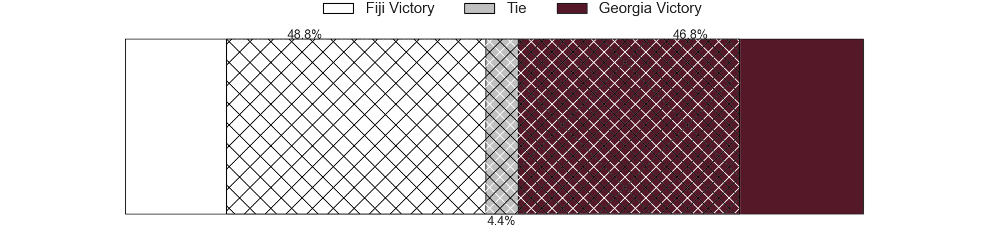
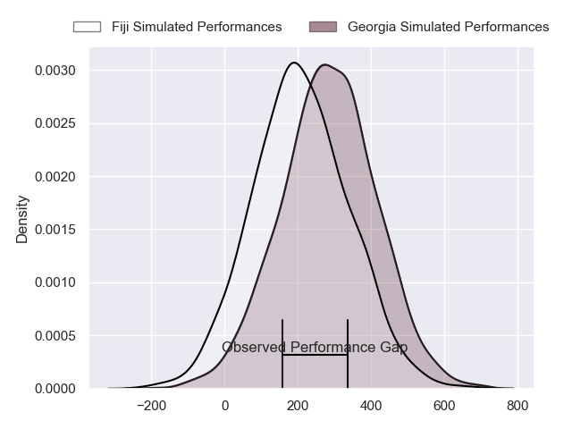
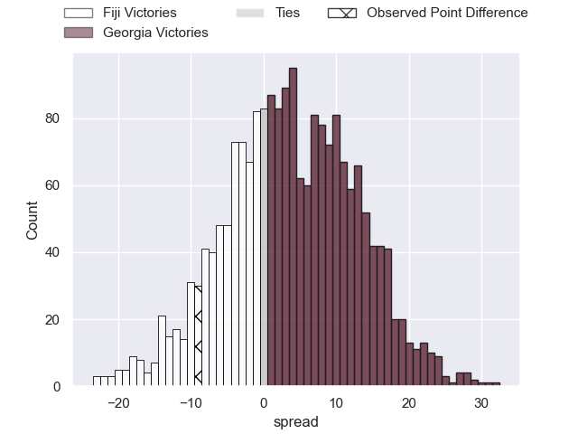
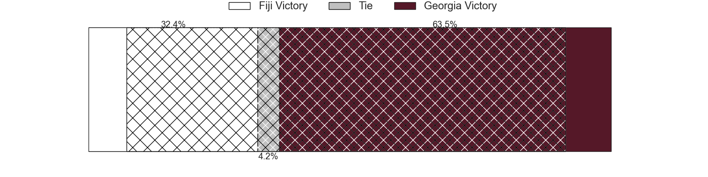

---  
layout: page  
title: Fiji at Georgia; 21-12  
date: 2024-07-04 18:00:00 -0500  
categories: "International Test Match 2024" match review  
---
# Fiji at Georgia; 21-12

# Club Level Predictions

The first set of predictions treats a club as the smallest object, as the club develops its members, organizes a gameplan, and deploys its players as needed for each match. This club model has a prediction of 0.488, which translates to predicting Fiji to win by 0.5.

Our Over/Under is 49.5 - and combined with the spread above, we have a predicted scoreline of 25 to 25

Each club has a rating and a rating deviation (similar to a Glicko rating), and expected performances can be generated. This allows for simulated matches and spreads like the ones below.
## Projected Performances - Club Model

## Projected Spreads - Club Model

## Projected Results - Club Model

# Player Level Predictions

Treating teams instead as an entity made up of the currently active players, I have ratings for each player in an altogether different system. These can be combined to form team ratings once teamsheets are announced, weighting starters a bit higher than the reserves. After the match is played, players can be weighted by their minutes on the field, allowing for an accurate measure of the team's composition. With these compiled team ratings, we can make predictions, measure inaccuracy, and update the individual player ratings.
## Prediction without Player Minutes: Georgia by 4.0

Georgia by 0.6 on a neutral pitch

## Projected Performances - Player Model

## Projected Spreads - Player Model

## Projected Results - Player Model

|   Away Minutes | Away Player          |   Away Percentile |   Number |   Home Percentile | Home Player          |   Home Minutes |
|---------------:|:---------------------|------------------:|---------:|------------------:|:---------------------|---------------:|
|             80 | Eroni Mawi           |             84.25 |        1 |             25.73 | Giorgi Akhaladze     |             80 |
|             80 | Tevita Ikanivere     |             92.43 |        2 |             76.25 | Vano Karkadze        |             80 |
|             80 | Mesake Doge          |             58    |        3 |             22.55 | Irakli Aptsiauri     |             80 |
|             80 | Isoa Nasilasila      |             78.76 |        4 |             31.75 | Mikheil Babunashvili |             80 |
|             80 | Temo Mayanavanua     |             92.32 |        5 |             31.75 | Giorgi Javakhia      |             80 |
|             80 | Lekima Tagitagivalu  |             80.21 |        6 |              2.89 | Ilia Spanderashvili  |             80 |
|             80 | Kitione Salawa       |             17.84 |        7 |             70.72 | Luka Ivanishvili     |             80 |
|             80 | Bill Mata            |             54.31 |        8 |            nan    | nan                  |            nan |
|             80 | Frank Lomani         |             83.98 |        9 |             11.42 | Vasil Lobzhanidze    |             80 |
|             80 | Vilimoni Botitu      |             68.53 |       10 |             57.37 | Tedo Abzhandadze     |             80 |
|             80 | Peniasi Dakuwaqa     |             57    |       11 |             84.47 | Davit Niniashvili    |             80 |
|             80 | Inia Tabuavou        |             68.13 |       12 |             92.79 | Giorgi Kveseladze    |             80 |
|            nan | nan                  |            nan    |       13 |             27.93 | Demi Tapladze        |             80 |
|             80 | Jiuta Wainiqolo      |             93.87 |       14 |             87.33 | Aka Tabutsadze       |             80 |
|             80 | Ilaisa Droasese      |             69.35 |       15 |             79.03 | Luka Matkava         |             80 |
|              0 | Zuriel Togiatama     |             36.49 |       16 |            nan    | Luka Petriashvili    |              0 |
|              0 | Haereiti Hetet       |             93.63 |       17 |            nan    | Giorgi Mamaiashvili  |              0 |
|              0 | Peni Ravai Kovekalou |             50.95 |       18 |            nan    | Aleksandre Kuntelia  |              0 |
|              0 | Albert Tuisue        |             89.79 |       19 |             36.29 | Lado Chachanidze     |              0 |
|              0 | Meli Derenalagi      |             42.19 |       20 |            nan    | Luka Saghinadze      |              0 |
|              0 | Elia Canakaivata     |             65.03 |       21 |             39.86 | Tornike Jalagonia    |              0 |
|              0 | Simione Kuruvoli     |             15.1  |       22 |             55.99 | Gela Aprasidze       |              0 |
|              0 | Isaiah Ravula        |            nan    |       23 |             91.32 | Sandro Todua         |              0 |

