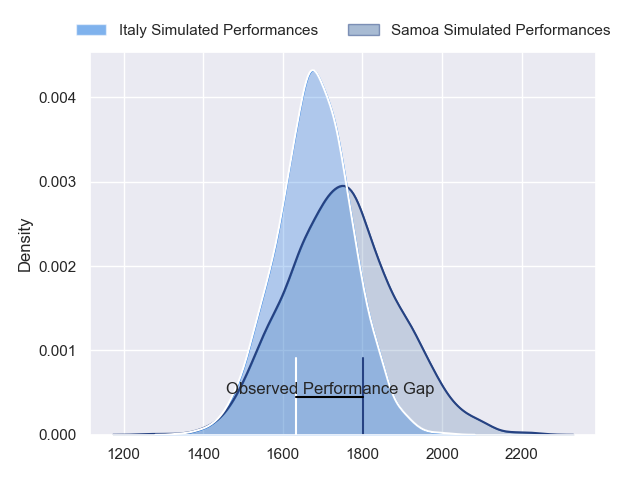
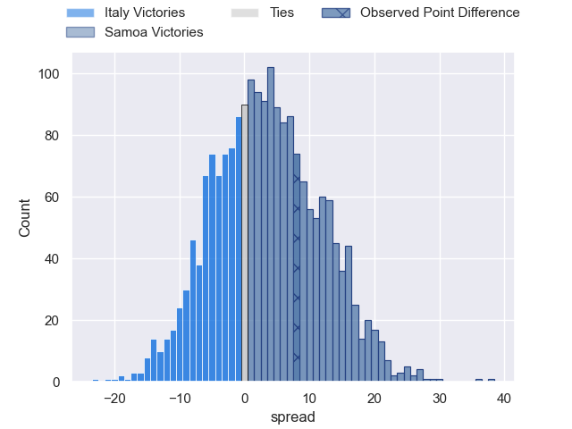
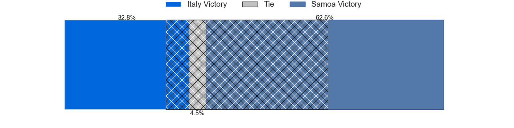
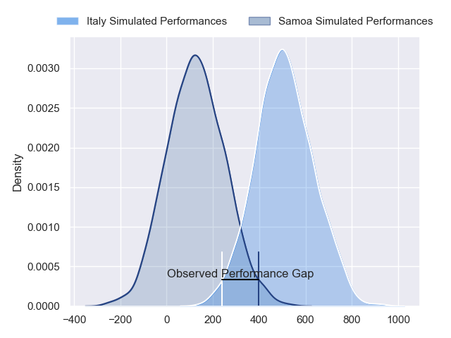
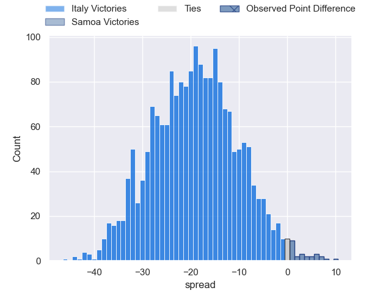
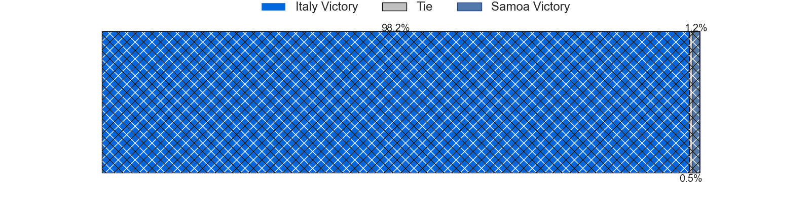

---  
layout: page  
title: Italy at Samoa; 25-33  
date: 2024-07-04 18:00:00 -0500  
categories: "International Test Match 2024" match review  
---
# Italy at Samoa; 25-33

# Club Level Predictions

The first set of predictions treats a club as the smallest object, as the club develops its members, organizes a gameplan, and deploys its players as needed for each match. This club model has a prediction of 0.595, which translates to predicting Samoa to win by 3.5.

Our Over/Under is 46.5 - and combined with the spread above, we have a predicted scoreline of 22 to 25

Each club has a rating and a rating deviation (similar to a Glicko rating), and expected performances can be generated. This allows for simulated matches and spreads like the ones below.
## Projected Performances - Club Model

## Projected Spreads - Club Model

## Projected Results - Club Model

# Player Level Predictions

Treating teams instead as an entity made up of the currently active players, I have ratings for each player in an altogether different system. These can be combined to form team ratings once teamsheets are announced, weighting starters a bit higher than the reserves. After the match is played, players can be weighted by their minutes on the field, allowing for an accurate measure of the team's composition. With these compiled team ratings, we can make predictions, measure inaccuracy, and update the individual player ratings.
## Prediction without Player Minutes: Italy by 17.7

Italy by 20.3 on a neutral pitch

## Projected Performances - Player Model

## Projected Spreads - Player Model

## Projected Results - Player Model

|   Away Minutes | Away Player        |   Away Percentile |   Number |   Home Percentile | Home Player         |   Home Minutes |
|---------------:|:-------------------|------------------:|---------:|------------------:|:--------------------|---------------:|
|             61 | Danilo Fischetti   |             22.03 |        1 |             19.65 | Aki Seiuli          |             76 |
|             69 | Gianmarco Lucchesi |             85.87 |        2 |             68.69 | Sama Malolo         |             76 |
|             60 | Simone Ferrari     |             96.01 |        3 |             71.91 | Marco Fepulea'i     |             69 |
|             60 | Niccolo Cannone    |             68.12 |        4 |             68.78 | Ben Nee Nee         |             69 |
|             80 | Federico Ruzza     |             95.84 |        5 |             16.27 | Sam Slade           |             80 |
|             66 | Alessandro Izekor  |             63.99 |        6 |             54.29 | Theo McFarland      |             80 |
|             80 | Michele Lamaro     |             97.05 |        7 |             69.44 | Izaiha Moore-Aiono  |             80 |
|             55 | Ross Vintcent      |             71.66 |        8 |             63.47 | OJ Noa              |             72 |
|             55 | Stephen Varney     |              3.14 |        9 |             58.84 | Jonathan Taumateine |             69 |
|             80 | Paolo Garbisi      |             84.67 |       10 |             24.14 | D'Angelo Leuila     |             80 |
|             80 | Monty Ioane        |             98.18 |       11 |             82.73 | Nigel Ah Wong       |             80 |
|             80 | Tommaso Menoncello |             91.21 |       12 |             10.29 | Danny Toala         |             71 |
|             80 | Juan Ignacio Brex  |             95.9  |       13 |             64.34 | Alapati Leiua       |             80 |
|             80 | Louis Lynagh       |             58.36 |       14 |             58    | Sebastian Visinia   |             40 |
|             80 | Matt Gallagher     |             96.39 |       15 |             87.95 | Duncan Paia'aua     |             80 |
|             11 | Loris Zarantonello |             31.91 |       16 |            nan    | Andrew Tuala        |              4 |
|             19 | Mirco Spagnolo     |             78.05 |       17 |             74.37 | Tietie Tuimauga     |             11 |
|             20 | Giosue Zilocchi    |             73.52 |       18 |            nan    | Lolani Faleiva      |              4 |
|             20 | Edoardo Iachizzi   |             79.38 |       19 |             79.85 | Michael Curry       |             11 |
|             14 | Manuel Zuliani     |             74.79 |       20 |            nan    | Iakopo Petelo-Mapu  |              8 |
|             25 | Lorenzo Cannone    |             93.81 |       21 |             38.18 | Melani Matavao      |             11 |
|             25 | Martin Page-Relo   |             79.67 |       22 |            nan    | Afa Moleli          |              9 |
|              0 | Leonardo Marin     |             67.24 |       23 |             81.22 | Stacey Ili          |             40 |

