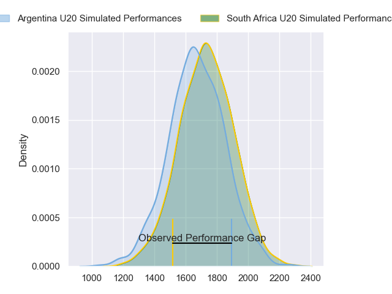
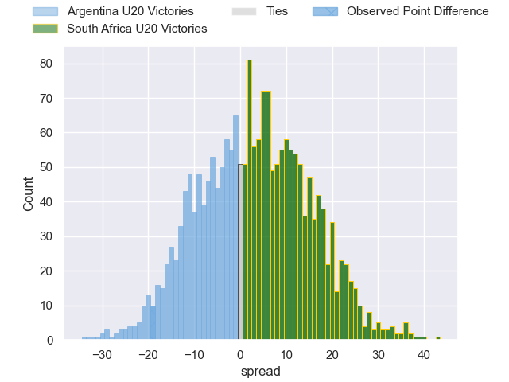
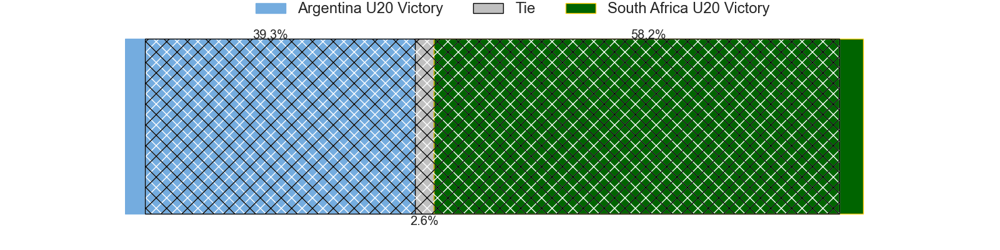
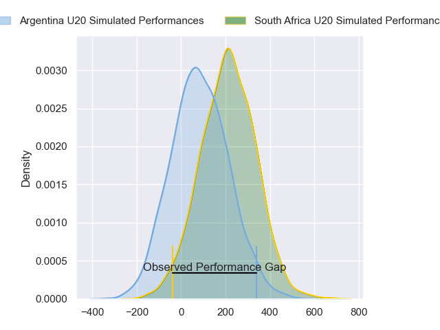
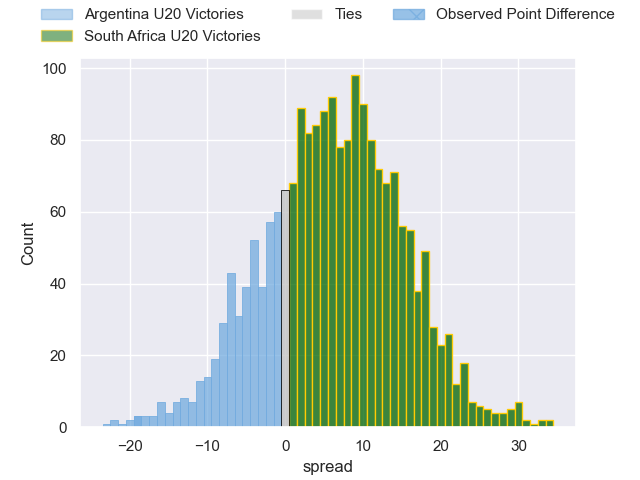
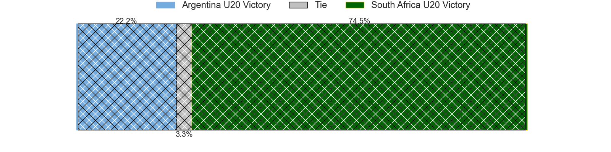

---  
layout: page  
title: Argentina U20 at South Africa U20; 31-12  
date: 2024-07-04 18:00:00 -0500  
categories: "World Rugby U20 Championship 2024" match review  
---
# Argentina U20 at South Africa U20; 31-12

# Club Level Predictions

The first set of predictions treats a club as the smallest object, as the club develops its members, organizes a gameplan, and deploys its players as needed for each match. This club model has a prediction of 0.58, which translates to predicting South Africa U20 to win by 3.3.

Our Over/Under is 57.5 - and combined with the spread above, we have a predicted scoreline of 27 to 31

Each club has a rating and a rating deviation (similar to a Glicko rating), and expected performances can be generated. This allows for simulated matches and spreads like the ones below.
## Projected Performances - Club Model

## Projected Spreads - Club Model

## Projected Results - Club Model

# Player Level Predictions

Treating teams instead as an entity made up of the currently active players, I have ratings for each player in an altogether different system. These can be combined to form team ratings once teamsheets are announced, weighting starters a bit higher than the reserves. After the match is played, players can be weighted by their minutes on the field, allowing for an accurate measure of the team's composition. With these compiled team ratings, we can make predictions, measure inaccuracy, and update the individual player ratings.
## Prediction without Player Minutes: South Africa U20 by 6.7

South Africa U20 by 4.5 on a neutral pitch

## Projected Performances - Player Model

## Projected Spreads - Player Model

## Projected Results - Player Model

|   Away Minutes | Away Player                  |   Away Percentile |   Number |   Home Percentile | Home Player               |   Home Minutes |
|---------------:|:-----------------------------|------------------:|---------:|------------------:|:--------------------------|---------------:|
|             56 | Diego Correa                 |             76.44 |        1 |             48.89 | Ruan Swart                |             48 |
|             56 | Juan Ignacio Greising Revol  |             63.98 |        2 |             33.89 | Luca Bakkes               |             58 |
|             73 | Tomas Rapetti                |             63.09 |        3 |             31.85 | Zachary Porthen           |             75 |
|             80 | Efrain Elias                 |             92.05 |        4 |             35.29 | Jaco Grobbelaar           |             28 |
|             63 | Felipe Bruno                 |             75.02 |        5 |             40.11 | JF van Heerden            |             80 |
|             80 | Juan Penoucos                |             73.31 |        6 |             45.71 | Thabang Mphafi            |             45 |
|             80 | Santos Fernandez De Oliveira |             61.96 |        7 |             27.24 | Batho Hlekani             |             80 |
|             63 | Juan Pedro Bernasconi        |             51.1  |        8 |             46.11 | Tiaan Jacobs              |             66 |
|             53 | Tomas Di Biase               |             61.82 |        9 |             36.2  | Asad Moos                 |             80 |
|             80 | Santino Di Lucca             |             39.66 |       10 |             25.86 | Liam Koen                 |             80 |
|             80 | Franco Rossetto              |             75.73 |       11 |             34.73 | Lili Bester               |             80 |
|             43 | Tomas Medina                 |             66.63 |       12 |             20.48 | Philip-Albert Van Niekerk |             80 |
|             80 | Faustino Sánchez Valarolo    |             81.12 |       13 |             34.67 | Jurenzo Julius            |             80 |
|             80 | Timoteo Silva                |             60.36 |       14 |             42.91 | Joel Leotlela             |             69 |
|             80 | Benjamin Elizalde            |             43.57 |       15 |              8.84 | Bruce Sherwood            |             70 |
|             37 | Felipe Ledesma               |             72    |       16 |             24.41 | Thomas Dyer               |             52 |
|             27 | Jeronimo Llorens Villanueva  |            nan    |       17 |             52.26 | Sibabalwe Mahashe         |             35 |
|             24 | Juan Manuel Vivas            |             55.17 |       18 |             32.62 | Casper Badenhorst         |             32 |
|             24 | Joaquin Yakiche              |            nan    |       19 |            nan    | Ethan Bester              |             22 |
|             17 | Agustin Sarelli              |             62.23 |       20 |            nan    | Keanu Coetsee             |             14 |
|             17 | Alvaro Garcia Iandolino      |             36.61 |       21 |             54.15 | Joshua Boulle             |             11 |
|              7 | Emir Gael Galvan             |             60.48 |       22 |            nan    | Tylor Sefoor              |             10 |
|            nan | nan                          |            nan    |       23 |            nan    | Liyema Ntshanga           |              5 |

