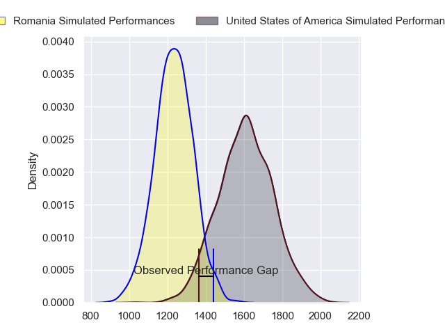
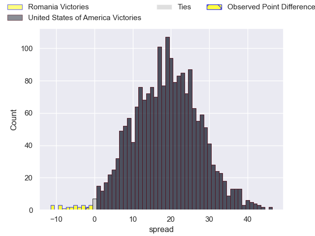
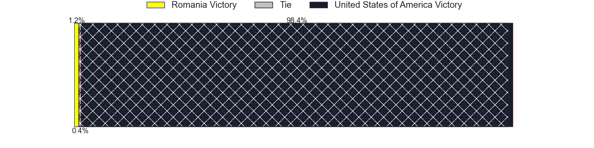
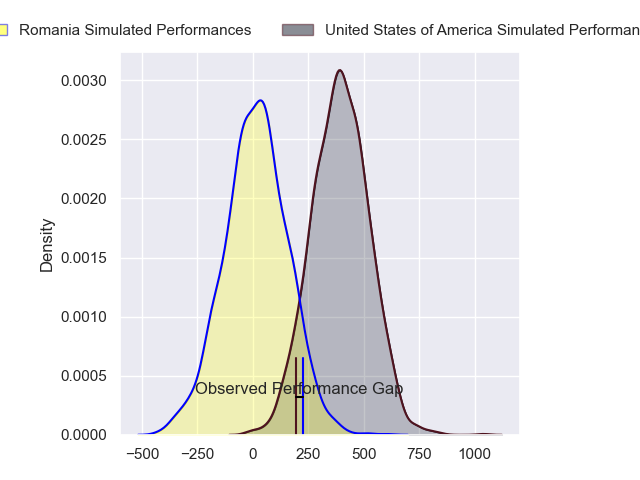
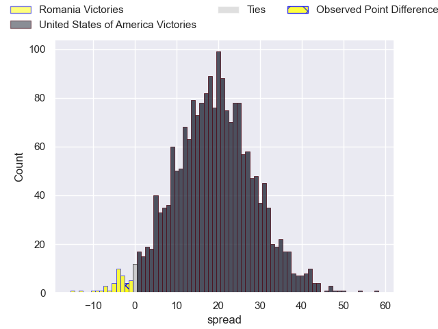
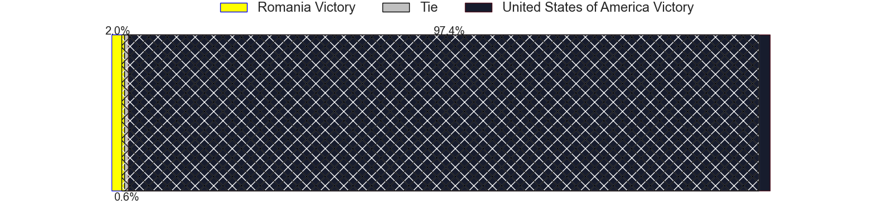

---  
layout: page  
title: Romania at United States of America; 22-20  
date: 2024-07-04 18:00:00 -0500  
categories: "International Test Match 2024" match review  
---
# Romania at United States of America; 22-20

# Club Level Predictions

The first set of predictions treats a club as the smallest object, as the club develops its members, organizes a gameplan, and deploys its players as needed for each match. This club model has a prediction of 0.889, which translates to predicting United States of America to win by 18.9.

Our Over/Under is 57.5 - and combined with the spread above, we have a predicted scoreline of 19 to 38

Each club has a rating and a rating deviation (similar to a Glicko rating), and expected performances can be generated. This allows for simulated matches and spreads like the ones below.
## Projected Performances - Club Model

## Projected Spreads - Club Model

## Projected Results - Club Model

# Player Level Predictions

Treating teams instead as an entity made up of the currently active players, I have ratings for each player in an altogether different system. These can be combined to form team ratings once teamsheets are announced, weighting starters a bit higher than the reserves. After the match is played, players can be weighted by their minutes on the field, allowing for an accurate measure of the team's composition. With these compiled team ratings, we can make predictions, measure inaccuracy, and update the individual player ratings.
## Prediction without Player Minutes: United States of America by 18.9

United States of America by 16.1 on a neutral pitch

## Projected Performances - Player Model

## Projected Spreads - Player Model

## Projected Results - Player Model

|   Away Minutes | Away Player       |   Away Percentile |   Number |   Home Percentile | Home Player              |   Home Minutes |
|---------------:|:------------------|------------------:|---------:|------------------:|:-------------------------|---------------:|
|             80 | Iulian Hartig     |             29.35 |        1 |             26.76 | Jake Turnbull            |             80 |
|             80 | Stefan Buruiana   |             64.54 |        2 |             97.07 | Dylan Fawsitt            |             80 |
|             80 | Vasile Balan      |             41.74 |        3 |             51.12 | Paul Mullen              |             80 |
|             80 | Yanis Horvat      |             64.35 |        4 |             26.89 | Renger van Eerten        |             80 |
|             80 | Andrei Mahu       |             88.58 |        5 |              7.47 | Greg Peterson            |             80 |
|             80 | Vlad Neculau      |             49.28 |        6 |             68.45 | Sam Golla                |             80 |
|             80 | Dragos Ser        |             11.75 |        7 |             22.06 | Jamason Fa'anana-Schultz |             80 |
|             80 | Nicolaas Immelman |             56.88 |        8 |             49.65 | Thomas Tu'avao           |             80 |
|             80 | Alin Conache      |             38.49 |        9 |             23.94 | Juan Philip Smith        |             80 |
|             80 | Hinckley Vaovasa  |             58.93 |       10 |             95.09 | AJ MacGinty              |             80 |
|             80 | Tevita Manumua    |              5.82 |       11 |             98.16 | Nate Augspurger          |             80 |
|             80 | Jason Tomane      |             69.93 |       12 |              1.58 | Tommaso Boni             |             80 |
|             80 | Mihai Graure      |             56.87 |       13 |             78.38 | Tavite Lopeti            |             80 |
|             80 | Marius Simionescu |              2.04 |       14 |             93.16 | Christian Dyer           |             80 |
|             80 | Paul Popoaia      |             52.76 |       15 |             89.86 | Mitch Wilson             |             80 |
|              0 | Rob Irimescu      |             75.04 |       16 |            nan    | Mike Sosene-Feagai       |              0 |
|              0 | Alexandru Savin   |             30.9  |       17 |            nan    | Nathan Sylvia            |              0 |
|              0 | Cosmin Manole     |            nan    |       18 |            nan    | Kaleb Geiger             |              0 |
|              0 | Marius Iftimiciuc |             16.22 |       19 |            nan    | Vili Helu                |              0 |
|              0 | Kamil Sobota      |            nan    |       20 |            nan    | Ben Bonasso              |              0 |
|              0 | Gabriel Rupanu    |             29.65 |       21 |             88.76 | Paddy Ryan               |              0 |
|              0 | Fonovai Tangimana |             25.34 |       22 |             12.44 | Luke Carty               |              0 |
|              0 | Daniel Plai       |            nan    |       23 |            nan    | Bryce Campbell           |              0 |

