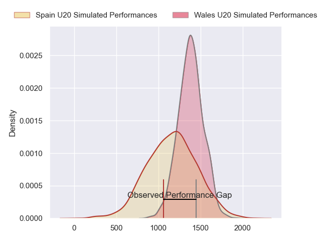
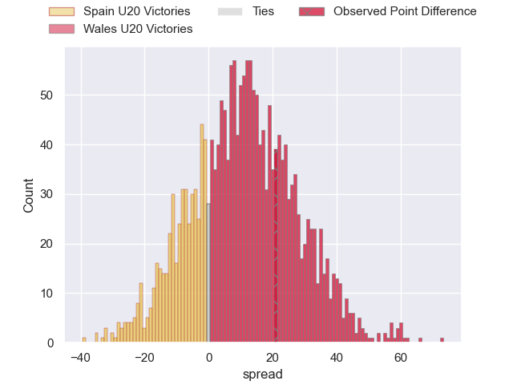
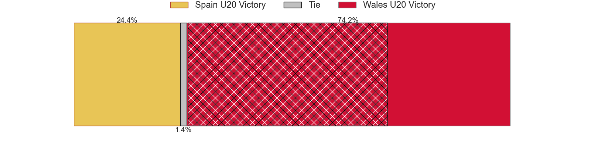
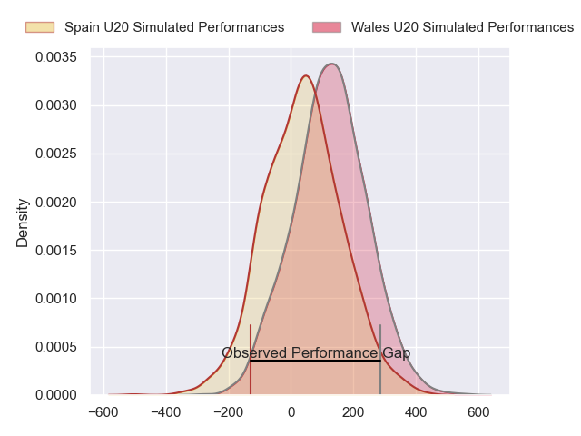
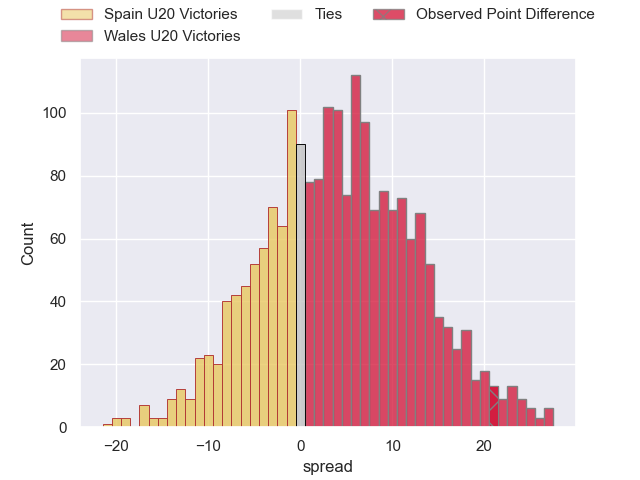
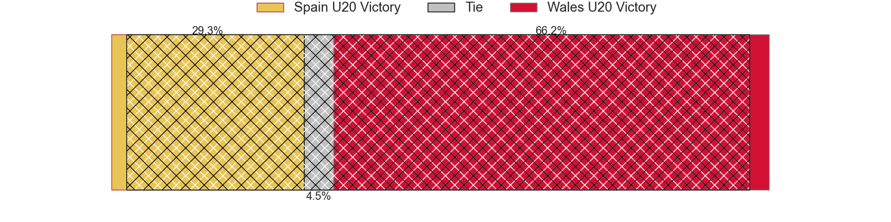

---  
layout: page  
title: Spain U20 at Wales U20; 10-31  
date: 2024-07-04 18:00:00 -0500  
categories: "World Rugby U20 Championship 2024" match review  
---
# Spain U20 at Wales U20; 10-31

# Club Level Predictions

The first set of predictions treats a club as the smallest object, as the club develops its members, organizes a gameplan, and deploys its players as needed for each match. This club model has a prediction of 0.726, which translates to predicting Wales U20 to win by 11.6.

Our Over/Under is 44.5 - and combined with the spread above, we have a predicted scoreline of 17 to 28

Each club has a rating and a rating deviation (similar to a Glicko rating), and expected performances can be generated. This allows for simulated matches and spreads like the ones below.
## Projected Performances - Club Model

## Projected Spreads - Club Model

## Projected Results - Club Model

# Player Level Predictions

Treating teams instead as an entity made up of the currently active players, I have ratings for each player in an altogether different system. These can be combined to form team ratings once teamsheets are announced, weighting starters a bit higher than the reserves. After the match is played, players can be weighted by their minutes on the field, allowing for an accurate measure of the team's composition. With these compiled team ratings, we can make predictions, measure inaccuracy, and update the individual player ratings.
## Prediction without Player Minutes: Wales U20 by 4.3

Wales U20 by 2.0 on a neutral pitch

## Projected Performances - Player Model

## Projected Spreads - Player Model

## Projected Results - Player Model

|   Away Minutes | Away Player           |   Away Percentile |   Number |   Home Percentile | Home Player       |   Home Minutes |
|---------------:|:----------------------|------------------:|---------:|------------------:|:------------------|---------------:|
|             58 | Hugo Gonzalez         |             20.34 |        1 |             58.25 | Ioan Emanuel      |             56 |
|             46 | Diego Gonzalez Blanco |             16.72 |        2 |             48.78 | Harry Thomas      |             40 |
|             48 | Aniol Franch          |             25.25 |        3 |             54.11 | Kian Hire         |             56 |
|             80 | Pablo Guirao          |             18.35 |        4 |              8.8  | Jonny Green       |             80 |
|             46 | Adam Llinares         |             33.11 |        5 |             59.41 | Nick Thomas       |             80 |
|             80 | Nicolas Moleti        |             15.6  |        6 |             29.73 | Ryan Woodman      |             67 |
|             67 | Jokin Zolezzi         |             16.9  |        7 |             57.09 | Morgan Morse      |             61 |
|             80 | Manex Ariceta         |             21.56 |        8 |             54.69 | Owen Conquer      |             80 |
|             46 | Nicolas Infer Arias   |             25.45 |        9 |             55.37 | Rhodri Lewis      |             53 |
|             80 | Gonzalo Otamendi      |              6.51 |       10 |             46.36 | Harri Ford        |             61 |
|             53 | Roberto Ponce         |             22.36 |       11 |             60.18 | Kodie Stone       |             80 |
|             62 | Yago Fernandez Vilar  |             20.68 |       12 |             46.25 | Steffan Emanuel   |             80 |
|             80 | Alberto Carmona       |              9.69 |       13 |             54.75 | Elijah Evans      |             80 |
|             80 | Julien Burguillos     |             17.55 |       14 |             49.55 | Harry Rees-Weldon |             56 |
|             80 | Luciano Richardis     |             13.45 |       15 |             45.78 | Matty Young       |             80 |
|             34 | David Gallego         |            nan    |       16 |            nan    | Jordan Morris     |             24 |
|             22 | Alberto Gomez         |             17.65 |       17 |             35.61 | Sam Scott         |             24 |
|             32 | Guido Reyes Rendon    |             14.58 |       18 |             37.09 | Osian Thomas      |             13 |
|             13 | Martin Serrano        |             20.25 |       19 |             29.07 | Louie Hennessey   |             24 |
|             34 | Valentino Rizzo       |             20.16 |       20 |             34.67 | Harri Wilde       |             19 |
|             34 | Javier Lopez de Haro  |             16.69 |       21 |             37.36 | Ieuan Davies      |             27 |
|             18 | Unax Zuriarrain       |             21.58 |       22 |             30.24 | Isaac Young       |             19 |
|             27 | Gabriel Rocaries      |              7.23 |       23 |            nan    | Will Austin       |             40 |

