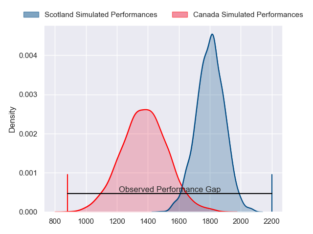
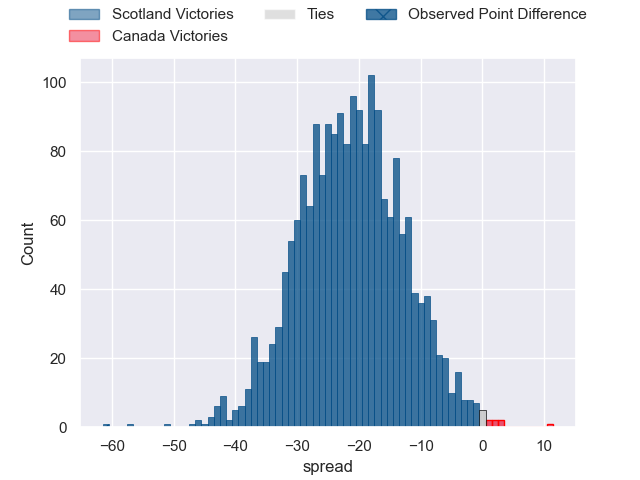
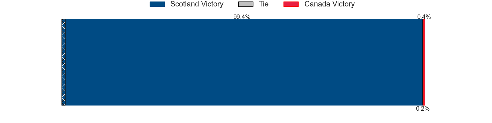
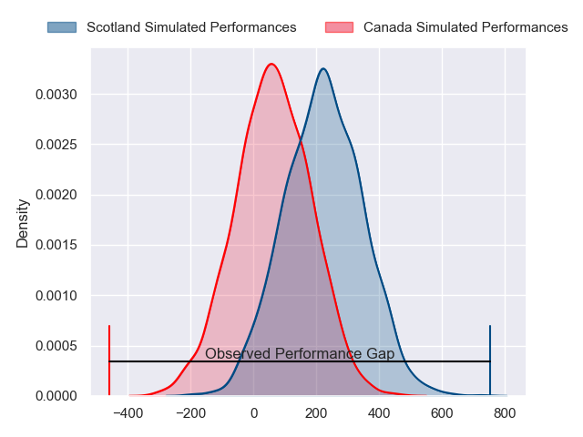
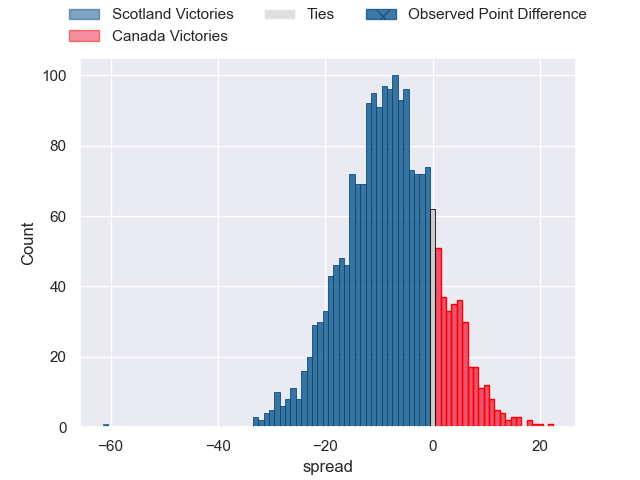

---  
layout: page  
title: Scotland at Canada; 73-12  
date: 2024-07-05 18:00:00 -0500  
categories: "International Test Match 2024" match review  
---
# Scotland at Canada; 73-12

# Club Level Predictions

The first set of predictions treats a club as the smallest object, as the club develops its members, organizes a gameplan, and deploys its players as needed for each match. This club model has a prediction of 0.087, which translates to predicting Scotland to win by 21.2.

Our Over/Under is 56.5 - and combined with the spread above, we have a predicted scoreline of 39 to 18

Each club has a rating and a rating deviation (similar to a Glicko rating), and expected performances can be generated. This allows for simulated matches and spreads like the ones below.
## Projected Performances - Club Model

## Projected Spreads - Club Model

## Projected Results - Club Model

# Player Level Predictions

Treating teams instead as an entity made up of the currently active players, I have ratings for each player in an altogether different system. These can be combined to form team ratings once teamsheets are announced, weighting starters a bit higher than the reserves. After the match is played, players can be weighted by their minutes on the field, allowing for an accurate measure of the team's composition. With these compiled team ratings, we can make predictions, measure inaccuracy, and update the individual player ratings.
## Prediction without Player Minutes: Scotland by 9.3

Scotland by 12.0 on a neutral pitch

## Projected Performances - Player Model

## Projected Spreads - Player Model

## Projected Results - Player Model

|   Away Minutes | Away Player         |   Away Percentile |   Number |   Home Percentile | Home Player         |   Home Minutes |
|---------------:|:--------------------|------------------:|---------:|------------------:|:--------------------|---------------:|
|             46 | Rory Sutherland     |             33.69 |        1 |              0.08 | Liam Murray         |             50 |
|             83 | Dylan Richardson    |             70.52 |        2 |             30.7  | Andrew Quattrin     |             63 |
|             52 | Elliot Millar-Mills |             90.87 |        3 |             14.35 | Conor Young         |             53 |
|             56 | Max Williamson      |             57.71 |        4 |             69.16 | Conor Keys          |             83 |
|             83 | Glen Young          |              6.24 |        5 |             52.98 | Kyle Baillie        |             71 |
|             83 | Gregor Brown        |             66.3  |        6 |              3.42 | Mason Flesch        |             83 |
|             56 | Luke Crosbie        |             94.64 |        7 |              1.48 | Lucas Rumball       |             83 |
|             74 | Josh Bayliss        |             25.55 |        8 |              7.19 | Siaki Vikilani      |             58 |
|             62 | Gus Warr            |             54.71 |        9 |             35.87 | Jason Higgins       |             83 |
|             56 | Ross Thompson       |             72.99 |       10 |              4.02 | Peter Nelson        |             83 |
|             83 | Arron Reed          |             91.09 |       11 |             43.36 | Nic Benn            |             83 |
|             83 | Stafford McDowall   |             90.91 |       12 |             69.63 | Ben LeSage          |             63 |
|             62 | Matt Currie         |             81.52 |       13 |             30.77 | Mitch Richardson    |             70 |
|             83 | Jamie Dobie         |             84.55 |       14 |             32.73 | Andrew Coe          |             58 |
|             75 | Harry Paterson      |             69.28 |       15 |             23.09 | Cooper Coats        |             83 |
|             27 | Robbie Smith        |            nan    |       16 |            nan    | Jesse MacKail       |             20 |
|             37 | Nathan McBeth       |             49.27 |       17 |              1.77 | Djustice Sears-Duru |             33 |
|             31 | Will Hurd           |             60.86 |       18 |             87.34 | Cole Keith          |             30 |
|             27 | Ewan Johnson        |             67.17 |       19 |            nan    | James Stockwood     |             12 |
|              9 | Matt Fagerson       |             98.06 |       20 |             28.99 | Sion Parry          |             25 |
|             27 | Ben Healy           |             80.08 |       21 |            nan    | Brock Gallagher     |             13 |
|             29 | Kyle Steyn          |             98.91 |       22 |            nan    | Talon McMullin      |             20 |
|             21 | Ross McCann         |            nan    |       23 |            nan    | Takoda McMullin     |             25 |

