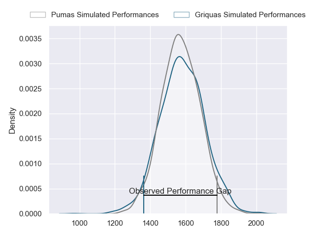
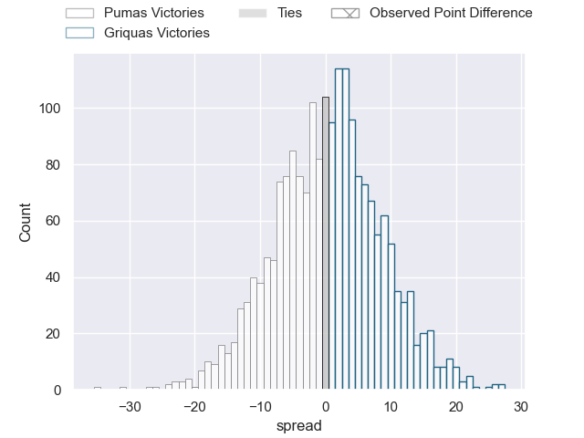
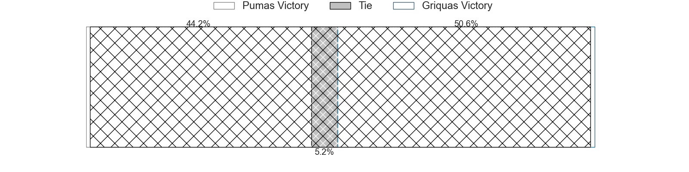
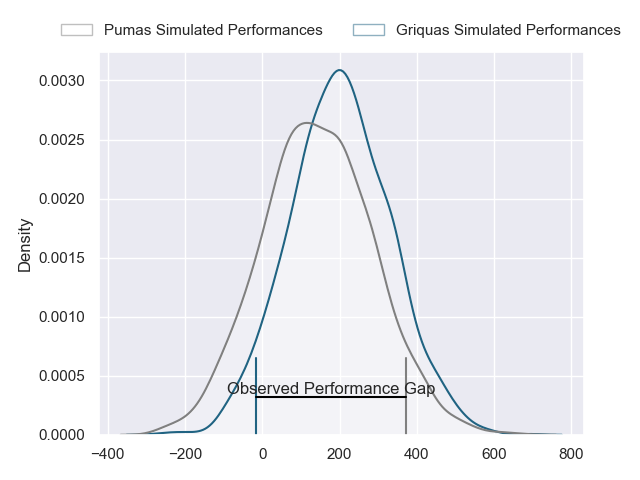
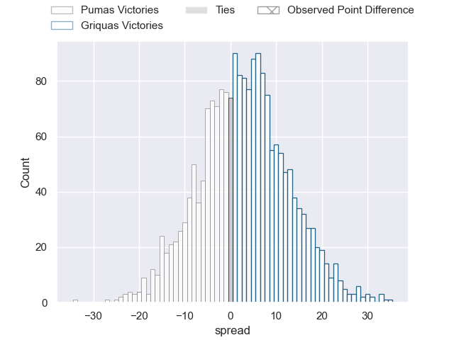
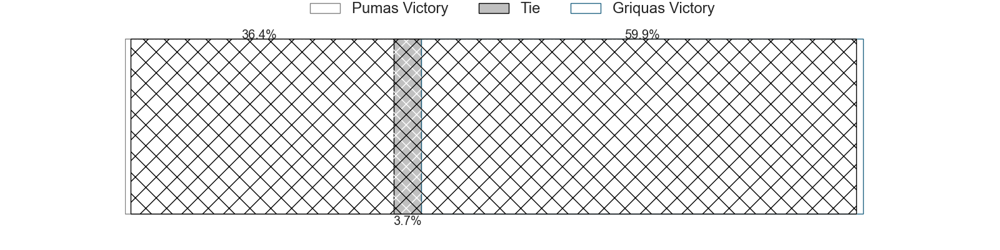

---  
layout: page  
title: Pumas at Griquas; 44-24  
date: 2024-07-05 18:00:00 -0500  
categories: "Currie Cup 2024" match review  
---
# Pumas at Griquas; 44-24

# Club Level Predictions

The first set of predictions treats a club as the smallest object, as the club develops its members, organizes a gameplan, and deploys its players as needed for each match. This club model has a prediction of 0.512, which translates to predicting Griquas to win by 0.4.

Our Over/Under is 69.5 - and combined with the spread above, we have a predicted scoreline of 35 to 35

Each club has a rating and a rating deviation (similar to a Glicko rating), and expected performances can be generated. This allows for simulated matches and spreads like the ones below.
## Projected Performances - Club Model

## Projected Spreads - Club Model

## Projected Results - Club Model

# Player Level Predictions

Treating teams instead as an entity made up of the currently active players, I have ratings for each player in an altogether different system. These can be combined to form team ratings once teamsheets are announced, weighting starters a bit higher than the reserves. After the match is played, players can be weighted by their minutes on the field, allowing for an accurate measure of the team's composition. With these compiled team ratings, we can make predictions, measure inaccuracy, and update the individual player ratings.
## Prediction without Player Minutes: Griquas by 3.5

Griquas by 0.1 on a neutral pitch

## Projected Performances - Player Model

## Projected Spreads - Player Model

## Projected Results - Player Model

|   Away Minutes | Away Player              |   Away Percentile |   Number |   Home Percentile | Home Player                      |   Home Minutes |
|---------------:|:-------------------------|------------------:|---------:|------------------:|:---------------------------------|---------------:|
|             80 | Etienne Janeke           |             82.81 |        1 |             10.18 | Leon Lyons                       |             80 |
|             80 | Eduan Swart              |             86.72 |        2 |             42.14 | Janco Uys                        |             80 |
|             80 | Sampie Swiegers          |             79.8  |        3 |             51.43 | Janu Botha                       |             80 |
|             80 | Malembe Mpofu            |             61.27 |        4 |             35.78 | Dylan Sjoblom                    |             80 |
|             80 | Shane Monro Kirkwood     |             92.58 |        5 |              2.57 | Albert Liebenberg                |             80 |
|             80 | Ntsinka Fisanti          |             53.53 |        6 |             15.77 | Stephan Smit                     |             80 |
|             80 | Ruwald Van der Merwe     |             51.86 |        7 |             32.1  | Marco De Witt                    |             80 |
|             80 | Kwanda Dimaza            |             84.14 |        8 |             92.97 | Hanru Sirgel                     |             80 |
|             80 | Ross Braude              |             57.88 |        9 |             10.61 | Thomas Bursey                    |             80 |
|             80 | Clinton Swart            |             46.44 |       10 |             26.4  | George Whitehead                 |             80 |
|             80 | Phiko Sobahle            |             55.84 |       11 |             10.13 | Sakoyisa Makata                  |             80 |
|             80 | Wian van Niekerk         |             45.94 |       12 |             19.56 | Mnombo Zwelendaba                |             80 |
|             80 | De-An Deneille Ackermann |             66.8  |       13 |             18.15 | Sango (Saida) Xamlashe           |             80 |
|             80 | Lundi Msenge             |             69.34 |       14 |             22.45 | Marcqiewn Titus                  |             80 |
|             80 | Stefan Coetzee           |             58.06 |       15 |             41.94 | Cameron Hufke                    |             80 |
|              0 | Darnell Osowagu          |            nan    |       16 |            nan    | Gustav Du Rand                   |              0 |
|              0 | Stephan de Jager         |            nan    |       17 |            nan    | Edward Davids                    |              0 |
|              0 | Dewald Maritz            |            nan    |       18 |            nan    | Cebolenkosi Dlamini              |              0 |
|              0 | Deon Slabbert            |             87.16 |       19 |            nan    | Athenkosi Ernest (Dave) Khethani |              0 |
|              0 | Marvelous Mashimbyi      |            nan    |       20 |            nan    | Carl Els                         |              0 |
|              0 | Richman Gora             |            nan    |       21 |            nan    | Bobby Alexander                  |              0 |
|              0 | Danrich Zynodene Visagie |            nan    |       22 |            nan    | Lubabalo Dobela                  |              0 |
|              0 | Tino Swanepoel           |            nan    |       23 |            nan    | Tertius Kruger                   |              0 |

