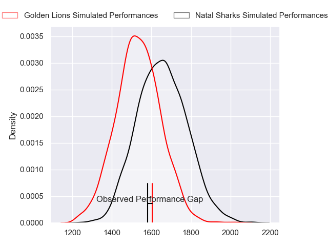
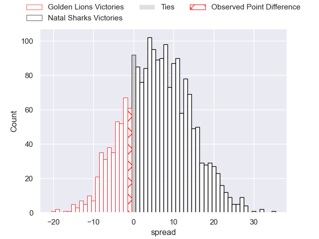
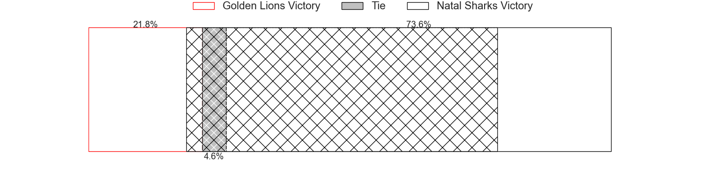
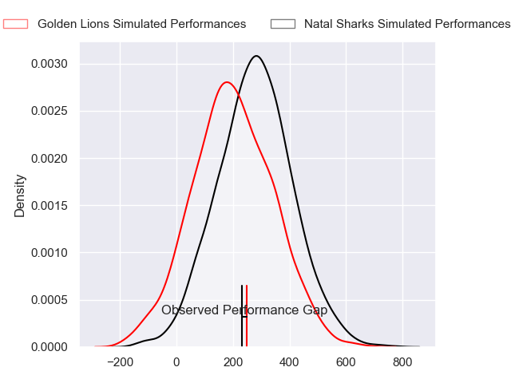
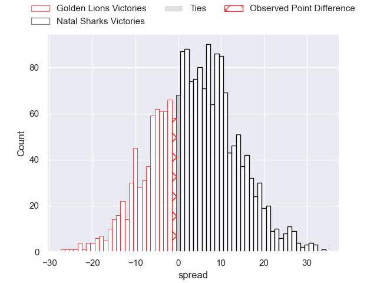
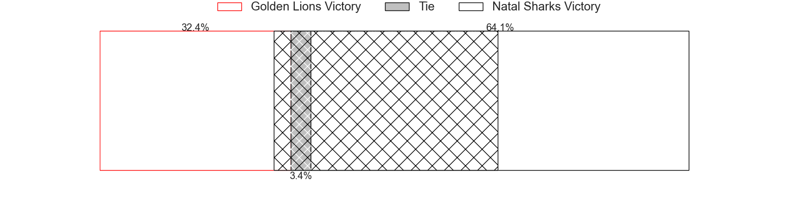

---  
layout: page  
title: Golden Lions at Natal Sharks; 26-25  
date: 2024-07-05 18:00:00 -0500  
categories: "Currie Cup 2024" match review  
---
# Golden Lions at Natal Sharks; 26-25

# Club Level Predictions

The first set of predictions treats a club as the smallest object, as the club develops its members, organizes a gameplan, and deploys its players as needed for each match. This club model has a prediction of 0.657, which translates to predicting Natal Sharks to win by 6.0.

Our Over/Under is 51.5 - and combined with the spread above, we have a predicted scoreline of 23 to 29

Each club has a rating and a rating deviation (similar to a Glicko rating), and expected performances can be generated. This allows for simulated matches and spreads like the ones below.
## Projected Performances - Club Model

## Projected Spreads - Club Model

## Projected Results - Club Model

# Player Level Predictions

Treating teams instead as an entity made up of the currently active players, I have ratings for each player in an altogether different system. These can be combined to form team ratings once teamsheets are announced, weighting starters a bit higher than the reserves. After the match is played, players can be weighted by their minutes on the field, allowing for an accurate measure of the team's composition. With these compiled team ratings, we can make predictions, measure inaccuracy, and update the individual player ratings.
## Prediction without Player Minutes: Natal Sharks by 4.5

Natal Sharks by 1.1 on a neutral pitch

## Projected Performances - Player Model

## Projected Spreads - Player Model

## Projected Results - Player Model

|   Away Minutes | Away Player       |   Away Percentile |   Number |   Home Percentile | Home Player                 |   Home Minutes |
|---------------:|:------------------|------------------:|---------:|------------------:|:----------------------------|---------------:|
|             80 | Morgan Naude      |             65.08 |        1 |             33.92 | Braam Reyneke               |             80 |
|             80 | Jaco Visagie      |             82.67 |        2 |             28.27 | Dan Jooste                  |             80 |
|             80 | RF Schoeman       |             54.8  |        3 |             65.69 | Khwezi Mona                 |             80 |
|             80 | Raynard Roets     |             74.65 |        4 |             38.22 | Coetzee Le Roux             |             80 |
|             80 | Ruben Schoeman    |             95.36 |        5 |             97.26 | Reniel Hugo                 |             80 |
|             80 | Jarod Cairns      |              9.97 |        6 |             76.18 | Tinotenda Mavesere          |             80 |
|             80 | Ruan Venter       |             93.44 |        7 |             34.53 | Jannes Potgieter            |             80 |
|             80 | Izan Esterhuizen  |             49.3  |        8 |             33.73 | Nick Hatton                 |             80 |
|             80 | Nico Steyn        |             66.45 |        9 |             51.07 | Bradley Davids              |             80 |
|             80 | Kade Wolhuter     |             10.73 |       10 |             95.02 | Lionel Cronje               |             80 |
|             80 | Rabz Maxwane      |             89    |       11 |             37.64 | Jaco Williams               |             80 |
|             80 | Zander du Plessis |             57.94 |       12 |             49.25 | Murray Koster               |             80 |
|             80 | Manuel Rass       |             32.87 |       13 |             35.36 | Diego Appollis              |             80 |
|             80 | Boldwin Hansen    |             12    |       14 |              5.55 | Yaw Penxe                   |             80 |
|             80 | Gianni Lombard    |             80.72 |       15 |             31.73 | Hakeem Kunene               |             80 |
|              0 | Morné Brandon     |            nan    |       16 |             24.32 | Kerron van Vuuren           |              0 |
|              0 | Heiko Pohlmann    |            nan    |       17 |            nan    | Phatu Ganyane               |              0 |
|              0 | SJ Kotze          |            nan    |       18 |            nan    | Mawande Mdanda              |              0 |
|              0 | Ruhan Straeuli    |             72.48 |       19 |            nan    | Renier Viljoen              |              0 |
|              0 | Renzo du Plessis  |            nan    |       20 |            nan    | Siya Ningiza                |              0 |
|              0 | Leighton Horn     |            nan    |       21 |            nan    | Tiaan Fourie                |              0 |
|              0 | Rynardt Jonker    |             79.62 |       22 |            nan    | Alwayno Visagie             |              0 |
|              0 | Tapiwa Mafura     |             61.24 |       23 |            nan    | Hillegard Muller du Plessis |              0 |

