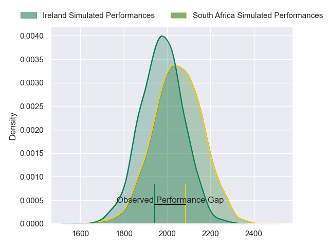
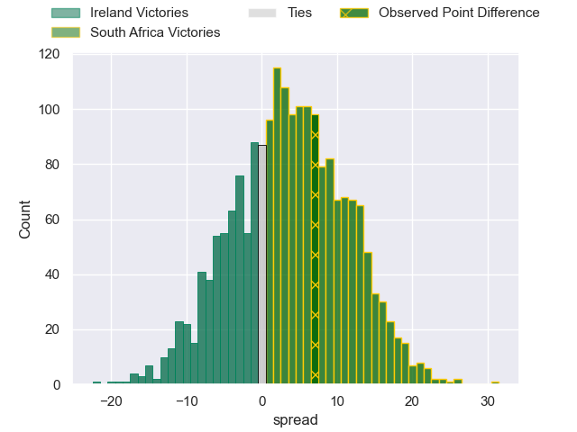
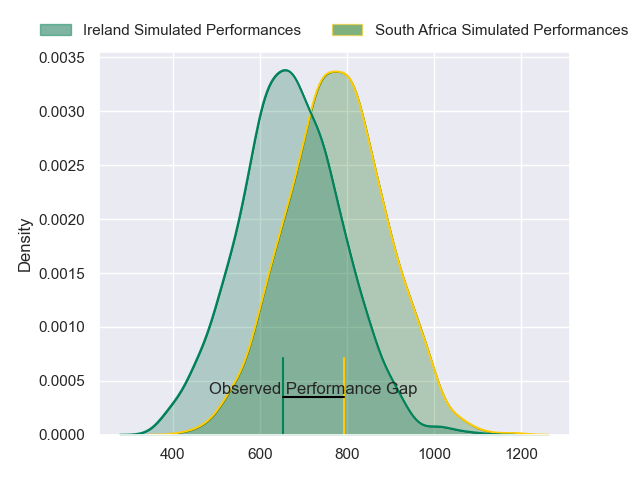
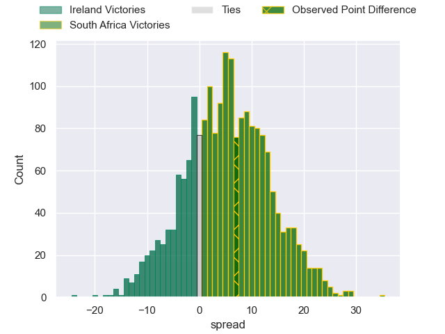

---  
layout: page  
title: Ireland at South Africa; 20-27  
date: 2024-07-05 18:00:00 -0500  
categories: "International Test Match 2024" match review  
---
# Ireland at South Africa; 20-27

# Club Level Predictions

The first set of predictions treats a club as the smallest object, as the club develops its members, organizes a gameplan, and deploys its players as needed for each match. This club model has a prediction of 0.604, which translates to predicting South Africa to win by 3.8.

Our Over/Under is 43.5 - and combined with the spread above, we have a predicted scoreline of 20 to 24

Each club has a rating and a rating deviation (similar to a Glicko rating), and expected performances can be generated. This allows for simulated matches and spreads like the ones below.
## Projected Performances - Club Model

## Projected Spreads - Club Model

## Projected Results - Club Model

# Player Level Predictions

Treating teams instead as an entity made up of the currently active players, I have ratings for each player in an altogether different system. These can be combined to form team ratings once teamsheets are announced, weighting starters a bit higher than the reserves. After the match is played, players can be weighted by their minutes on the field, allowing for an accurate measure of the team's composition. With these compiled team ratings, we can make predictions, measure inaccuracy, and update the individual player ratings.
## Prediction without Player Minutes: South Africa by 9.7

South Africa by 6.2 on a neutral pitch

## Projected Performances - Player Model

## Projected Spreads - Player Model

## Projected Results - Player Model

|   Away Minutes | Away Player        |   Away Percentile |   Number |   Home Percentile | Home Player               |   Home Minutes |
|---------------:|:-------------------|------------------:|---------:|------------------:|:--------------------------|---------------:|
|             65 | Andrew Porter      |             90.56 |        1 |             99.69 | Ox Nche                   |             50 |
|             41 | Dan Sheehan        |             70.97 |        2 |             98.02 | Bongi Mbonambi            |             50 |
|             63 | Tadhg Furlong      |             96.93 |        3 |             88.49 | Frans Malherbe            |             50 |
|             50 | Joe McCarthy       |             78.33 |        4 |             99.05 | Eben Etzebeth             |             50 |
|             80 | Tadhg Beirne       |             98.86 |        5 |             91.49 | Franco Mostert            |             50 |
|             50 | Peter O'Mahony     |             97.14 |        6 |             88.73 | Siya Kolisi               |             50 |
|             80 | Josh van der Flier |             98.61 |        7 |             94.18 | Pieter-Steph du Toit      |             80 |
|             80 | Caelan Doris       |             94.41 |        8 |             87.23 | Kwagga Smith              |             80 |
|             64 | Craig Casey        |             80.99 |        9 |             94.88 | Faf de Klerk              |             60 |
|             80 | Jack Crowley       |             46.93 |       10 |             90.23 | Handre Pollard            |             74 |
|             80 | James Lowe         |            100    |       11 |             97.82 | Kurt-Lee Arendse          |             80 |
|             80 | Bundee Aki         |             98.6  |       12 |             99.6  | Damian de Allende         |             80 |
|             41 | Robbie Henshaw     |             89.61 |       13 |             98.3  | Jesse Kriel               |             80 |
|             80 | Calvin Nash        |             95.45 |       14 |             99.82 | Cheslin Kolbe             |             80 |
|             51 | Jamie Osborne      |             90.76 |       15 |             97.79 | Willie le Roux            |             80 |
|             39 | Ronan Kelleher     |             94.07 |       16 |            100    | Malcolm Marx              |             30 |
|             15 | Cian Healy         |             93.78 |       17 |             92.4  | Gerhard Steenekamp        |             30 |
|             17 | Finlay Bealham     |             96.24 |       18 |             69.46 | Vincent Koch              |             30 |
|             30 | James Ryan         |             94.7  |       19 |             79    | Salmaan Moerat            |             30 |
|             30 | Ryan Baird         |             88.37 |       20 |             99.34 | RG Snyman                 |             30 |
|             16 | Conor Murray       |             98.84 |       21 |             90.4  | Marco van Staden          |             30 |
|             29 | Ciaran Frawley     |             60.24 |       22 |             69.75 | Grant Williams            |             20 |
|             39 | Garry Ringrose     |             97.8  |       23 |             41.66 | Sacha Feinberg-Mngomezulu |              6 |

