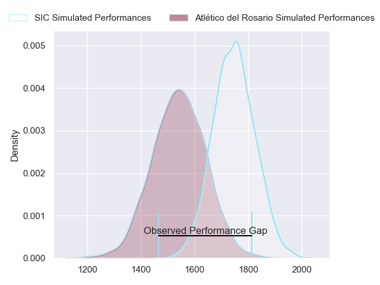
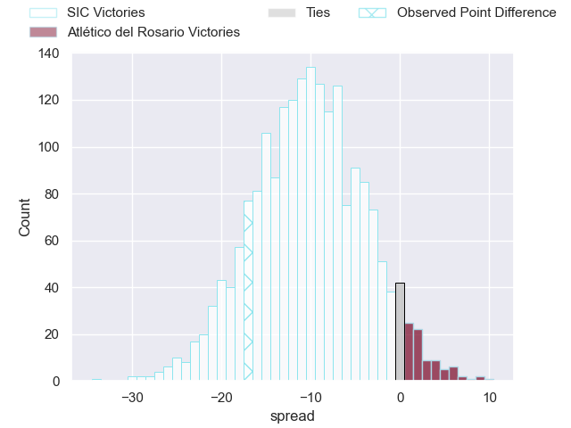
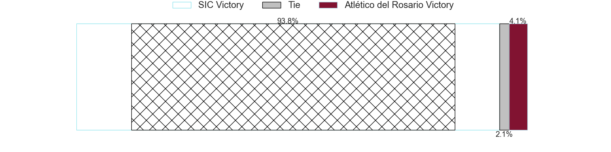
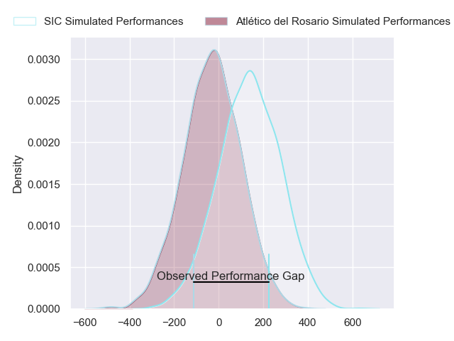
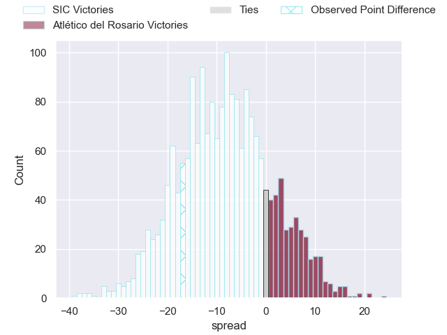
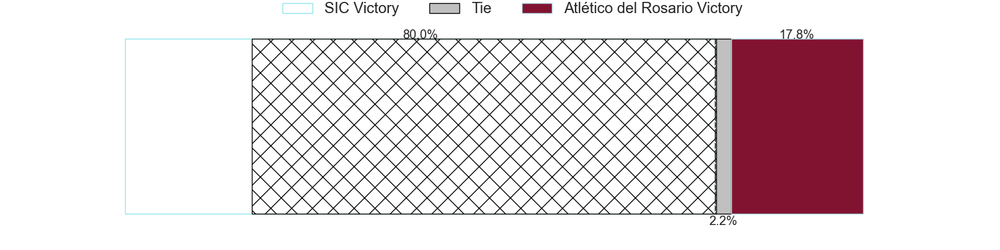

---  
layout: page  
title: SIC at Atletico del Rosario; 49-32  
date: 2024-07-06 18:00:00 -0500  
categories: "URBA Top 12 2024" match review  
---
# SIC at Atletico del Rosario; 49-32

# Club Level Predictions

The first set of predictions treats a club as the smallest object, as the club develops its members, organizes a gameplan, and deploys its players as needed for each match. This club model has a prediction of 0.241, which translates to predicting SIC to win by 10.3.

Our Over/Under is 56.5 - and combined with the spread above, we have a predicted scoreline of 33 to 23

Each club has a rating and a rating deviation (similar to a Glicko rating), and expected performances can be generated. This allows for simulated matches and spreads like the ones below.
## Projected Performances - Club Model

## Projected Spreads - Club Model

## Projected Results - Club Model

# Player Level Predictions

Treating teams instead as an entity made up of the currently active players, I have ratings for each player in an altogether different system. These can be combined to form team ratings once teamsheets are announced, weighting starters a bit higher than the reserves. After the match is played, players can be weighted by their minutes on the field, allowing for an accurate measure of the team's composition. With these compiled team ratings, we can make predictions, measure inaccuracy, and update the individual player ratings.
## Prediction without Player Minutes: SIC by 9.0

SIC by 12.7 on a neutral pitch

## Projected Performances - Player Model

## Projected Spreads - Player Model

## Projected Results - Player Model

|   Away Minutes | Away Player             |   Away Percentile |   Number |   Home Percentile | Home Player                 |   Home Minutes |
|---------------:|:------------------------|------------------:|---------:|------------------:|:----------------------------|---------------:|
|             80 | Marcos Piccinini        |             77.87 |        1 |             16.58 | Ezequiel Reyes              |             80 |
|             80 | Ignacio Bottazzini      |             69.77 |        2 |             20    | Matias Malanos              |             80 |
|             80 | Juan Pedro Olcese       |             51.5  |        3 |              2.08 | Agustin Fernandez           |             80 |
|             80 | Tomas Borghi            |             76.97 |        4 |              4.95 | Matias Kremer               |             80 |
|             80 | Bautista Viero          |             74.22 |        5 |              4.76 | Octavio Capella             |             80 |
|             80 | Andrea Panzarini        |             66.79 |        6 |             18.55 | Jose Ignacio Ferrer         |             80 |
|             80 | Alejo Daireaux          |             42.95 |        7 |              3.34 | Lucas Malanos               |             80 |
|             80 | Pedro Georgalo          |             49.2  |        8 |             23.69 | Jose Caseres                |             80 |
|             80 | Felipe Sascaro          |             71.48 |        9 |             22.39 | Felipe Nogues               |             80 |
|             80 | Santiago Pavlovsky      |             68.98 |       10 |             18.88 | Manuel Nogues               |             80 |
|             80 | Nicanor Acosta          |             57.66 |       11 |              7.57 | Maximiliano Nicoli Fiscella |             80 |
|             80 | Santos Rubio            |             67.7  |       12 |             18.66 | Ramiro Musio                |             80 |
|             80 | Carlos Piran            |             56.57 |       13 |              3.61 | Pedro de Aro                |             80 |
|             80 | Lucas Albanese          |             32.57 |       14 |              6.57 | Facundo Gerosa              |             80 |
|             80 | Bernabe Lopez Fleming   |             45.97 |       15 |              3.43 | Pedro Bisio                 |             80 |
|              0 | Francisco Calandra      |            nan    |       16 |            nan    | Ramiro Rubio                |              0 |
|              0 | Jaime Gilligan          |            nan    |       17 |              6.96 | Santiago Casals             |              0 |
|              0 | Benjamin Chiappe        |             66.69 |       18 |            nan    | Jose Carro                  |              0 |
|              0 | Tomas Meyrelles         |             70.68 |       19 |             27.91 | Bruno Montenegro            |              0 |
|              0 | Ignacio Pietranera      |            nan    |       20 |            nan    | Federico Martin             |              0 |
|              0 | Ramon Martinez Tomietto |            nan    |       21 |             28.52 | Martin Del Pazo             |              0 |
|              0 | Agustin Sascaro         |            nan    |       22 |              7.32 | Guido Vidalle               |              0 |
|              0 | Facundo Madero          |            nan    |       23 |             40.91 | Federico Mayol              |              0 |

