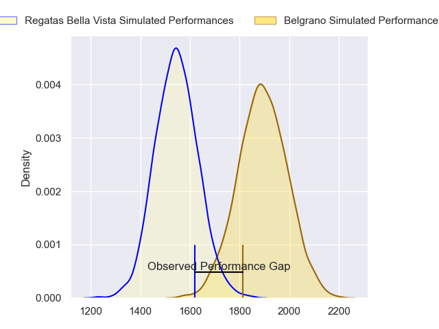
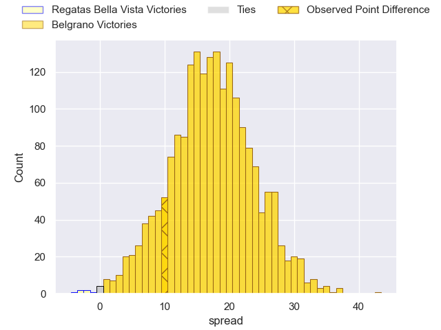
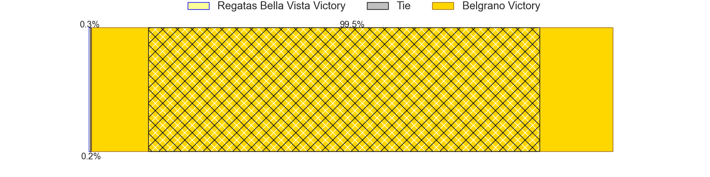
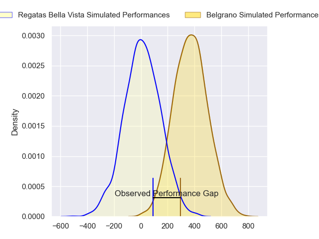
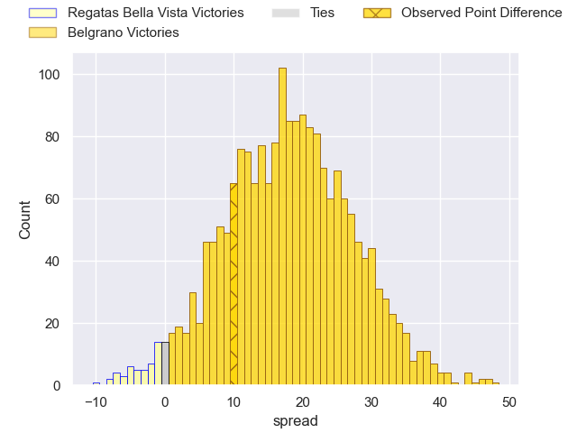
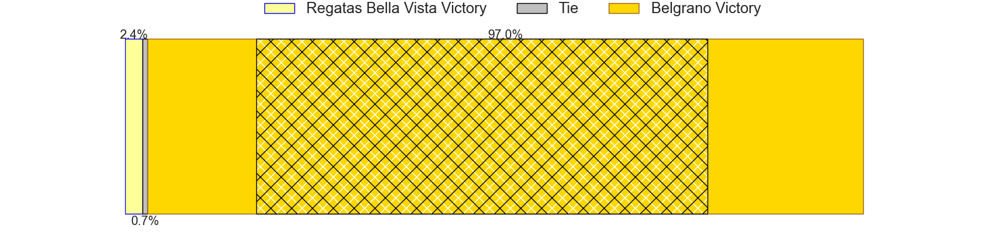

---  
layout: page  
title: Regatas Bella Vista at Belgrano; 12-22  
date: 2024-07-06 18:00:00 -0500  
categories: "URBA Top 12 2024" match review  
---
# Regatas Bella Vista at Belgrano; 12-22

# Club Level Predictions

The first set of predictions treats a club as the smallest object, as the club develops its members, organizes a gameplan, and deploys its players as needed for each match. This club model has a prediction of 0.872, which translates to predicting Belgrano to win by 17.2.

Our Over/Under is 55.5 - and combined with the spread above, we have a predicted scoreline of 19 to 36

Each club has a rating and a rating deviation (similar to a Glicko rating), and expected performances can be generated. This allows for simulated matches and spreads like the ones below.
## Projected Performances - Club Model

## Projected Spreads - Club Model

## Projected Results - Club Model

# Player Level Predictions

Treating teams instead as an entity made up of the currently active players, I have ratings for each player in an altogether different system. These can be combined to form team ratings once teamsheets are announced, weighting starters a bit higher than the reserves. After the match is played, players can be weighted by their minutes on the field, allowing for an accurate measure of the team's composition. With these compiled team ratings, we can make predictions, measure inaccuracy, and update the individual player ratings.
## Prediction without Player Minutes: Belgrano by 19.2

Belgrano by 15.1 on a neutral pitch

## Projected Performances - Player Model

## Projected Spreads - Player Model

## Projected Results - Player Model

|   Away Minutes | Away Player          |   Away Percentile |   Number |   Home Percentile | Home Player            |   Home Minutes |
|---------------:|:---------------------|------------------:|---------:|------------------:|:-----------------------|---------------:|
|             82 | Tomas Barbaccia      |             21.43 |        1 |             86.4  | Francisco Ferronato    |             82 |
|             82 | Beltran Landivar     |             51.46 |        2 |             88.3  | Francisco Lusarreta    |             82 |
|             82 | Mateo Trimarco       |             51.98 |        3 |             79.78 | Lisandro Garcia Dragui |             82 |
|             82 | Valentin Sanguinetti |             37.67 |        4 |             87.19 | Luciano Tecca          |             82 |
|             82 | Marcelo Toledo       |             52.72 |        5 |             63.61 | Ramon Duggan           |             82 |
|             82 | Marcos Ferro         |             47.42 |        6 |             84.23 | Joaquin de la Serna    |             82 |
|             82 | Tomas Sanguinetti    |             27.22 |        7 |             76.29 | Augusto Vaccarino      |             82 |
|             82 | Felipe Camerlinckx   |             28.21 |        8 |             81.35 | Franco Vega            |             82 |
|             82 | Marcos Joseph        |             24.86 |        9 |             74.22 | Ignacio Marino         |             82 |
|             82 | Mateo Camerlinckx    |             25.45 |       10 |             62.5  | Juan Aparicio          |             82 |
|             82 | Enrique Camerlinckx  |             24.21 |       11 |             50.56 | Pedro Arana            |             82 |
|             82 | Ramiro Moadeb        |             24.77 |       12 |             36.26 | Juan Brescia           |             82 |
|             82 | Alejo Barrera        |             24.89 |       13 |             79.62 | Tomas Etchepare        |             82 |
|             82 | Rafael Santana       |             35.85 |       14 |             82.74 | Ignacio Diaz           |             82 |
|             82 | Felipe Rugolo        |             41.47 |       15 |             77.19 | Juan Lando             |             82 |
|              0 | Manuel Lozano Oneto  |            nan    |       16 |            nan    | Ignacio Saporiti       |              0 |
|              0 | Diego Aguero         |            nan    |       17 |            nan    | Santiago Garcia Botta  |              0 |
|              0 | Juan Gobet           |             26.94 |       18 |             59.9  | Justo Duranona         |              0 |
|              0 | Lucas Gobet          |             16.19 |       19 |             67.34 | Mateo Gasparotti       |              0 |
|              0 | Pedro Vega           |             25.36 |       20 |             62.06 | Theo Blaksley          |              0 |
|              0 | Gonzalo Deluca       |            nan    |       21 |             80.18 | Tobias Bernabe         |              0 |
|              0 | Justo Camerlinckx    |             37.95 |       22 |             64.51 | Joaquin Mihura         |              0 |
|              0 | Francisco Pisani     |             19.1  |       23 |             31.96 | Francisco Gradin       |              0 |

