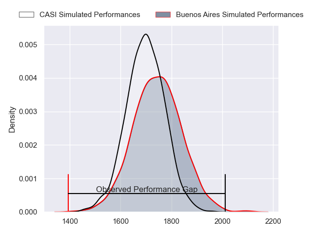
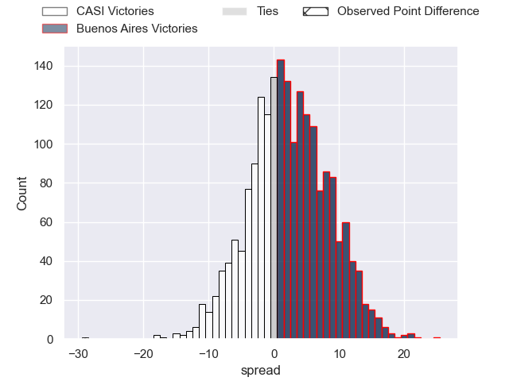
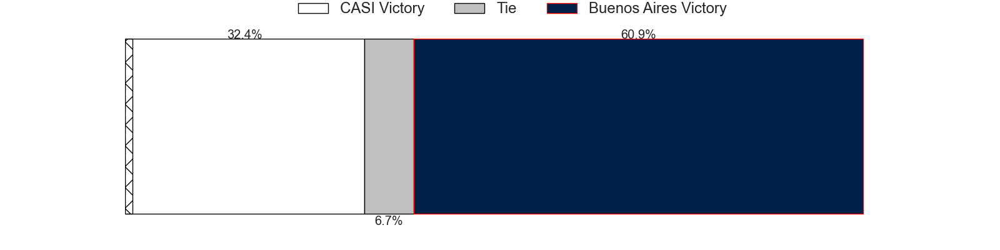
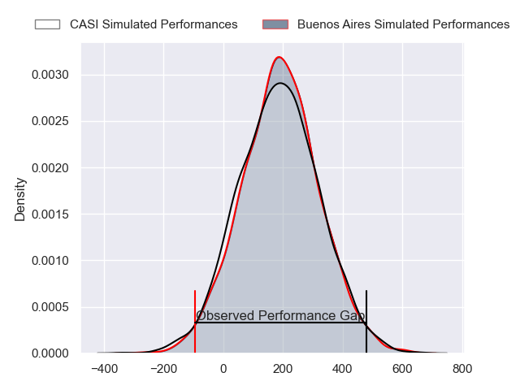
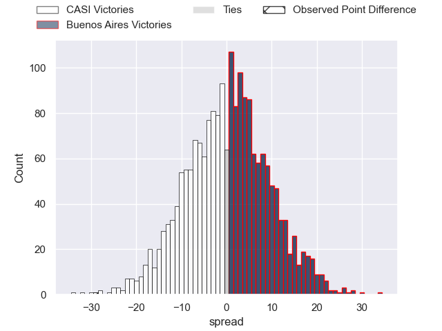
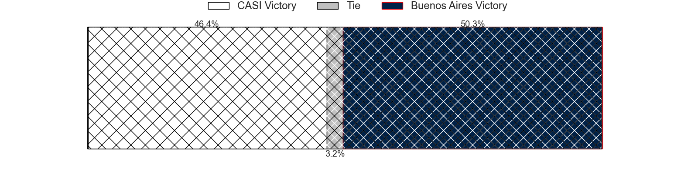

---  
layout: page  
title: CASI at Buenos Aires; 53-24  
date: 2024-07-06 18:00:00 -0500  
categories: "URBA Top 12 2024" match review  
---
# CASI at Buenos Aires; 53-24

# Club Level Predictions

The first set of predictions treats a club as the smallest object, as the club develops its members, organizes a gameplan, and deploys its players as needed for each match. This club model has a prediction of 0.564, which translates to predicting Buenos Aires to win by 2.3.

Our Over/Under is 59.5 - and combined with the spread above, we have a predicted scoreline of 28 to 31

Each club has a rating and a rating deviation (similar to a Glicko rating), and expected performances can be generated. This allows for simulated matches and spreads like the ones below.
## Projected Performances - Club Model

## Projected Spreads - Club Model

## Projected Results - Club Model

# Player Level Predictions

Treating teams instead as an entity made up of the currently active players, I have ratings for each player in an altogether different system. These can be combined to form team ratings once teamsheets are announced, weighting starters a bit higher than the reserves. After the match is played, players can be weighted by their minutes on the field, allowing for an accurate measure of the team's composition. With these compiled team ratings, we can make predictions, measure inaccuracy, and update the individual player ratings.
## Prediction without Player Minutes: Buenos Aires by 0.8

CASI by 2.0 on a neutral pitch

## Projected Performances - Player Model

## Projected Spreads - Player Model

## Projected Results - Player Model

|   Away Minutes | Away Player                |   Away Percentile |   Number |   Home Percentile | Home Player            |   Home Minutes |
|---------------:|:---------------------------|------------------:|---------:|------------------:|:-----------------------|---------------:|
|             82 | Facundo Scaiano            |             59.02 |        1 |             13.12 | Tomas Herrador         |             82 |
|             82 | Juan Torres Obeid          |             87.23 |        2 |             52.89 | Tomas Rosasco          |             82 |
|             82 | Juan Ignacio Nieto Sanchez |             85.65 |        3 |             39.52 | Tomas Gallo            |             82 |
|             82 | Agustin Posleman           |             65.37 |        4 |             49.67 | Francisco Jose Sluga   |             82 |
|             82 | Bautista Belleze           |             68.59 |        5 |             45.03 | Bautista Duranona      |             82 |
|             82 | Eugenio Sartori            |             87.72 |        6 |             19.94 | Simon Mimessi          |             82 |
|             82 | Joaquin Saenz de Miera     |             83.29 |        7 |             44.88 | Matias Espina          |             82 |
|             82 | Luis Briatore              |             70.26 |        8 |             17.37 | Tomas Etcheverry       |             82 |
|             82 | Luca Canzani               |             80.66 |        9 |             29.26 | Mateo Freire           |             82 |
|             82 | Felipe Hileman             |             78.74 |       10 |             28.16 | Tomas Bunge            |             82 |
|             82 | Felipe Probaos             |             41.91 |       11 |             25    | Benjamin Handley       |             82 |
|             82 | Jeronimo Solveyra          |             79.17 |       12 |             46.15 | Agustin Lamensa Sanudo |             82 |
|             82 | Bruno Devoto               |             79.17 |       13 |             41.16 | Ramiro Costa           |             82 |
|             82 | Santiago David             |             82.64 |       14 |             22.91 | Manuel Traverso        |             82 |
|             82 | Juan Akemeier              |             77.91 |       15 |             42.97 | Julian Quetglas Bojar  |             82 |
|              0 | Facundo Andreotti          |            nan    |       16 |             42.4  | Valentino Minoyetti    |              0 |
|              0 | Joaquin Britto             |             82.96 |       17 |            nan    | Maximo Mielgo          |              0 |
|              0 | Hugo Garcia                |            nan    |       18 |             56.41 | Blas Armando Coria     |              0 |
|              0 | Franco Presta              |            nan    |       19 |            nan    | Jaime McGrech          |              0 |
|              0 | Jeronimo Tumbarello        |             74.91 |       20 |             47.7  | Tomas Alvarez Bayon    |              0 |
|              0 | Benjamin Rocca Rivarola    |             38.87 |       21 |             64.13 | Juan Monasterio        |              0 |
|              0 | Tomas Phelan               |            nan    |       22 |            nan    | Francisco Lamensa      |              0 |
|              0 | Tobias Casaurang           |            nan    |       23 |            nan    | Juan Pablo Barzi       |              0 |

