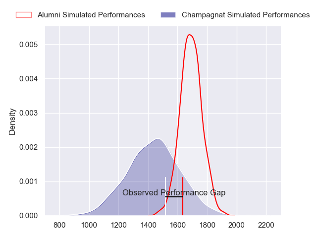
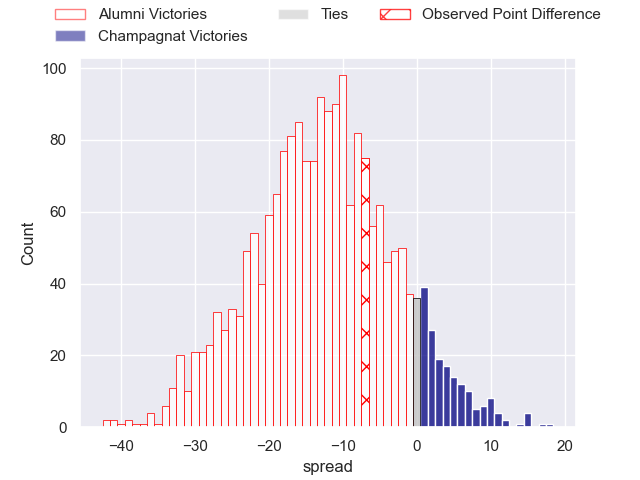
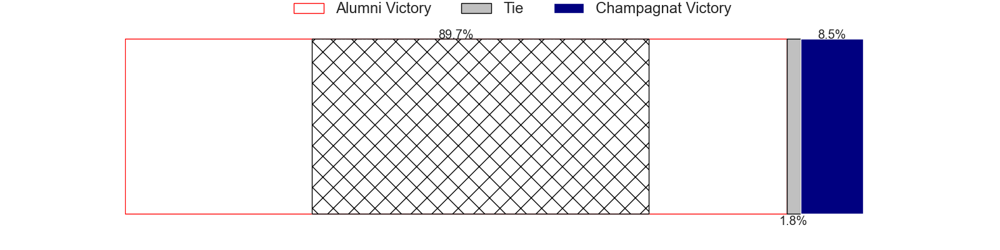
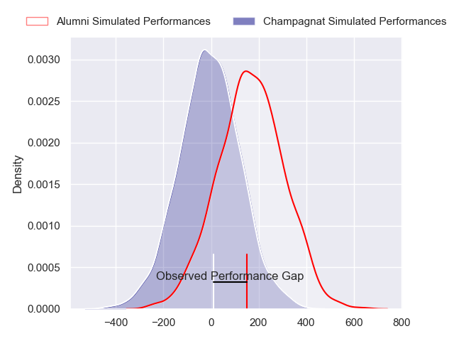
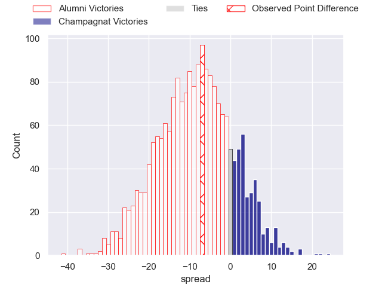
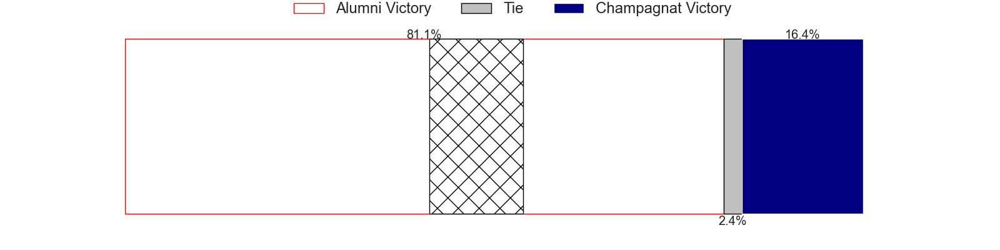

---  
layout: page  
title: Alumni at Champagnat; 25-18  
date: 2024-07-06 18:00:00 -0500  
categories: "URBA Top 12 2024" match review  
---
# Alumni at Champagnat; 25-18

# Club Level Predictions

The first set of predictions treats a club as the smallest object, as the club develops its members, organizes a gameplan, and deploys its players as needed for each match. This club model has a prediction of 0.197, which translates to predicting Alumni to win by 12.5.

Our Over/Under is 51.5 - and combined with the spread above, we have a predicted scoreline of 32 to 20

Each club has a rating and a rating deviation (similar to a Glicko rating), and expected performances can be generated. This allows for simulated matches and spreads like the ones below.
## Projected Performances - Club Model

## Projected Spreads - Club Model

## Projected Results - Club Model

# Player Level Predictions

Treating teams instead as an entity made up of the currently active players, I have ratings for each player in an altogether different system. These can be combined to form team ratings once teamsheets are announced, weighting starters a bit higher than the reserves. After the match is played, players can be weighted by their minutes on the field, allowing for an accurate measure of the team's composition. With these compiled team ratings, we can make predictions, measure inaccuracy, and update the individual player ratings.
## Prediction without Player Minutes: Alumni by 8.8

Alumni by 11.4 on a neutral pitch

## Projected Performances - Player Model

## Projected Spreads - Player Model

## Projected Results - Player Model

|   Away Minutes | Away Player                |   Away Percentile |   Number |   Home Percentile | Home Player         |   Home Minutes |
|---------------:|:---------------------------|------------------:|---------:|------------------:|:--------------------|---------------:|
|             85 | Federico Lucca             |             64.29 |        1 |             25.22 | Tomas Distel        |             85 |
|             85 | Maximo Lamelas             |             45.78 |        2 |             15.32 | Joaquin Guerra      |             85 |
|             85 | Bautista Vidal             |             78.83 |        3 |             19.54 | Marcos Magaro       |             85 |
|             85 | Manuel Mora                |             64.46 |        4 |             11.42 | Inaki Ustariz       |             85 |
|             85 | Santiago Alduncin          |             65.42 |        5 |             26.79 | Tobias Rivas Orozco |             85 |
|             85 | Ignacio Cubilla            |             60.1  |        6 |             13.92 | Matias Alonso Boto  |             85 |
|             85 | Juan Anderson              |             75.05 |        7 |             20.93 | Lucas Moresco       |             85 |
|             85 | Juan Cruz Alvarinas        |             20.28 |        8 |             14.69 | Matias Muniagurria  |             85 |
|             85 | Tomas Passerotti           |             60.41 |        9 |             10.5  | Martin Graciarena   |             85 |
|             85 | Joaquin Luzzi              |             78.35 |       10 |             14.73 | Santos Panela       |             85 |
|             85 | Ramon Fuentes              |             65.17 |       11 |             12.77 | Tomas Baca Castex   |             85 |
|             85 | Franco Battezzati          |             56.64 |       12 |             12.39 | Tobias Imbrosciano  |             85 |
|             85 | Alejo Chavez               |             57.77 |       13 |             31.64 | Marcos Lafuente     |             85 |
|             85 | Franco Sabato              |             43.92 |       14 |             42.59 | Simon Zappella      |             85 |
|             85 | Santiago Pernas            |             48.62 |       15 |             10.37 | Geronimo Tomasella  |             85 |
|              0 | Tomas Baldo                |            nan    |       16 |            nan    | Federico Dominguez  |              0 |
|              0 | Maximo Castillo            |            nan    |       17 |             29.69 | Martin Rinaldelli   |              0 |
|              0 | Ezequiel Oliva             |             23.84 |       18 |             20.14 | Alberto Adissi      |              0 |
|              0 | Federico Canovas           |             29.35 |       19 |             29.99 | Santiago Escuti     |              0 |
|              0 | Nicolas Promanzio          |             45.78 |       20 |             34.95 | Tomas Alonso Boto   |              0 |
|              0 | Santiago Ambroa            |            nan    |       21 |            nan    | Pedro Del Piano     |              0 |
|              0 | Santiago Gonzalez Iglesias |             34.1  |       22 |             16.78 | Tomas Cotter        |              0 |
|              0 | Luca Sabato                |             71.2  |       23 |             18.59 | Facundo Rufino      |              0 |

