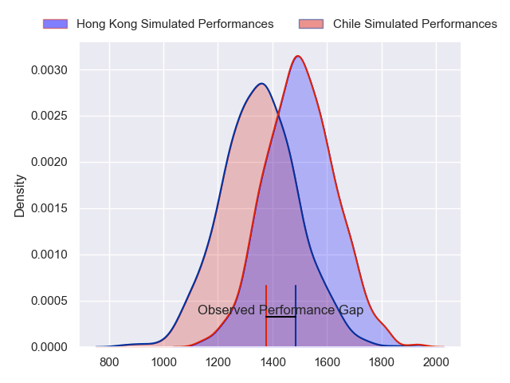
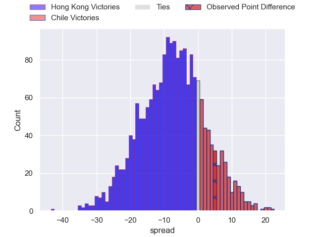
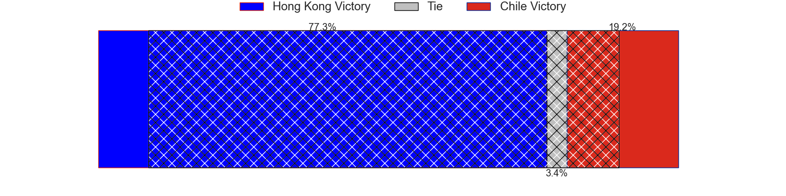
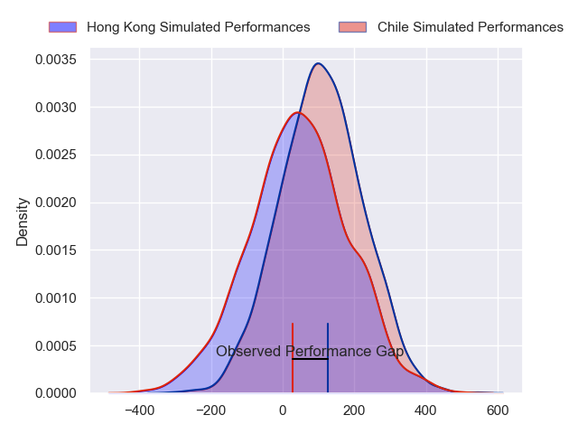
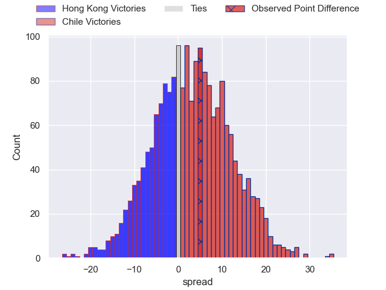
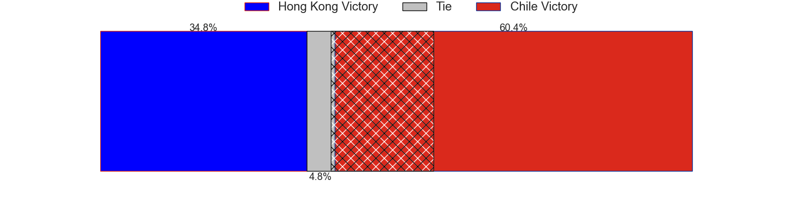

---  
layout: page  
title: Hong Kong at Chile; 17-22  
date: 2024-07-06 18:00:00 -0500  
categories: "Tests Matchs 2023" match review  
---
# Hong Kong at Chile; 17-22

# Club Level Predictions

The first set of predictions treats a club as the smallest object, as the club develops its members, organizes a gameplan, and deploys its players as needed for each match. This club model has a prediction of 0.31, which translates to predicting Hong Kong to win by 7.5.

Our Over/Under is 58.5 - and combined with the spread above, we have a predicted scoreline of 33 to 26

Each club has a rating and a rating deviation (similar to a Glicko rating), and expected performances can be generated. This allows for simulated matches and spreads like the ones below.
## Projected Performances - Club Model

## Projected Spreads - Club Model

## Projected Results - Club Model

# Player Level Predictions

Treating teams instead as an entity made up of the currently active players, I have ratings for each player in an altogether different system. These can be combined to form team ratings once teamsheets are announced, weighting starters a bit higher than the reserves. After the match is played, players can be weighted by their minutes on the field, allowing for an accurate measure of the team's composition. With these compiled team ratings, we can make predictions, measure inaccuracy, and update the individual player ratings.
## Prediction without Player Minutes: Chile by 2.4

Chile by 0.0 on a neutral pitch

## Projected Performances - Player Model

## Projected Spreads - Player Model

## Projected Results - Player Model

|   Away Minutes | Away Player          |   Away Percentile |   Number |   Home Percentile | Home Player             |   Home Minutes |
|---------------:|:---------------------|------------------:|---------:|------------------:|:------------------------|---------------:|
|             80 | Rory Cinnamond       |             42.29 |        1 |             46.97 | Javier Carrasco         |           59   |
|             80 | Calum Scott          |             41.79 |        2 |             76.6  | Diego Escobar           |           39.5 |
|             80 | Calum Scott          |             41.79 |        2 |             76.6  | Diego Escobar           |           27   |
|             80 | Zac Cinnamond        |             12.36 |        3 |             27.01 | Iñaki Gurruchaga        |           62   |
|             80 | Callum McCullough    |             43.52 |        4 |             54.68 | Santiago Pedrero        |           80   |
|             80 | Pat Jenkinson        |             20.62 |        5 |              1.23 | Javier Eissmann         |           54   |
|             80 | Joshua Hrstich       |             40.3  |        6 |              7.94 | Raimundo Martinez       |           64   |
|             80 | James Sawyer         |             40.3  |        7 |             15.24 | Clemente Saavedra       |           80   |
|             80 | Luke van der Smit    |             12.97 |        8 |             27.35 | Alfonso Escobar         |           27   |
|             80 | Luke van der Smit    |             12.97 |        8 |             27.35 | Alfonso Escobar         |           39.5 |
|             80 | Harry Laidler        |             42.98 |        9 |              2.15 | Marcelo Torrealba       |           50   |
|             80 | Matteo Avitabile     |             39.85 |       10 |             45.4  | Tomás Salas             |           80   |
|             80 | Harry Sayers         |             44.05 |       11 |             83.18 | Nicolas Garafulic Schar |           66   |
|             80 | Tom Hill             |              7.39 |       12 |             27.87 | Santiago Videla         |           15   |
|             80 | Nathan de Thierry    |              6.19 |       13 |             46.75 | Domingo Saavedra        |           80   |
|             80 | Sebastian Brien      |             44.05 |       14 |             44.45 | Cristobal Game          |           80   |
|             80 | Matt Worley          |             24.1  |       15 |             41.77 | Luca Strabucchi         |           80   |
|              0 | Alexander Post       |            nan    |       16 |             71.58 | Augusto Bohme           |           26   |
|              0 | Ben Higgins          |            nan    |       17 |             25.17 | Salvador Lues           |           21   |
|              0 | Faizal Solomona      |            nan    |       18 |            nan    | Vittorio Lastra         |           18   |
|              0 | Kyle Sullivan        |            nan    |       19 |             66.07 | Martin Sigren           |           26   |
|              0 | Tyler McNutt         |            nan    |       20 |            nan    | Andres Kuzmanic         |            1   |
|              0 | Pierce McKinlay-West |            nan    |       21 |            nan    | Inti Ubeda              |           16   |
|              0 | Jack Combes          |            nan    |       22 |             34.71 | Benjamin Videla         |           15   |
|              0 | Paul Altier          |            nan    |       23 |            nan    | Clemente Armstrong      |           14   |

