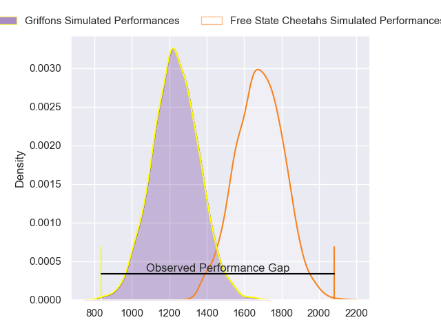
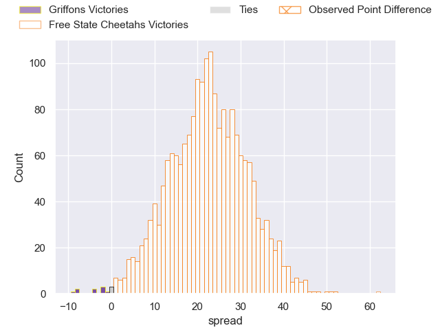
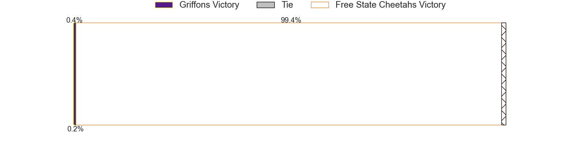
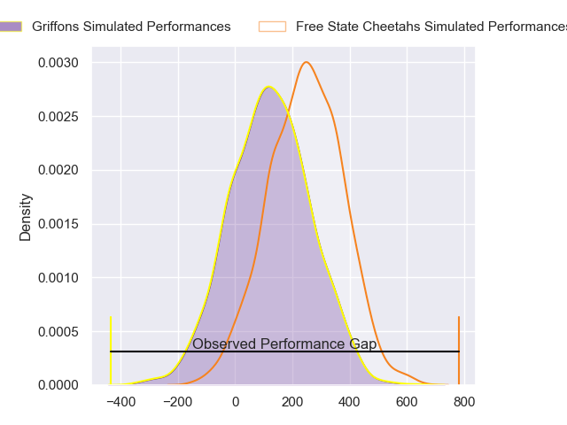
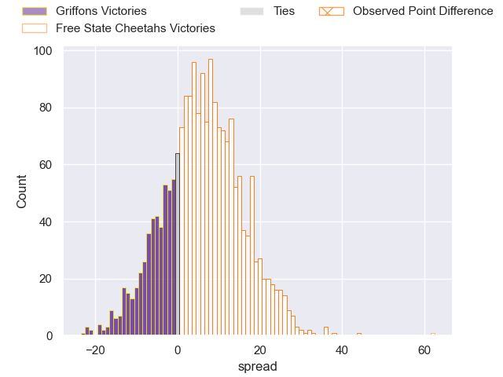
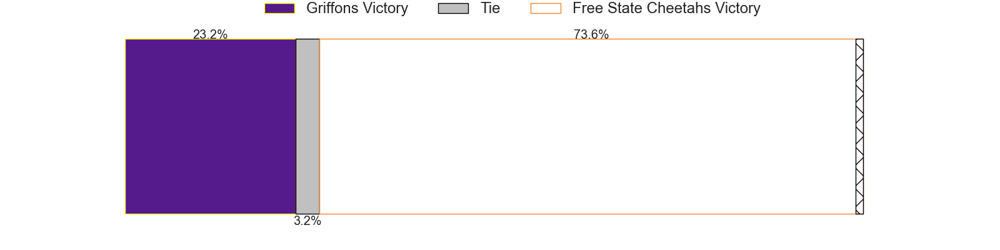

---  
layout: page  
title: Griffons at Free State Cheetahs; 20-82  
date: 2024-07-06 18:00:00 -0500  
categories: "Currie Cup 2024" match review  
---
# Griffons at Free State Cheetahs; 20-82

# Club Level Predictions

The first set of predictions treats a club as the smallest object, as the club develops its members, organizes a gameplan, and deploys its players as needed for each match. This club model has a prediction of 0.923, which translates to predicting Free State Cheetahs to win by 23.1.

Our Over/Under is 69.5 - and combined with the spread above, we have a predicted scoreline of 23 to 46

Each club has a rating and a rating deviation (similar to a Glicko rating), and expected performances can be generated. This allows for simulated matches and spreads like the ones below.
## Projected Performances - Club Model

## Projected Spreads - Club Model

## Projected Results - Club Model

# Player Level Predictions

Treating teams instead as an entity made up of the currently active players, I have ratings for each player in an altogether different system. These can be combined to form team ratings once teamsheets are announced, weighting starters a bit higher than the reserves. After the match is played, players can be weighted by their minutes on the field, allowing for an accurate measure of the team's composition. With these compiled team ratings, we can make predictions, measure inaccuracy, and update the individual player ratings.
## Prediction without Player Minutes: Free State Cheetahs by 6.5

Free State Cheetahs by 3.1 on a neutral pitch

## Projected Performances - Player Model

## Projected Spreads - Player Model

## Projected Results - Player Model

|   Away Minutes | Away Player               |   Away Percentile |   Number |   Home Percentile | Home Player                    |   Home Minutes |
|---------------:|:--------------------------|------------------:|---------:|------------------:|:-------------------------------|---------------:|
|             80 | Xolani Jacobs             |             11.49 |        1 |              9.25 | Schalk Ferreira                |             80 |
|             80 | Chadley Wenn              |             82.14 |        2 |             83.82 | Marko Louis Janse van Rensburg |             80 |
|             80 | Ebune Moango Ngundue      |             26.06 |        3 |             23.13 | Aranos Coetzee                 |             80 |
|             80 | Rian Olivier              |             17.13 |        4 |             31.49 | Mzwanele Zito                  |             80 |
|             80 | Curtley Thomas            |             14.56 |        5 |             80.4  | Victor Sekekete                |             80 |
|             80 | Thato Siward Mavundla     |             51.39 |        6 |             93.32 | Gideon van der Merwe           |             80 |
|             80 | Wikus Nieuwenhuis         |             25.79 |        7 |             30.71 | Aidon Davis                    |             80 |
|             80 | Orateng Koikanyang        |             27.31 |        8 |             61.85 | Jeandre Rudolph                |             80 |
|             80 | Keegan Schaefer           |             29.35 |        9 |             91.87 | Rewan Kruger                   |             80 |
|             80 | Duan Pretorius            |             58.57 |       10 |             57.61 | Ethan SJ Wentzel               |             80 |
|             80 | Gurshwin Wehr             |             29.79 |       11 |             93.52 | Daniel Kasende                 |             80 |
|             80 | Jeandre De Beer           |             19.76 |       12 |             61.99 | Ali Mgijima                    |             80 |
|             80 | Keanu Armandio Vers       |             20.96 |       13 |             81.54 | Munier Hartzenberg             |             80 |
|             80 | Gilroy Philander          |             29.79 |       14 |             55.57 | Sbu Nkosi                      |             80 |
|             80 | Andrew Kota               |             16.13 |       15 |             52.02 | Litha Nkula                    |             80 |
|              0 | Cheslin Arendse           |            nan    |       16 |              3.62 | Cameron Dawson                 |              0 |
|              0 | Mthokozisi Charles Gumede |            nan    |       17 |            nan    | Robert Hunt                    |              0 |
|              0 | Jared Kruger              |            nan    |       18 |            nan    | Marco Jansen van Vuren         |              0 |
|              0 | Buhle Nojekwa             |            nan    |       19 |             18.69 | George Lourens                 |              0 |
|              0 | Joshua Aiden  Paris       |            nan    |       20 |            nan    | Jandre Nel                     |              0 |
|              0 | Robbie Petzer             |            nan    |       21 |            nan    | Vernon Paulo                   |              0 |
|              0 | Mingo Piti                |            nan    |       22 |            nan    | Pierre-Raymond Uys             |              0 |
|              0 | Simon Westraadt           |            nan    |       23 |            nan    | Neels Volschenk                |              0 |

