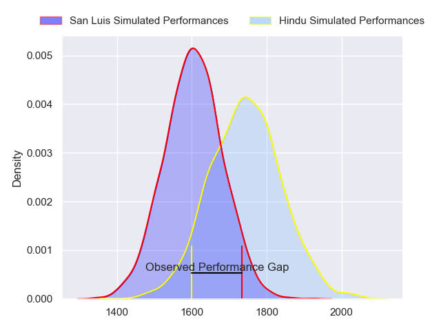
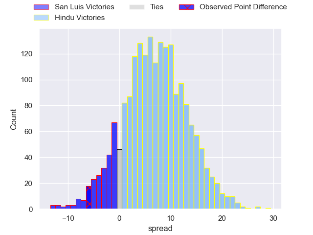
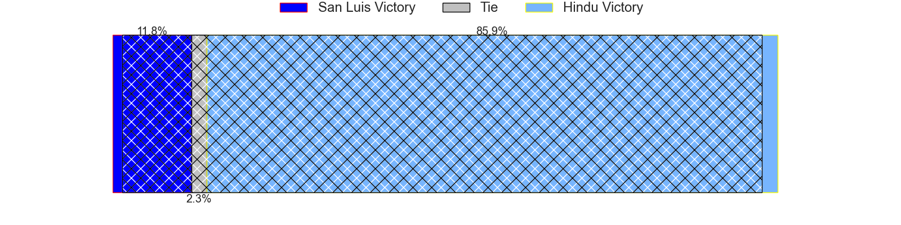
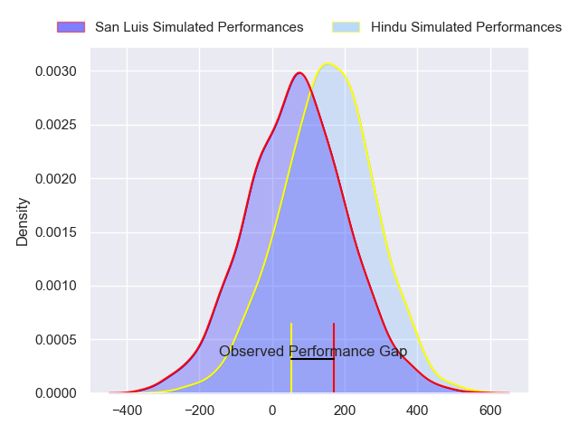
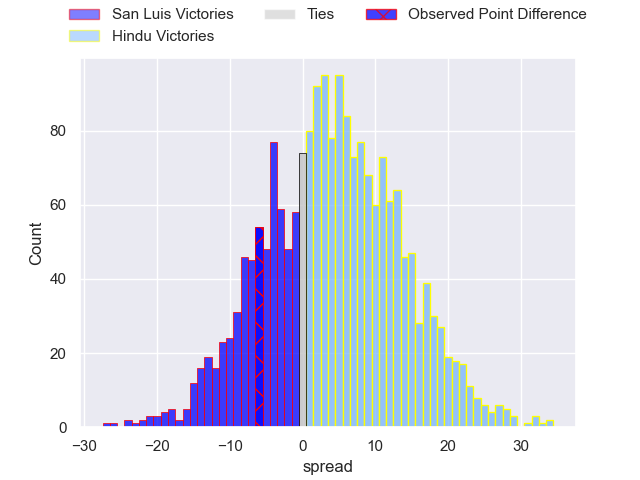
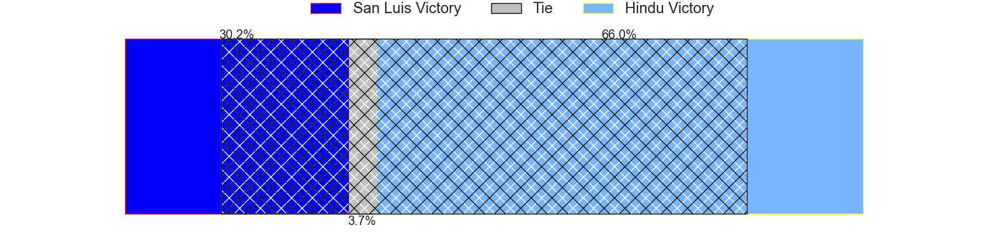

---  
layout: page  
title: San Luis at Hindu; 23-17  
date: 2024-07-06 18:00:00 -0500  
categories: "URBA Top 12 2024" match review  
---
# San Luis at Hindu; 23-17

# Club Level Predictions

The first set of predictions treats a club as the smallest object, as the club develops its members, organizes a gameplan, and deploys its players as needed for each match. This club model has a prediction of 0.687, which translates to predicting Hindu to win by 7.0.

Our Over/Under is 54.5 - and combined with the spread above, we have a predicted scoreline of 24 to 31

Each club has a rating and a rating deviation (similar to a Glicko rating), and expected performances can be generated. This allows for simulated matches and spreads like the ones below.
## Projected Performances - Club Model

## Projected Spreads - Club Model

## Projected Results - Club Model

# Player Level Predictions

Treating teams instead as an entity made up of the currently active players, I have ratings for each player in an altogether different system. These can be combined to form team ratings once teamsheets are announced, weighting starters a bit higher than the reserves. After the match is played, players can be weighted by their minutes on the field, allowing for an accurate measure of the team's composition. With these compiled team ratings, we can make predictions, measure inaccuracy, and update the individual player ratings.
## Prediction without Player Minutes: Hindu by 4.3

Hindu by 0.3 on a neutral pitch

## Projected Performances - Player Model

## Projected Spreads - Player Model

## Projected Results - Player Model

|   Away Minutes | Away Player                |   Away Percentile |   Number |   Home Percentile | Home Player                |   Home Minutes |
|---------------:|:---------------------------|------------------:|---------:|------------------:|:---------------------------|---------------:|
|             80 | Santiago Bonavento         |             42.25 |        1 |             20.65 | Juan Ignacio Martinez Sosa |             80 |
|             80 | Agustin Fitzsimons Herrera |             39.24 |        2 |              8.61 | Agustin Capurro            |             80 |
|             80 | Alexis Uvieda              |             75.13 |        3 |              7.75 | Nicolas Leiva              |             80 |
|             80 | Ramiro Bruni               |             49.31 |        4 |             28.92 | Carlos Repetto             |             80 |
|             80 | Santiago Canal             |             50.91 |        5 |             15.69 | Juan Ignacio Comolli       |             80 |
|             80 | Facundo Alvarez Amado      |             35.77 |        6 |             23.2  | Tomas Scallan              |             80 |
|             80 | Franco Gnecco              |             55.46 |        7 |              8.87 | Santino Amayav             |             80 |
|             80 | Agustin Torello            |             44.06 |        8 |             25.64 | Nicolas Amaya              |             80 |
|             80 | Juan Vaca                  |             65.38 |        9 |             21.73 | Lucas Fernandez Miranda    |             80 |
|             80 | Felipe Campodonico         |             50.89 |       10 |             93.75 | Santiago Fernandez         |             80 |
|             80 | Felipe Crispo              |             67.72 |       11 |             38.3  | Federico Graglia           |             80 |
|             80 | Segundo Fresco             |             58    |       12 |             10.81 | Bautista Farise            |             80 |
|             80 | Benjamin Marban            |             44.71 |       13 |             30.86 | Juan Fernandez Miranda     |             80 |
|             80 | Wilmer Ramirez             |             52.2  |       14 |             32.28 | Alfredo Mayol              |             80 |
|             80 | Valentino Quattrocchi      |             27.65 |       15 |             51.15 | Joaquin Diaz Bonilla       |             80 |
|              0 | Mateo Caffaro              |            nan    |       16 |            nan    | Benjamin Silveyra          |              0 |
|              0 | Alejo Garcia               |             30.46 |       17 |             16.27 | Franco Diviesti            |              0 |
|              0 | Mateo Calistro             |             36.75 |       18 |            nan    | Mariano Leiva              |              0 |
|              0 | Nahuel Curti               |             22.68 |       19 |            nan    | Victor Franco              |              0 |
|              0 | Luka Gullo                 |            nan    |       20 |            nan    | Juan Pacheco               |              0 |
|              0 | Isidro Lazzarini           |             35.71 |       21 |            nan    | Gaspar Jeckeln             |              0 |
|              0 | Santiago Gibert            |            nan    |       22 |            nan    | Pedro Miranda              |              0 |
|              0 | Lautaro Grys Arana         |            nan    |       23 |            nan    | Nicolas Marzano            |              0 |

