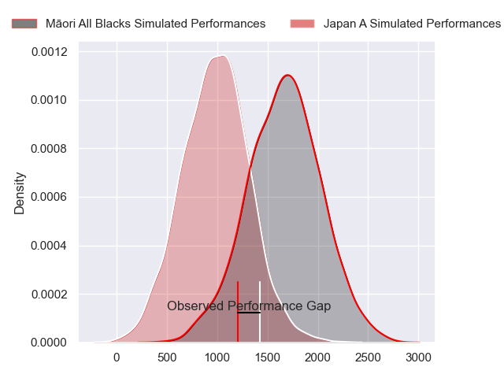
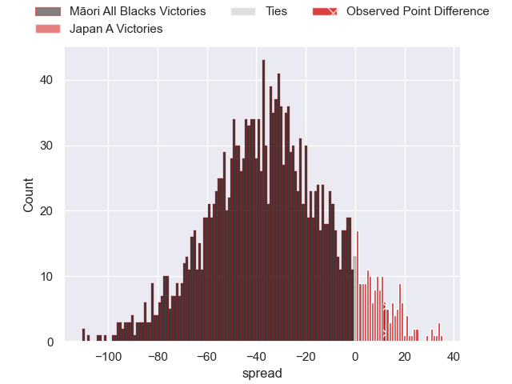
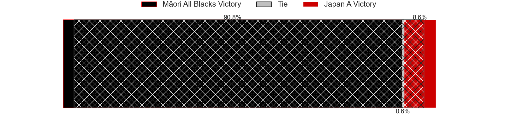
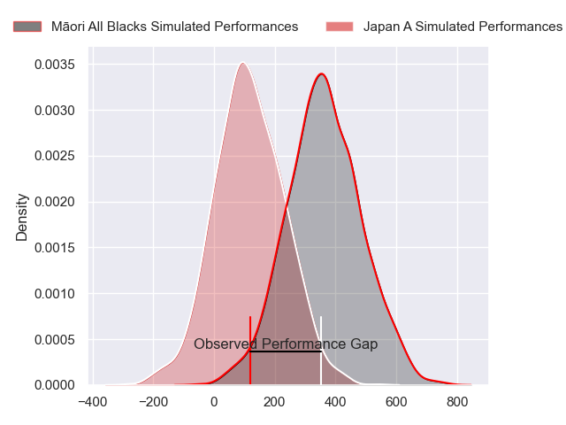
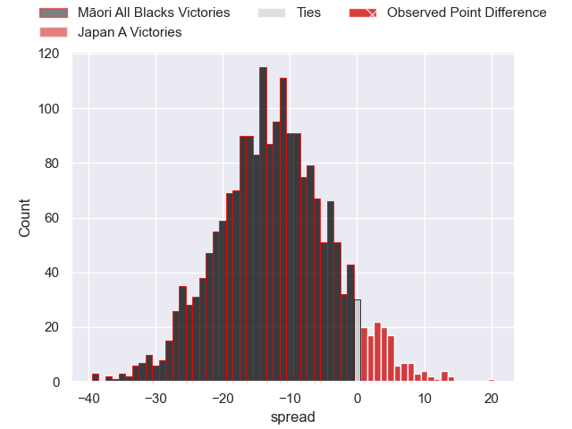
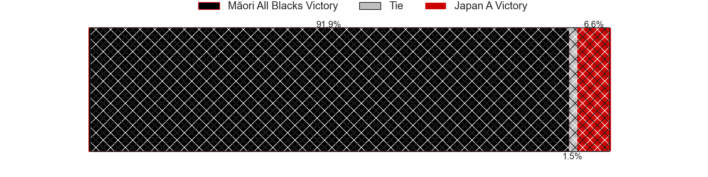

---  
layout: page  
title: Maori All Blacks at Japan A; 14-26  
date: 2024-07-06 18:00:00 -0500  
categories: "Tests Matchs 2023" match review  
---
# Maori All Blacks at Japan A; 14-26

# Club Level Predictions

The first set of predictions treats a club as the smallest object, as the club develops its members, organizes a gameplan, and deploys its players as needed for each match. This club model has a prediction of 0.081, which translates to predicting Māori All Blacks to win by 32.5.

Our Over/Under is 52.5 - and combined with the spread above, we have a predicted scoreline of 42 to 10

Each club has a rating and a rating deviation (similar to a Glicko rating), and expected performances can be generated. This allows for simulated matches and spreads like the ones below.
## Projected Performances - Club Model

## Projected Spreads - Club Model

## Projected Results - Club Model

# Player Level Predictions

Treating teams instead as an entity made up of the currently active players, I have ratings for each player in an altogether different system. These can be combined to form team ratings once teamsheets are announced, weighting starters a bit higher than the reserves. After the match is played, players can be weighted by their minutes on the field, allowing for an accurate measure of the team's composition. With these compiled team ratings, we can make predictions, measure inaccuracy, and update the individual player ratings.
## Prediction without Player Minutes: Māori All Blacks by 12.7

Māori All Blacks by 14.9 on a neutral pitch

## Projected Performances - Player Model

## Projected Spreads - Player Model

## Projected Results - Player Model

|   Away Minutes | Away Player            |   Away Percentile |   Number |   Home Percentile | Home Player        |   Home Minutes |
|---------------:|:-----------------------|------------------:|---------:|------------------:|:-------------------|---------------:|
|             54 | Pouri Rakete-Stones    |             84.04 |        1 |             63.24 | Shogo Miura        |             58 |
|             54 | Kurt Eklund            |             91.03 |        2 |             56.38 | Mamoru Harada      |             65 |
|             69 | Marcel Renata          |             84.11 |        3 |             53.95 | Keijiro Tamefusa   |             43 |
|             80 | Isaia Walker-Leawere   |             96.5  |        4 |             65    | Eishin Kuwano      |             80 |
|             57 | Laghlan McWhannell     |             96.88 |        5 |             57.33 | Naohiro Kotaki     |             46 |
|             67 | TK Howden              |              0.55 |        6 |             81.81 | Kanji Shimokawa    |             80 |
|             80 | Billy Harmon           |             78.21 |        7 |             60.85 | Kai Yamamoto       |             70 |
|             78 | Cameron Suafoa         |             50.1  |        8 |             71.06 | Amanaki Saumaki    |             50 |
|             54 | Sam Nock               |             78.68 |        9 |             14.88 | Naoto Saito        |             58 |
|             40 | Rivez Reihana          |             45.59 |       10 |             58.05 | Takuya Yamasawa    |             69 |
|             59 | Bailyn Sullivan        |             25.18 |       11 |             53.73 | Koga Nezuka        |             80 |
|             80 | Quinn Tupaea           |             91.81 |       12 |             52.35 | Samisoni Tua       |             80 |
|             80 | Rameka Poihipi         |             78.82 |       13 |             76.52 | Tomoki Osada       |             80 |
|             80 | Joshua Moorby          |             87.09 |       14 |             65.27 | Taichi Takahashi   |             61 |
|             80 | Cole Forbes            |             69.88 |       15 |             51.81 | Yoshitaka Yazaki   |             80 |
|             26 | Tyrone Thompson        |             70.21 |       16 |            nan    | Kenji Sato         |             15 |
|             26 | Ollie Norris           |             90.18 |       17 |            nan    | Takato Okabe       |             22 |
|             13 | Benet Kumeroa          |            nan    |       18 |             38.14 | Shuhei Takeuchi    |             47 |
|             23 | Max Hicks              |             23.64 |       19 |             34.15 | Junior Waqa        |             34 |
|             13 | Nikora Broughton       |             29.14 |       20 |             33.15 | Tiennan Costley    |             30 |
|             26 | Te Toiroa Tahuriorangi |             71.9  |       21 |             38.84 | Taiki Koyama       |             22 |
|             40 | Taha Kemara            |              7.66 |       22 |            nan    | Harumichi Tatekawa |             11 |
|             21 | Corey Evans            |             78.92 |       23 |            nan    | Nik Mccurran       |             19 |

