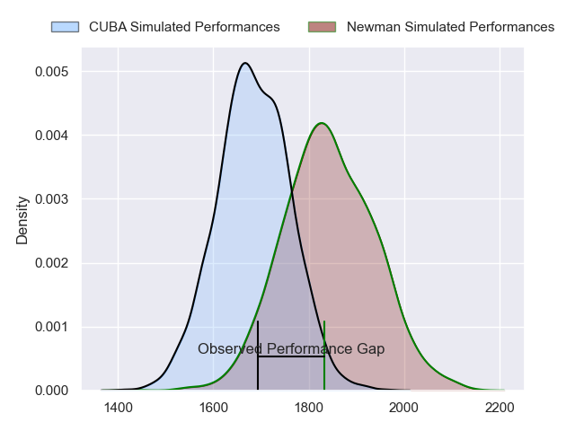
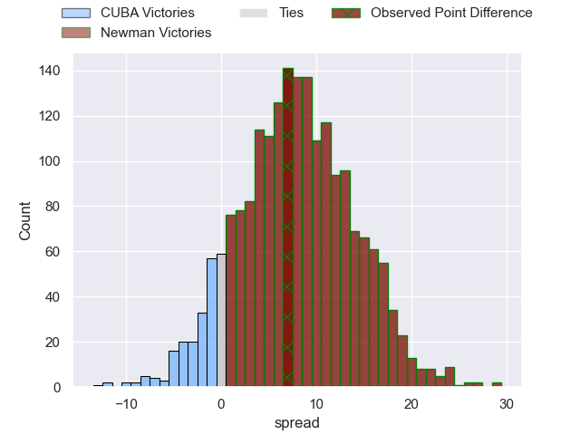
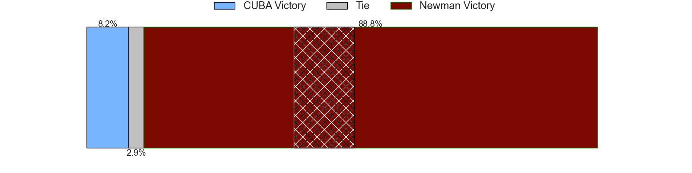
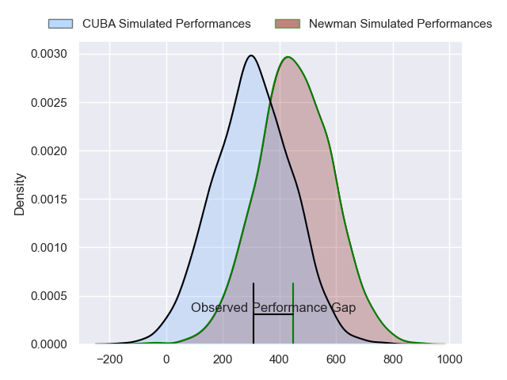
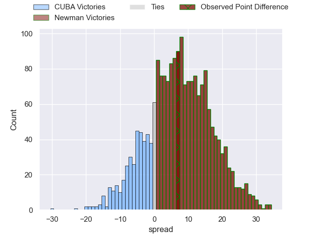
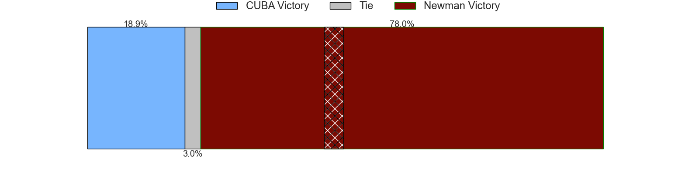

---  
layout: page  
title: CUBA at Newman; 27-34  
date: 2024-07-06 18:00:00 -0500  
categories: "URBA Top 12 2024" match review  
---
# CUBA at Newman; 27-34

# Club Level Predictions

The first set of predictions treats a club as the smallest object, as the club develops its members, organizes a gameplan, and deploys its players as needed for each match. This club model has a prediction of 0.712, which translates to predicting Newman to win by 8.1.

Our Over/Under is 53.5 - and combined with the spread above, we have a predicted scoreline of 23 to 31

Each club has a rating and a rating deviation (similar to a Glicko rating), and expected performances can be generated. This allows for simulated matches and spreads like the ones below.
## Projected Performances - Club Model

## Projected Spreads - Club Model

## Projected Results - Club Model

# Player Level Predictions

Treating teams instead as an entity made up of the currently active players, I have ratings for each player in an altogether different system. These can be combined to form team ratings once teamsheets are announced, weighting starters a bit higher than the reserves. After the match is played, players can be weighted by their minutes on the field, allowing for an accurate measure of the team's composition. With these compiled team ratings, we can make predictions, measure inaccuracy, and update the individual player ratings.
## Prediction without Player Minutes: Newman by 9.1

Newman by 4.9 on a neutral pitch

## Projected Performances - Player Model

## Projected Spreads - Player Model

## Projected Results - Player Model

|   Away Minutes | Away Player           |   Away Percentile |   Number |   Home Percentile | Home Player               |   Home Minutes |
|---------------:|:----------------------|------------------:|---------:|------------------:|:--------------------------|---------------:|
|             80 | Facundo Aguirre       |             86.57 |        1 |             90.33 | Miguel Prince             |             80 |
|             80 | Enrique Devoto        |             90.73 |        2 |             91.79 | Marcelo Brandi            |             80 |
|             80 | Estanislao Carullo    |             81.66 |        3 |             44.67 | Manuel Lozano             |             80 |
|             80 | Santiago Uriarte      |             84.86 |        4 |             92.9  | Pablo Cardinal            |             80 |
|             80 | Santiago Landau       |             84.67 |        5 |             78.43 | Alejandro Urtubey         |             80 |
|             80 | Lucas Campion         |             51.99 |        6 |             84.67 | Joaquin de la Vega        |             80 |
|             80 | Segundo Pisani        |             81.35 |        7 |             84.58 | Mateo Montoya             |             80 |
|             80 | Benito Ortiz de Rozas |             80.04 |        8 |             91.42 | Rodrigo Diaz de Vivar     |             80 |
|             80 | Simon Benitez Cruz    |             47.93 |        9 |             92.56 | Lucas Marguery            |             80 |
|             80 | Valentin Mastroizi    |             85.82 |       10 |             87.74 | Gonzalo Guiterrez Taboada |             80 |
|             80 | Bautista Casaurang    |             89.27 |       11 |             46.27 | Jeronimo Ulloa            |             80 |
|             80 | Felipe Perdomo        |             78.72 |       12 |             62.14 | Benjamin Lanfranco        |             80 |
|             80 | Felipe de la Vega     |             70.43 |       13 |             74.13 | Silvestre Casa            |             80 |
|             80 | Marcos Moroni         |             85.27 |       14 |             95.09 | Justo Ortiz Basualdo      |             80 |
|             80 | Marcos Elicagaray     |             58.84 |       15 |             88.96 | Santiago Marolda          |             80 |
|              0 | Esteban Iribarne      |            nan    |       16 |             58.21 | Rodrigo Pueyrredon        |              0 |
|              0 | Francisco Garoby      |             79.89 |       17 |            nan    | Isidro Bosch              |              0 |
|              0 | Hilario Casado        |            nan    |       18 |             94.4  | Bautista Bosch            |              0 |
|              0 | Tomas Anderlic        |             21.28 |       19 |             90.16 | Jeronimo Ureta            |              0 |
|              0 | Francisco Sied        |             83.19 |       20 |            nan    | Faustino Santarelli       |              0 |
|              0 | Rafael Iriarte        |             74.71 |       21 |             30.41 | Felix Branca              |              0 |
|              0 | Pedro Mesones         |             45.55 |       22 |            nan    | Carlos Mendez Beherty     |              0 |
|              0 | Jeronimo Conte Grand  |            nan    |       23 |             88.11 | Tomas Keena               |              0 |

