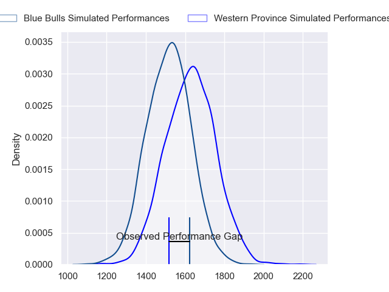
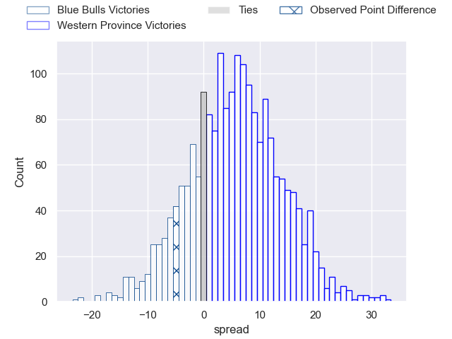
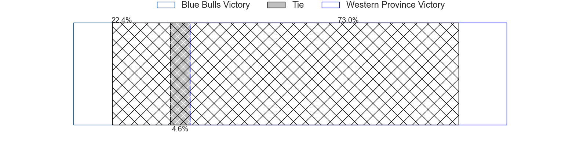
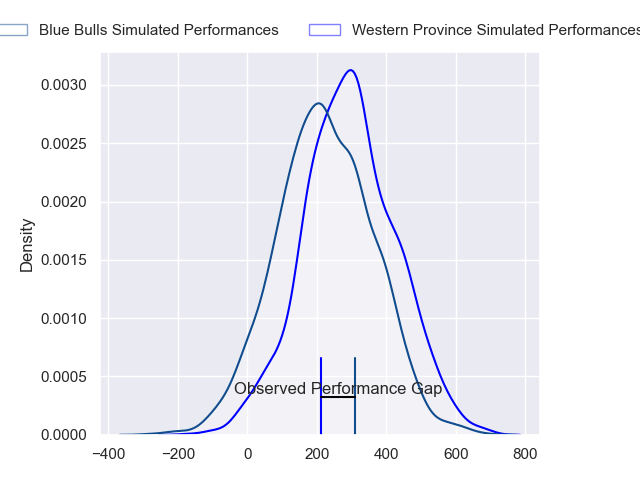
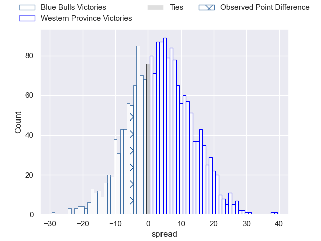
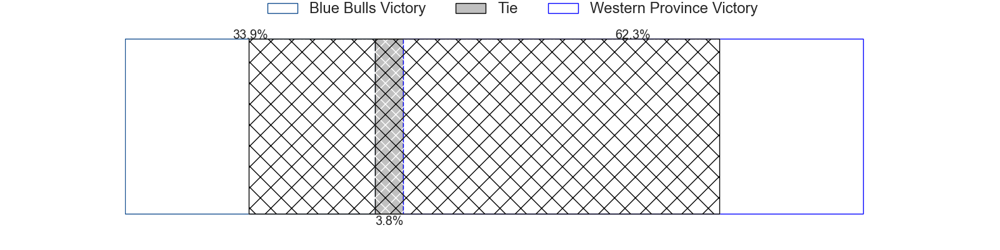

---  
layout: page  
title: Blue Bulls at Western Province; 30-25  
date: 2024-07-07 18:00:00 -0500  
categories: "Currie Cup 2024" match review  
---
# Blue Bulls at Western Province; 30-25

# Club Level Predictions

The first set of predictions treats a club as the smallest object, as the club develops its members, organizes a gameplan, and deploys its players as needed for each match. This club model has a prediction of 0.652, which translates to predicting Western Province to win by 5.8.

Our Over/Under is 48.5 - and combined with the spread above, we have a predicted scoreline of 22 to 27

Each club has a rating and a rating deviation (similar to a Glicko rating), and expected performances can be generated. This allows for simulated matches and spreads like the ones below.
## Projected Performances - Club Model

## Projected Spreads - Club Model

## Projected Results - Club Model

# Player Level Predictions

Treating teams instead as an entity made up of the currently active players, I have ratings for each player in an altogether different system. These can be combined to form team ratings once teamsheets are announced, weighting starters a bit higher than the reserves. After the match is played, players can be weighted by their minutes on the field, allowing for an accurate measure of the team's composition. With these compiled team ratings, we can make predictions, measure inaccuracy, and update the individual player ratings.
## Prediction without Player Minutes: Western Province by 4.9

Western Province by 1.5 on a neutral pitch

## Projected Performances - Player Model

## Projected Spreads - Player Model

## Projected Results - Player Model

|   Away Minutes | Away Player           |   Away Percentile |   Number |   Home Percentile | Home Player               |   Home Minutes |
|---------------:|:----------------------|------------------:|---------:|------------------:|:--------------------------|---------------:|
|             80 | Dylan Smith           |             88.51 |        1 |              9.1  | Lizo Gqoboka              |             80 |
|             80 | Joe van Zyl           |             25.5  |        2 |              6.41 | JJ Kotze                  |             80 |
|             80 | Francois Klopper      |              8.4  |        3 |             40.48 | Sazi Sandi                |             80 |
|             80 | Cobus Wiese           |             94.86 |        4 |             78.12 | Adre Smith                |             80 |
|             80 | Sintu Manjezi         |             77.93 |        5 |             19.22 | Gary Porter               |             80 |
|             80 | Corne Beets           |             57.7  |        6 |             24.58 | CJ Velleman               |             80 |
|             80 | Jannes Kirsten        |             90.72 |        7 |             15.86 | Connor Evans              |             80 |
|             80 | Nizaam Carr           |             91.77 |        8 |             75.9  | Willie Engelbrecht        |             80 |
|             80 | Bernard van der Linde |             26.7  |        9 |             11.11 | Imad Khan                 |             80 |
|             80 | Jaco van der Walt     |             79.38 |       10 |             43.16 | Jurie Matthee             |             80 |
|             80 | Devon Williams        |             88.23 |       11 |             95.89 | Angelo Davids             |             80 |
|             80 | Chris Smit            |             55.17 |       12 |             64.39 | Jean-Luc du Plessis       |             80 |
|             80 | Aphiwe Dyantyi        |              1.91 |       13 |             83.05 | Wandisile Simelane        |             80 |
|             80 | Sergeal Petersen      |             93.8  |       14 |             96.99 | Courtnall Skosan          |             80 |
|             80 | Boeta Chamberlain     |             56.25 |       15 |             55.04 | Luke John Burger          |             80 |
|              0 | Zak Burger            |             88.39 |       16 |            nan    | Paul De Villiers          |              0 |
|              0 | Juann Else            |            nan    |       17 |            nan    | Moegamat Labib Kannemeyer |              0 |
|              0 | Celimpilo Gumede      |             57.88 |       18 |            nan    | Damian Markus             |              0 |
|              0 | Cornal Hendricks      |              3.71 |       19 |            nan    | Vernon Matongo            |              0 |
|              0 | Ntuthuko Mchunu       |             47.96 |       20 |            nan    | Louw Nel                  |              0 |
|              0 | Merwe Olivier         |            nan    |       21 |             97.71 | Scarra Ntubeni            |              0 |
|              0 | Chris Smith           |             64.55 |       22 |             21.03 | Hendre Stassen            |              0 |
|              0 | Alulutho Tshakweni    |            nan    |       23 |            nan    | Corne Weilbach            |              0 |

