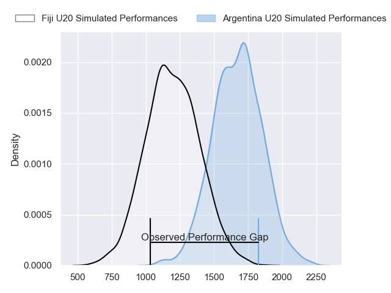
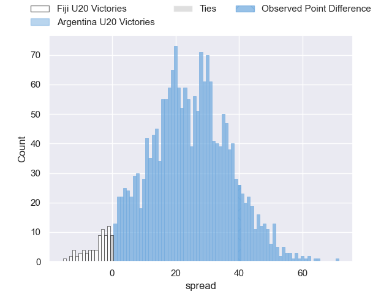
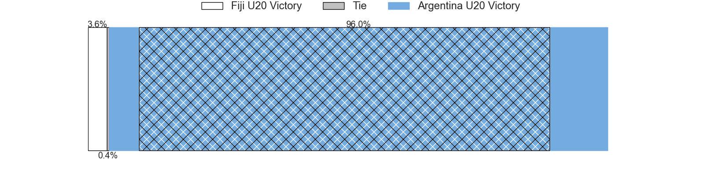
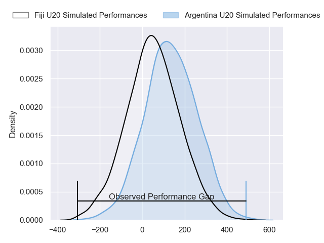
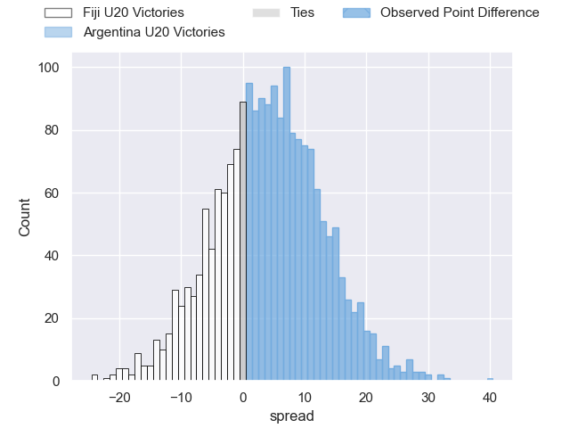
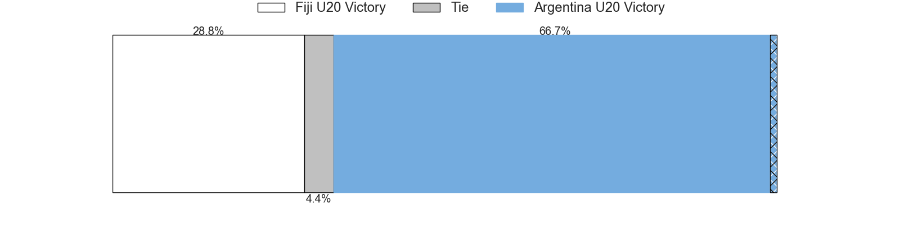

---  
layout: page  
title: Fiji U20 at Argentina U20; 12-52  
date: 2024-07-09 18:00:00 -0500  
categories: "World Rugby U20 Championship 2024" match review  
---
# Fiji U20 at Argentina U20; 12-52

# Club Level Predictions

The first set of predictions treats a club as the smallest object, as the club develops its members, organizes a gameplan, and deploys its players as needed for each match. This club model has a prediction of 0.911, which translates to predicting Argentina U20 to win by 23.9.

Our Over/Under is 62.5 - and combined with the spread above, we have a predicted scoreline of 19 to 43

Each club has a rating and a rating deviation (similar to a Glicko rating), and expected performances can be generated. This allows for simulated matches and spreads like the ones below.
## Projected Performances - Club Model

## Projected Spreads - Club Model

## Projected Results - Club Model

# Player Level Predictions

Treating teams instead as an entity made up of the currently active players, I have ratings for each player in an altogether different system. These can be combined to form team ratings once teamsheets are announced, weighting starters a bit higher than the reserves. After the match is played, players can be weighted by their minutes on the field, allowing for an accurate measure of the team's composition. With these compiled team ratings, we can make predictions, measure inaccuracy, and update the individual player ratings.
## Prediction without Player Minutes: Argentina U20 by 4.3

Argentina U20 by 2.1 on a neutral pitch

## Projected Performances - Player Model

## Projected Spreads - Player Model

## Projected Results - Player Model

|   Away Minutes | Away Player              |   Away Percentile |   Number |   Home Percentile | Home Player                  |   Home Minutes |
|---------------:|:-------------------------|------------------:|---------:|------------------:|:-----------------------------|---------------:|
|             45 | Mataiasi Tuisireli       |             16.78 |        1 |             81.46 | Diego Correa                 |             78 |
|             64 | Moses Armstrong-Ravula   |             10.74 |        2 |             55.22 | Juan Manuel Vivas            |             40 |
|             45 | Luke Nasau               |             20    |        3 |             71.34 | Emir Gael Galvan             |             51 |
|             80 | Nalani May               |             12.48 |        4 |             94.09 | Efrain Elias                 |             80 |
|             59 | Iliesa Erenavula         |             13.98 |        5 |             74.95 | Felipe Bruno                 |             59 |
|             80 | Ebernezer Tuidraki       |              9.53 |        6 |             62.35 | Agustin Sarelli              |             63 |
|             63 | Ratu Nemani Kurucake     |             19.33 |        7 |             78.45 | Juan Penoucos                |             80 |
|             67 | Simon Koroiyadi          |             11.51 |        8 |             54.56 | Ignacio Torrado              |             80 |
|             64 | Samuela Ledua            |             24.18 |        9 |             54.11 | Genaro Podesta               |             66 |
|             80 | Isikeli Rabitu           |             13.12 |       10 |             57.03 | Facundo Rodriguez            |             80 |
|             59 | Waisake Salabiau         |             17.2  |       11 |             74.88 | Felipe Ledesma               |             80 |
|             80 | Sivaniolo Kalaveti       |             10.17 |       12 |             66.6  | Tomas Medina                 |             80 |
|             80 | Harry Valevatu           |             17.35 |       13 |             81.06 | Faustino Sánchez Valarolo    |             59 |
|             80 | Aisea Nawai              |             13.74 |       14 |             75.52 | Franco Rossetto              |             80 |
|             80 | Isikeli Basiyalo         |              9.18 |       15 |             58.88 | Benjamin Elizalde            |             66 |
|             35 | Breyton Legge            |             27.24 |       16 |             78.67 | Juan Ignacio Greising Revol  |             40 |
|             35 | Elroy Macomber           |             33.03 |       17 |            nan    | Marcos Camerlinckx           |             29 |
|             21 | Malakai Masi             |             31.52 |       18 |             60.84 | Santino Di Lucca             |             21 |
|             21 | Bogidrau Kikau           |             21.29 |       19 |             66.07 | Juan Pedro Bernasconi        |             21 |
|             17 | Sakenasa Senivono Nalasi |            nan    |       20 |             74.75 | Santos Fernandez De Oliveira |             17 |
|             16 | Iowane Vakadrigi         |            nan    |       21 |             73.89 | Timoteo Silva                |             14 |
|             16 | Pauliasi Korobiau        |            nan    |       22 |             65.79 | Jeronimo Llorens Villanueva  |             14 |
|             13 | Josua Gonewai            |            nan    |       23 |            nan    | Renzo Martin                 |              2 |

