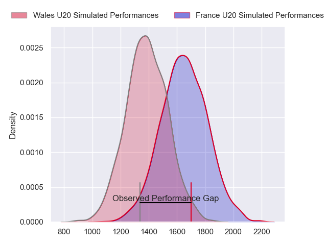
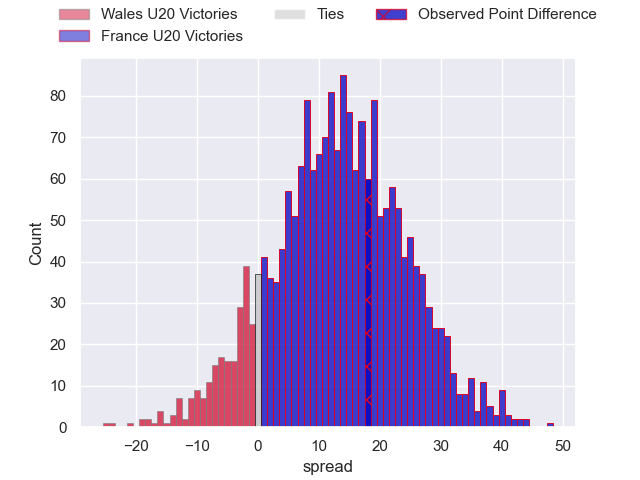
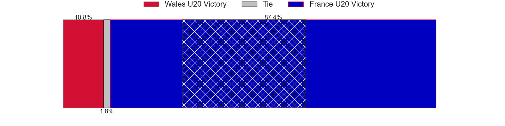
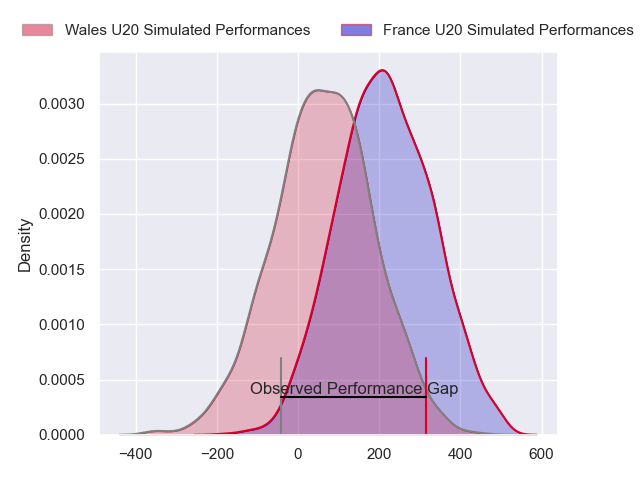
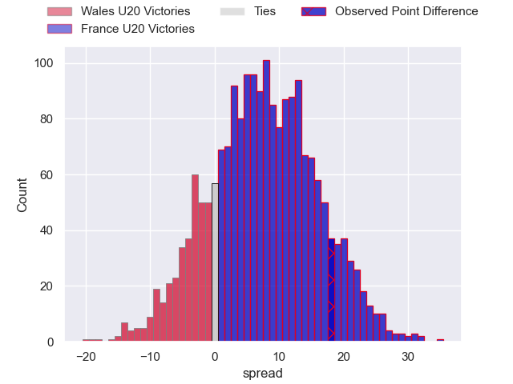
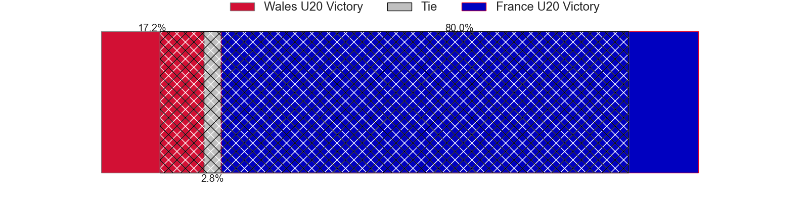

---  
layout: page  
title: Wales U20 at France U20; 11-29  
date: 2024-07-09 18:00:00 -0500  
categories: "World Rugby U20 Championship 2024" match review  
---
# Wales U20 at France U20; 11-29

# Club Level Predictions

The first set of predictions treats a club as the smallest object, as the club develops its members, organizes a gameplan, and deploys its players as needed for each match. This club model has a prediction of 0.801, which translates to predicting France U20 to win by 13.4.

Our Over/Under is 63.5 - and combined with the spread above, we have a predicted scoreline of 25 to 38

Each club has a rating and a rating deviation (similar to a Glicko rating), and expected performances can be generated. This allows for simulated matches and spreads like the ones below.
## Projected Performances - Club Model

## Projected Spreads - Club Model

## Projected Results - Club Model

# Player Level Predictions

Treating teams instead as an entity made up of the currently active players, I have ratings for each player in an altogether different system. These can be combined to form team ratings once teamsheets are announced, weighting starters a bit higher than the reserves. After the match is played, players can be weighted by their minutes on the field, allowing for an accurate measure of the team's composition. With these compiled team ratings, we can make predictions, measure inaccuracy, and update the individual player ratings.
## Prediction without Player Minutes: France U20 by 8.0

France U20 by 5.7 on a neutral pitch

## Projected Performances - Player Model

## Projected Spreads - Player Model

## Projected Results - Player Model

|   Away Minutes | Away Player     |   Away Percentile |   Number |   Home Percentile | Home Player            |   Home Minutes |
|---------------:|:----------------|------------------:|---------:|------------------:|:-----------------------|---------------:|
|             46 | Josh Morse      |             27.66 |        1 |             67.28 | Samuel Jean-Christophe |             70 |
|             53 | Isaac Young     |             30.26 |        2 |             62.33 | Thomas Lacombre        |             52 |
|             58 | Sam Scott       |             36.4  |        3 |             59.77 | Thomas Duchene         |             45 |
|             80 | Jonny Green     |              9    |        4 |             86.04 | Charly Gambini         |             80 |
|             46 | Osian Thomas    |             36.74 |        5 |             63.36 | Corentin Mezou         |             62 |
|             80 | Ryan Woodman    |             30.43 |        6 |             75.58 | Joe Quere Karaba       |             52 |
|             53 | Lucas De la Rua |             19.8  |        7 |             59.85 | Sialevailea Tolofua    |             80 |
|             80 | Morgan Morse    |             58.33 |        8 |             84.72 | Mathis Castro          |             46 |
|             46 | Ieuan Davies    |             37.17 |        9 |             62.5  | Thomas Souverbie       |             80 |
|             46 | Harri Ford      |             46.2  |       10 |             82.89 | Hugo Reus              |             69 |
|             80 | Aidan Boschoff  |             27.64 |       11 |             64.36 | Hoani Bosmorin         |             80 |
|             80 | Steffan Emanuel |             46.17 |       12 |             79.1  | Robin Taccola          |             80 |
|             80 | Louie Hennessey |             30.25 |       13 |             72.54 | Fabien Brau-Boirie     |             80 |
|             80 | Macs Page       |             25.07 |       14 |             68.09 | Maxence Biasotto       |             80 |
|             80 | Matty Young     |             47.21 |       15 |             82.07 | Mathis Ferté           |             53 |
|             34 | Jordan Morris   |             44.67 |       16 |            nan    | Thomas Marceline       |             35 |
|             34 | Nick Thomas     |             56.98 |       17 |             51.25 | Alexis Caumel          |             34 |
|             34 | Harri Wilde     |             36.5  |       18 |            nan    | Mathys Lotrian         |             28 |
|             34 | Rhodri Lewis    |             52.96 |       19 |             68.36 | Geoffrey Malaterre     |             28 |
|              9 | Ioan Emanuel    |             58.24 |       20 |             82.87 | Axel Desperes          |             27 |
|             27 | Owen Conquer    |             55.36 |       21 |             63.26 | Antonin Corso          |             18 |
|             22 | Kian Hire       |             53.87 |       22 |             74.01 | Leo Carbonneau         |             11 |
|             18 | Elijah Evans    |             55.12 |       23 |             68.35 | Lino Julien            |             10 |

