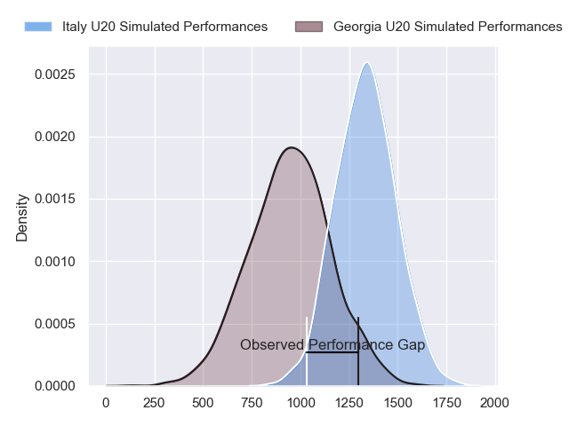
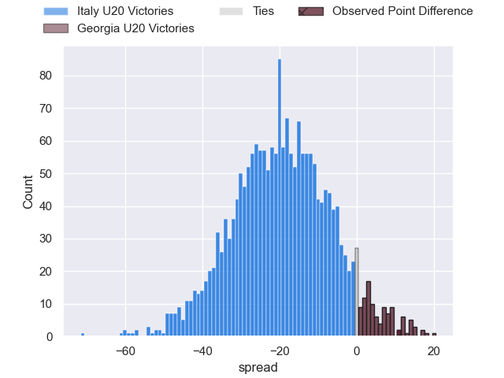
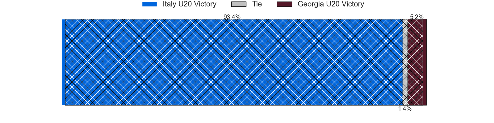
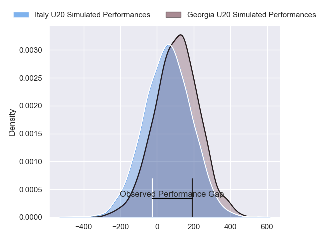
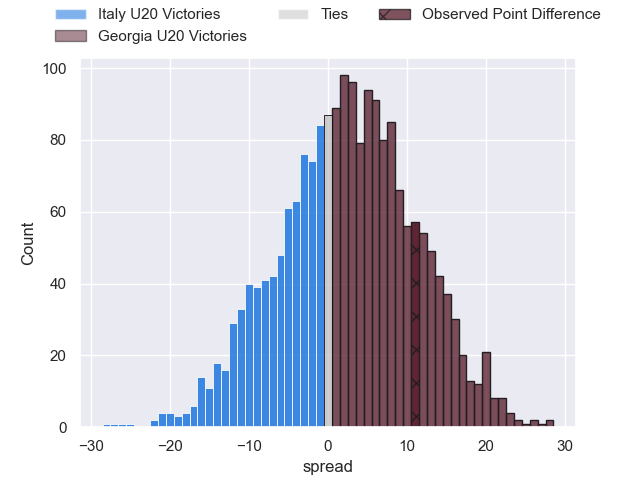

---  
layout: page  
title: Italy U20 at Georgia U20; 17-28  
date: 2024-07-09 18:00:00 -0500  
categories: "World Rugby U20 Championship 2024" match review  
---
# Italy U20 at Georgia U20; 17-28

# Club Level Predictions

The first set of predictions treats a club as the smallest object, as the club develops its members, organizes a gameplan, and deploys its players as needed for each match. This club model has a prediction of 0.119, which translates to predicting Italy U20 to win by 19.3.

Our Over/Under is 52.5 - and combined with the spread above, we have a predicted scoreline of 36 to 17

Each club has a rating and a rating deviation (similar to a Glicko rating), and expected performances can be generated. This allows for simulated matches and spreads like the ones below.
## Projected Performances - Club Model

## Projected Spreads - Club Model

## Projected Results - Club Model

# Player Level Predictions

Treating teams instead as an entity made up of the currently active players, I have ratings for each player in an altogether different system. These can be combined to form team ratings once teamsheets are announced, weighting starters a bit higher than the reserves. After the match is played, players can be weighted by their minutes on the field, allowing for an accurate measure of the team's composition. With these compiled team ratings, we can make predictions, measure inaccuracy, and update the individual player ratings.
## Prediction without Player Minutes: Georgia U20 by 3.0

Georgia U20 by 0.8 on a neutral pitch

## Projected Performances - Player Model

## Projected Spreads - Player Model

## Projected Results - Player Model

|   Away Minutes | Away Player         |   Away Percentile |   Number |   Home Percentile | Home Player           |   Home Minutes |
|---------------:|:--------------------|------------------:|---------:|------------------:|:----------------------|---------------:|
|             17 | Sergio Pellicciolli |             42.07 |        1 |             49.35 | Luka Ungiadze         |             51 |
|             67 | Nicholas Gasperini  |             22.24 |        2 |             47.2  | Mikheil Khakubia      |             51 |
|             70 | Federico Pisani     |             55.33 |        3 |             45.67 | Davit Mtchedlidze     |             66 |
|             54 | Samuele Mirenzi     |             57.88 |        4 |             43.15 | Davit Lagvilava       |             80 |
|             80 | Piero Gritti        |             66.7  |        5 |             58.91 | Temur Tsulukidze      |             76 |
|             67 | Giacomo Milano      |             45.98 |        6 |             49.4  | Tornike Ganiashvili   |             80 |
|             45 | Luca Bellucci       |             40.06 |        7 |             41.07 | Andro Dvali           |             80 |
|             80 | Jacopo Botturi      |             32.14 |        8 |             43.25 | Nika Lomidze          |             57 |
|             63 | Lorenzo Casilio     |             55.43 |        9 |             60.36 | Alexandre Jigauri     |             80 |
|             80 | Simone Brisighella  |             53.99 |       10 |             45.25 | Luka Tsirekidze       |             80 |
|              5 | Lorenzo Elettri     |             41.77 |       11 |             38.32 | Otani Metreveli       |             80 |
|             80 | Patrick De Villiers |             43.07 |       12 |             37.79 | Giorgi Khaindrava     |             70 |
|             80 | Nicola Bozzo        |             46.26 |       13 |             42.27 | Luka Kobauri          |             80 |
|             80 | Federico Zanandrea  |             26.32 |       14 |             59.24 | Luka Keshelava        |             80 |
|             80 | Mirko Belloni       |             40.12 |       15 |             48.1  | Luka Takaishvili      |             62 |
|             75 | Marco Scalabrini    |             29.94 |       16 |            nan    | Luka Kotorashvili     |             29 |
|             63 | Davide Ascari       |             37.93 |       17 |             31.47 | Tamaz Tchamiashvili   |             29 |
|             35 | Nelson Casartelli   |             56.43 |       18 |            nan    | Shota Kheladze        |             23 |
|             26 | Tommaso Redondi     |            nan    |       19 |             32.85 | Tarieli Burtikashvili |             18 |
|             17 | Mattia Jimenez      |             30.59 |       20 |            nan    | Davit Kuntelia        |             14 |
|             13 | Valerio Siciliano   |             64.45 |       21 |            nan    | Nuzgari Kevkhishvili  |             10 |
|             13 | Mattia Midena       |             25.89 |       22 |             30.02 | Murtazi Tskhadadze    |              4 |
|             10 | Francesco Gentile   |            nan    |       23 |            nan    | nan                   |            nan |

