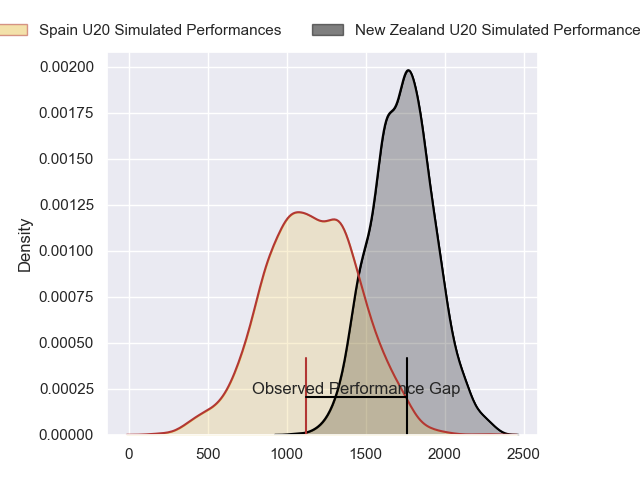
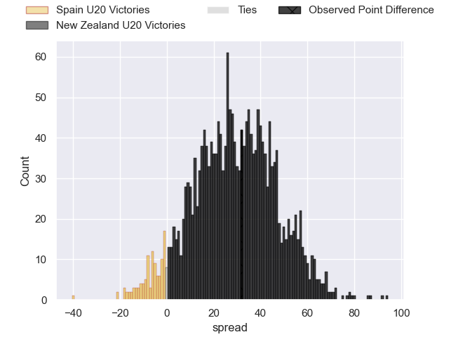
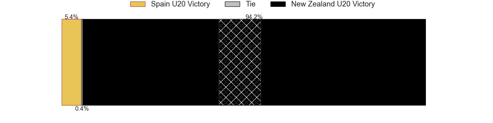
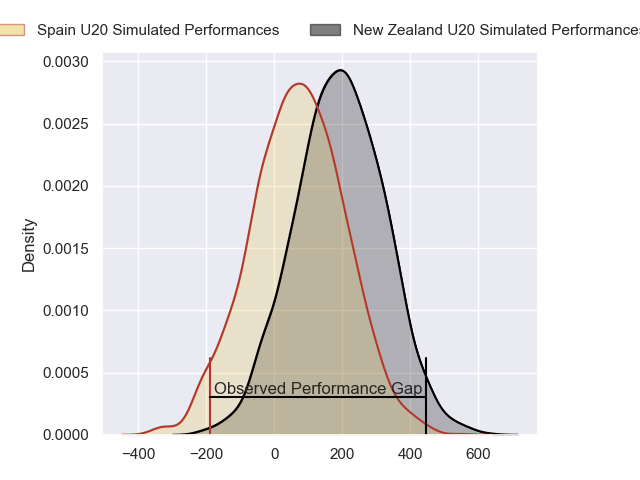
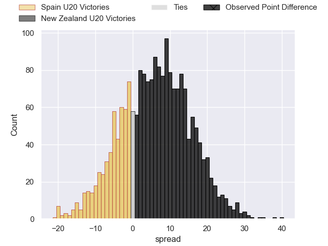
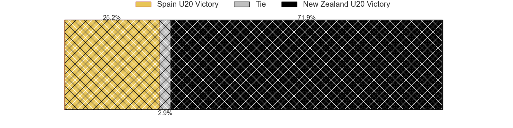

---  
layout: page  
title: Spain U20 at New Zealand U20; 13-45  
date: 2024-07-09 18:00:00 -0500  
categories: "World Rugby U20 Championship 2024" match review  
---
# Spain U20 at New Zealand U20; 13-45

# Club Level Predictions

The first set of predictions treats a club as the smallest object, as the club develops its members, organizes a gameplan, and deploys its players as needed for each match. This club model has a prediction of 0.92, which translates to predicting New Zealand U20 to win by 29.1.

Our Over/Under is 57.5 - and combined with the spread above, we have a predicted scoreline of 14 to 43

Each club has a rating and a rating deviation (similar to a Glicko rating), and expected performances can be generated. This allows for simulated matches and spreads like the ones below.
## Projected Performances - Club Model

## Projected Spreads - Club Model

## Projected Results - Club Model

# Player Level Predictions

Treating teams instead as an entity made up of the currently active players, I have ratings for each player in an altogether different system. These can be combined to form team ratings once teamsheets are announced, weighting starters a bit higher than the reserves. After the match is played, players can be weighted by their minutes on the field, allowing for an accurate measure of the team's composition. With these compiled team ratings, we can make predictions, measure inaccuracy, and update the individual player ratings.
## Prediction without Player Minutes: New Zealand U20 by 6.5

New Zealand U20 by 4.3 on a neutral pitch

## Projected Performances - Player Model

## Projected Spreads - Player Model

## Projected Results - Player Model

|   Away Minutes | Away Player                      |   Away Percentile |   Number |   Home Percentile | Home Player        |   Home Minutes |
|---------------:|:---------------------------------|------------------:|---------:|------------------:|:-------------------|---------------:|
|             80 | Alberto Gomez                    |             17.65 |        1 |             63.39 | Senio Sanele       |             80 |
|             80 | Pau Massoni Salado               |             26.75 |        2 |             66.11 | A-One Lolofie      |             80 |
|             80 | Guido Reyes Rendon               |             14.58 |        3 |             72.83 | Joshua Smith       |             80 |
|             80 | Martin Serrano                   |             20.25 |        4 |             73.42 | Tom Allen          |             80 |
|             80 | Antonio Gamez                    |             30.65 |        5 |             65.66 | Cameron Christie   |             80 |
|             80 | Victor Emmanuel Ofojetu Osayande |             26.55 |        6 |             65.1  | Andrew Smith       |             80 |
|             80 | Daniel Velasco                   |             26.55 |        7 |             69.16 | Matt Lowe          |             80 |
|             80 | Valentino Rizzo                  |             20.16 |        8 |             59.08 | Mosese Bason       |             80 |
|             80 | Javier Lopez de Haro             |             16.69 |        9 |             61.16 | Ben O'Donovan      |             80 |
|             80 | Gonzalo Otamendi                 |              6.51 |       10 |             59.39 | Cooper Grant       |             80 |
|             80 | Roberto Ponce                    |             22.36 |       11 |             66.64 | Frank Vaenuku      |             80 |
|             80 | Yago Fernandez Vilar             |             20.68 |       12 |             89.21 | Mark Tele'a        |             80 |
|             80 | Unax Zuriarrain                  |             21.58 |       13 |             71.83 | Xavier TIto-Harris |             80 |
|             80 | Javier Guillermo                 |             17.36 |       14 |             61.73 | King Maxwell       |             80 |
|             80 | Gabriel Rocaries                 |              7.23 |       15 |             58.43 | Isaac Hutchinson   |             80 |

