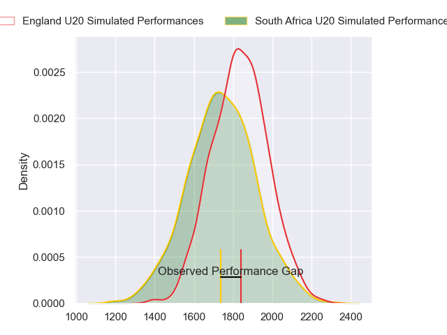
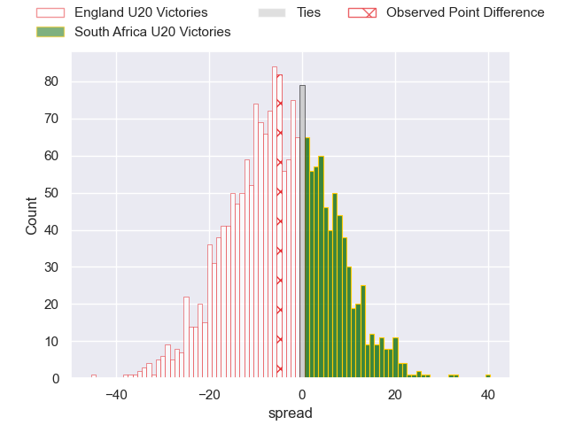
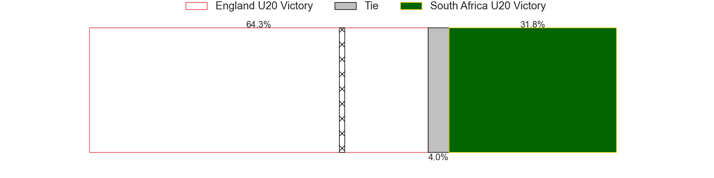
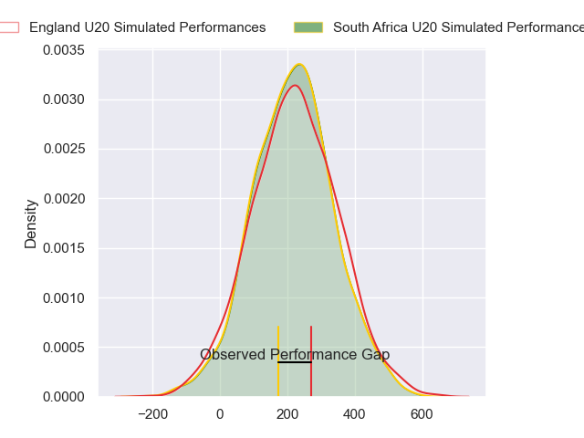
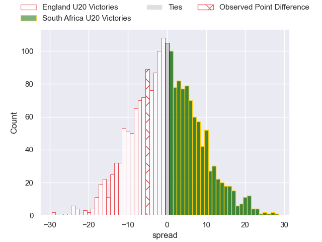

---  
layout: page  
title: England U20 at South Africa U20; 17-12  
date: 2024-07-09 18:00:00 -0500  
categories: "World Rugby U20 Championship 2024" match review  
---
# England U20 at South Africa U20; 17-12

# Club Level Predictions

The first set of predictions treats a club as the smallest object, as the club develops its members, organizes a gameplan, and deploys its players as needed for each match. This club model has a prediction of 0.374, which translates to predicting England U20 to win by 4.9.

Our Over/Under is 56.5 - and combined with the spread above, we have a predicted scoreline of 31 to 26

Each club has a rating and a rating deviation (similar to a Glicko rating), and expected performances can be generated. This allows for simulated matches and spreads like the ones below.
## Projected Performances - Club Model

## Projected Spreads - Club Model

## Projected Results - Club Model

# Player Level Predictions

Treating teams instead as an entity made up of the currently active players, I have ratings for each player in an altogether different system. These can be combined to form team ratings once teamsheets are announced, weighting starters a bit higher than the reserves. After the match is played, players can be weighted by their minutes on the field, allowing for an accurate measure of the team's composition. With these compiled team ratings, we can make predictions, measure inaccuracy, and update the individual player ratings.
## Prediction without Player Minutes: South Africa U20 by 0.3

England U20 by 1.9 on a neutral pitch

## Projected Performances - Player Model

## Projected Spreads - Player Model

## Projected Results - Player Model

|   Away Minutes | Away Player          |   Away Percentile |   Number |   Home Percentile | Home Player               |   Home Minutes |
|---------------:|:---------------------|------------------:|---------:|------------------:|:--------------------------|---------------:|
|             80 | Asher Opoku-Fordjour |             92.03 |        1 |             31.97 | Casper Badenhorst         |             75 |
|             77 | Craig Wright         |             72.33 |        2 |             33.23 | Luca Bakkes               |             46 |
|             63 | Billy Sela           |             65.53 |        3 |             18.68 | Zachary Porthen           |             75 |
|             54 | Joe Bailey           |             65.74 |        4 |             19.74 | Thomas Dyer               |             80 |
|             80 | Junior Kpoku         |             75.88 |        5 |             39.11 | JF van Heerden            |             80 |
|             80 | Finn Carnduff        |             91.42 |        6 |             36.25 | Sibabalwe Mahashe         |             62 |
|             63 | Henry Pollock        |             81.83 |        7 |             26.94 | Batho Hlekani             |             62 |
|             80 | Nathan Michelow      |             73.36 |        8 |             46.32 | Thabang Mphafi            |             43 |
|             66 | Ollie Allan          |             70.38 |        9 |             21.44 | Asad Moos                 |             80 |
|             80 | Benjamin Coen        |             66.79 |       10 |             26    | Liam Koen                 |             70 |
|             80 | Arron Reed           |             91.97 |       11 |             22.81 | Lili Bester               |             80 |
|             73 | Sean Kerr            |             64.19 |       12 |             54.9  | Joshua Boulle             |             80 |
|             80 | Ben Waghorn          |             42.73 |       13 |             23.24 | Jurenzo Julius            |             80 |
|             63 | Jack Bracken         |             63.57 |       14 |             48.15 | Likhona Finca             |             70 |
|             80 | Ben Redshaw          |             90.26 |       15 |             33.79 | Michail Damon             |             80 |
|             26 | Olamide Sodeke       |             54.56 |       16 |             36.38 | Tiaan Jacobs              |             37 |
|             17 | Ioan Jones           |             68.97 |       17 |             23.91 | Ethan Bester              |             34 |
|             17 | Afolabi Fasogbon     |             64.69 |       18 |            nan    | Divan Fuller              |             18 |
|             17 | Kane James           |             61.62 |       19 |             22.53 | Jaco Grobbelaar           |             18 |
|             14 | Lucas Friday         |            nan    |       20 |             36.05 | Tylor Sefoor              |             10 |
|              7 | Angus Hall           |             61.33 |       21 |             13.06 | Philip-Albert Van Niekerk |             10 |
|              3 | James Isaacs         |             63.76 |       22 |            nan    | Liyema Ntshanga           |              5 |
|            nan | nan                  |            nan    |       23 |            nan    | Herman Lubbe              |              5 |

