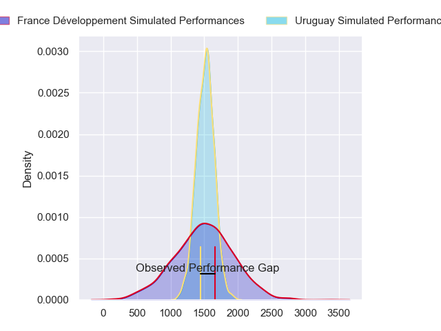
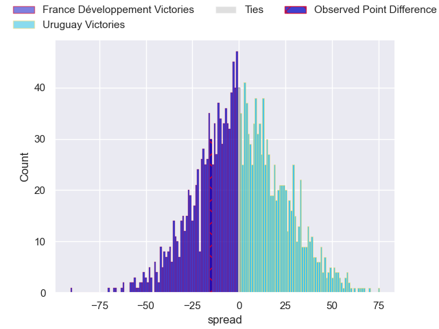
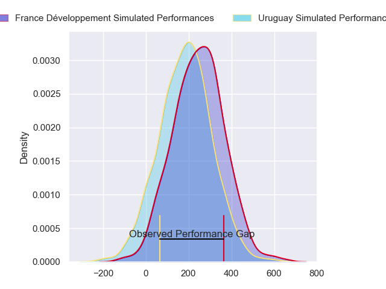
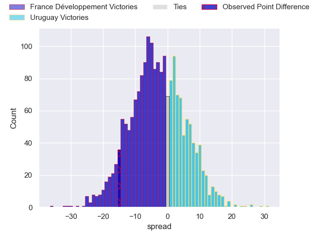
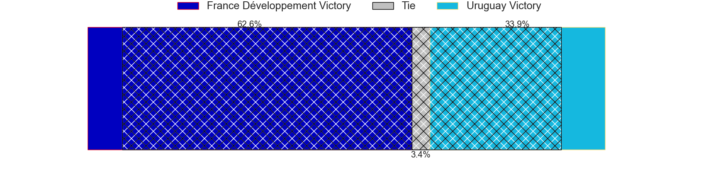

---  
layout: page  
title: France Developpement at Uruguay; 43-28  
date: 2024-07-10 18:00:00 -0500  
categories: "Tests Matchs 2023" match review  
---
# France Developpement at Uruguay; 43-28

# Club Level Predictions

The first set of predictions treats a club as the smallest object, as the club develops its members, organizes a gameplan, and deploys its players as needed for each match. This club model has a prediction of 0.514, which translates to predicting Uruguay to win by 0.8.

Our Over/Under is 47.5 - and combined with the spread above, we have a predicted scoreline of 23 to 24

Each club has a rating and a rating deviation (similar to a Glicko rating), and expected performances can be generated. This allows for simulated matches and spreads like the ones below.
## Projected Performances - Club Model

## Projected Spreads - Club Model

## Projected Results - Club Model

# Player Level Predictions

Treating teams instead as an entity made up of the currently active players, I have ratings for each player in an altogether different system. These can be combined to form team ratings once teamsheets are announced, weighting starters a bit higher than the reserves. After the match is played, players can be weighted by their minutes on the field, allowing for an accurate measure of the team's composition. With these compiled team ratings, we can make predictions, measure inaccuracy, and update the individual player ratings.
## Prediction without Player Minutes: France Développement by 3.3

France Développement by 5.7 on a neutral pitch

## Projected Performances - Player Model

## Projected Spreads - Player Model

## Projected Results - Player Model

|   Away Minutes | Away Player          |   Away Percentile |   Number |   Home Percentile | Home Player            |   Home Minutes |
|---------------:|:---------------------|------------------:|---------:|------------------:|:-----------------------|---------------:|
|             80 | Giorgi Beria         |             81.55 |        1 |              8.28 | Mateo Sanguinetti      |             49 |
|             50 | Teddy Baubigny       |             78.5  |        2 |             21.2  | German Kessler         |             57 |
|             16 | Thomas Laclayat      |             76.31 |        3 |             39.56 | Reinaldo Piussi        |             61 |
|             59 | Pierre-Henri Azagoh  |             76.07 |        4 |             74.12 | Felipe Aliaga          |             75 |
|             80 | Florent Vanverberghe |             76.54 |        5 |              3.07 | Manuel Leindekar       |             80 |
|             80 | Ibrahim Diallo       |             33.86 |        6 |             84.23 | Manuel Ardao           |             80 |
|             80 | Romain Briatte       |             60.89 |        7 |             49.45 | Santiago Civetta       |             57 |
|             50 | Killian Tixeront     |             67.79 |        8 |             34.59 | Manuel Diana           |             49 |
|             50 | Baptiste Couilloud   |             95.25 |        9 |             56.3  | Santiago Arata         |             26 |
|             54 | Leo Berdeu           |             81.97 |       10 |             65.28 | Felipe Etcheverry      |             80 |
|             80 | Joris Jurand         |             89.27 |       11 |             28.94 | Bautista Basso         |             80 |
|             80 | Leon Darricarrere    |             88.33 |       12 |              8.51 | Andres Vilaseca        |             80 |
|             80 | Arthur Vincent       |             63.7  |       13 |             56.38 | Felipe Arcos Perez     |             80 |
|             64 | Jules Favre          |             87.92 |       14 |             35.53 | Mateo Viñals Moratorio |             80 |
|             80 | Lucas Dubois         |             83.4  |       15 |             44.27 | Baltazar Amaya         |             80 |
|             30 | Janick Tarrit        |             30.83 |       16 |             93.38 | Guillermo Pujadas      |             23 |
|             21 | Sebastien Taofifenua |             17.16 |       17 |             91.04 | Ignacio Peculo         |             31 |
|             43 | Demba Bamba          |             93.62 |       18 |             69.55 | Diego Arbelo           |             19 |
|             21 | Posolo Tuilagi       |             20.86 |       19 |             13.97 | Ignacio Dotti Uria     |              5 |
|             30 | Yann Peysson         |             75.55 |       20 |             69.74 | Lucas Bianchi          |             31 |
|             30 | Baptiste Jauneau     |             73.65 |       21 |             69.28 | Carlos Deus            |             23 |
|             26 | Joris Segonds        |             77.42 |       22 |             31.75 | Tomas Inciarte         |             54 |
|             16 | Nathanael Hulleu     |             80.61 |       23 |            nan    | Ignacio Alvarez        |              0 |
|            nan | nan                  |            nan    |       24 |             40.85 |                        |              0 |

