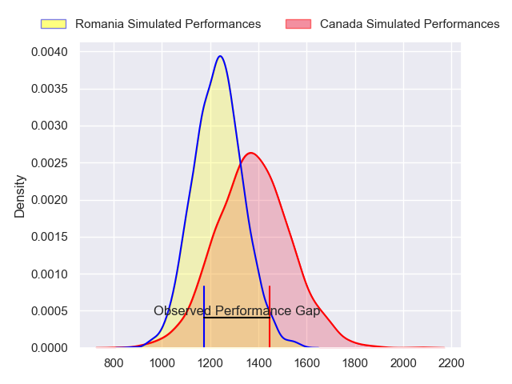
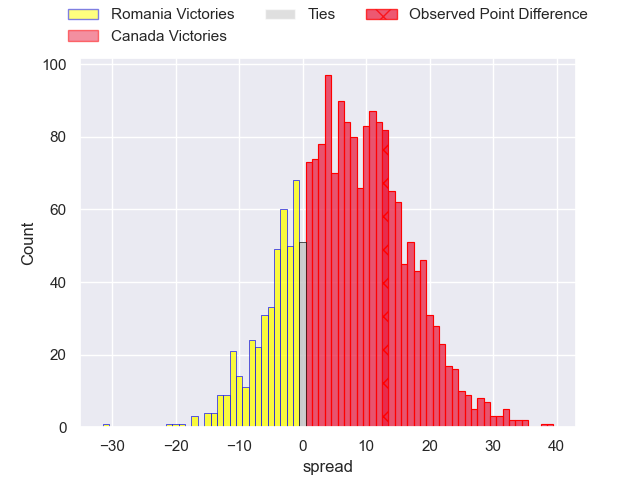
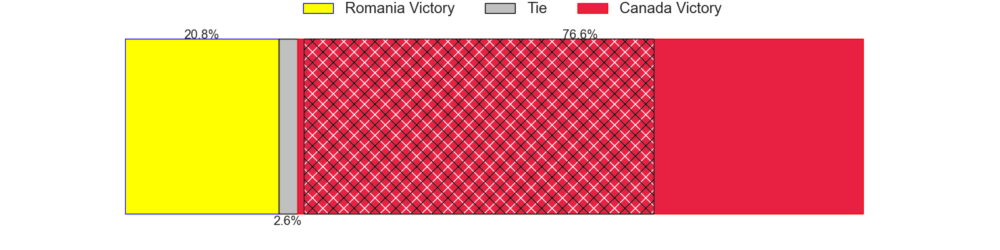
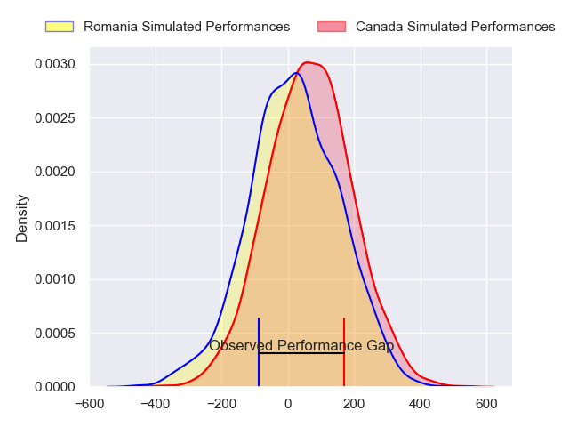
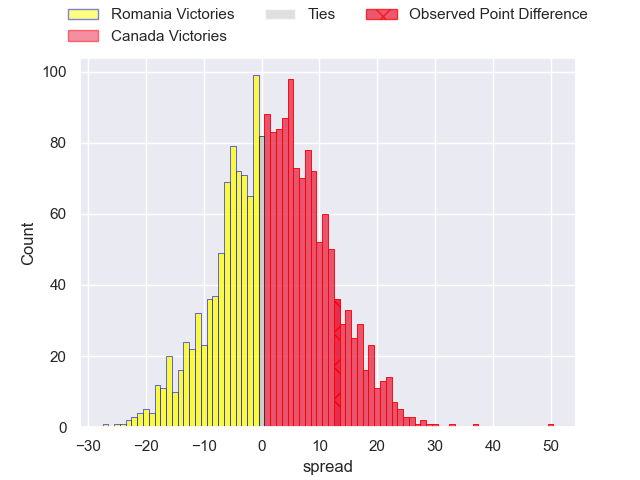
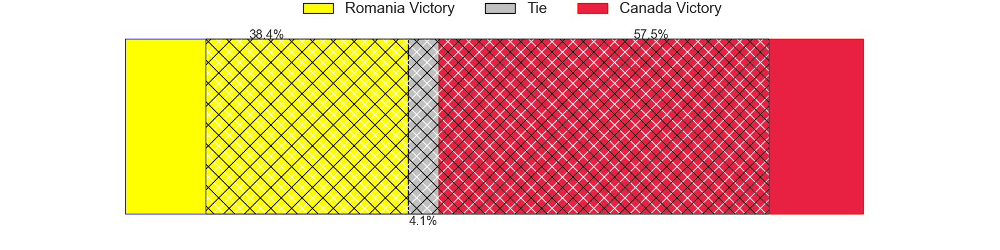

---  
layout: page  
title: Romania at Canada; 22-35  
date: 2024-07-11 18:00:00 -0500  
categories: "International Test Match 2024" match review  
---
# Romania at Canada; 22-35

# Club Level Predictions

The first set of predictions treats a club as the smallest object, as the club develops its members, organizes a gameplan, and deploys its players as needed for each match. This club model has a prediction of 0.686, which translates to predicting Canada to win by 7.1.

Our Over/Under is 40.5 - and combined with the spread above, we have a predicted scoreline of 17 to 24

Each club has a rating and a rating deviation (similar to a Glicko rating), and expected performances can be generated. This allows for simulated matches and spreads like the ones below.
## Projected Performances - Club Model

## Projected Spreads - Club Model

## Projected Results - Club Model

# Player Level Predictions

Treating teams instead as an entity made up of the currently active players, I have ratings for each player in an altogether different system. These can be combined to form team ratings once teamsheets are announced, weighting starters a bit higher than the reserves. After the match is played, players can be weighted by their minutes on the field, allowing for an accurate measure of the team's composition. With these compiled team ratings, we can make predictions, measure inaccuracy, and update the individual player ratings.
## Prediction without Player Minutes: Canada by 2.9

Canada by 0.2 on a neutral pitch

## Projected Performances - Player Model

## Projected Spreads - Player Model

## Projected Results - Player Model

|   Away Minutes | Away Player          |   Away Percentile |   Number |   Home Percentile | Home Player     |   Home Minutes |
|---------------:|:---------------------|------------------:|---------:|------------------:|:----------------|---------------:|
|             80 | Iulian Hartig        |             15.64 |        1 |              0.08 | Liam Murray     |             80 |
|             80 | Stefan Buruiana      |             46.62 |        2 |             60.75 | AJ Quattrin     |             80 |
|             80 | Vasile Balan         |             24.91 |        3 |             21.03 | Conor Young     |             80 |
|             80 | Yanis Horvat         |             52.51 |        4 |             75.61 | Conor Keys      |             80 |
|             80 | Andrei Mahu          |              5.96 |        5 |             66.11 | Kyle Baillie    |             80 |
|             80 | Vlad Neculau         |             43.73 |        6 |              4.43 | Mason Flesch    |             80 |
|             80 | Dragos Ser           |              9.32 |        7 |            nan    | nan             |            nan |
|             80 | Nicolaas Immelman    |             51.69 |        8 |              2.39 | Lucas Rumball   |             80 |
|             80 | Alin Conache         |             29.3  |        9 |             50.08 | Jason Higgins   |             80 |
|             80 | Hinckley Vaovasa     |             56.74 |       10 |              6.26 | Peter Nelson    |             80 |
|             80 | Tevita Manumua       |              4.87 |       11 |             55.28 | Nic Benn        |             80 |
|             80 | Jason Tomane         |             69.34 |       12 |             50.64 | Talon McMullin  |             80 |
|             80 | Mihai Graure         |             52.03 |       13 |             75.27 | Ben LeSage      |             80 |
|            nan | nan                  |            nan    |       14 |             86.47 | Andrew Coe      |             80 |
|             80 | Paul Popoaia         |             52.37 |       15 |             36.76 | Cooper Coats    |             80 |
|              0 | Robert Irimescu      |            nan    |       16 |            nan    | Dewald Kotze    |              0 |
|              0 | Alexandru Savin      |             30.37 |       17 |            nan    | Cali Martinez   |              0 |
|              0 | Cosmin Manole        |            nan    |       18 |             87.47 | Cole Keith      |              0 |
|              0 | Marius Iftimiciuc    |              5.12 |       19 |            nan    | James Stockwood |              0 |
|              0 | Fonovai Tangimana    |             26.71 |       20 |             28.97 | Sion Parry      |              0 |
|              0 | Gabriel Rupanu       |             31.75 |       21 |            nan    | Brock Gallagher |              0 |
|              0 | Romeo-Corrado Stetco |            nan    |       22 |            nan    | Mark Balaski    |              0 |
|              0 | Daniel Plai          |            nan    |       23 |            nan    | Takoda McMullin |              0 |

