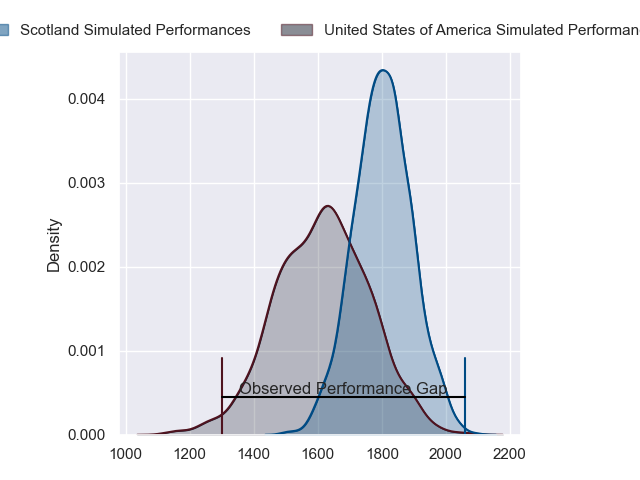
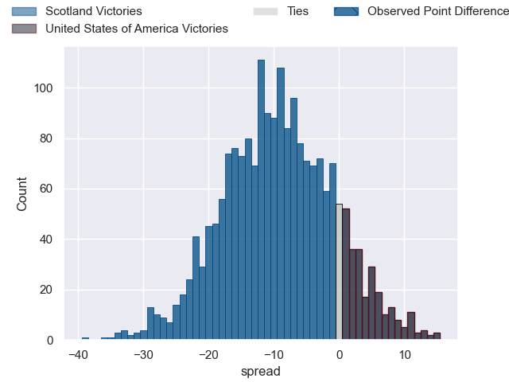
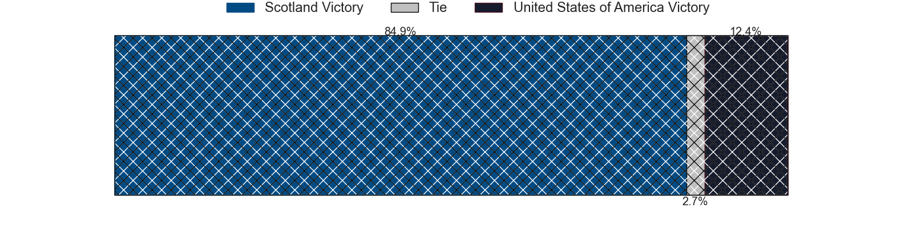
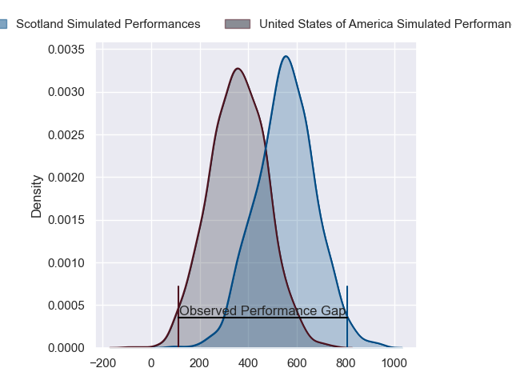
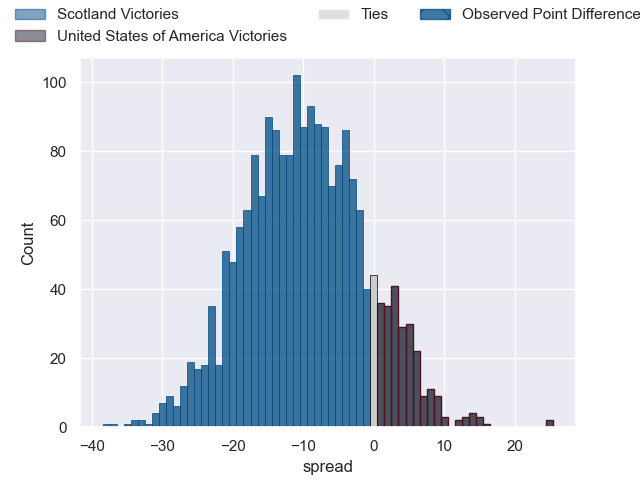
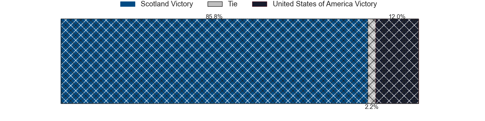

---  
layout: page  
title: Scotland at United States of America; 42-7  
date: 2024-07-11 18:00:00 -0500  
categories: "International Test Match 2024" match review  
---
# Scotland at United States of America; 42-7

# Club Level Predictions

The first set of predictions treats a club as the smallest object, as the club develops its members, organizes a gameplan, and deploys its players as needed for each match. This club model has a prediction of 0.261, which translates to predicting Scotland to win by 9.4.

Our Over/Under is 49.5 - and combined with the spread above, we have a predicted scoreline of 30 to 20

Each club has a rating and a rating deviation (similar to a Glicko rating), and expected performances can be generated. This allows for simulated matches and spreads like the ones below.
## Projected Performances - Club Model

## Projected Spreads - Club Model

## Projected Results - Club Model

# Player Level Predictions

Treating teams instead as an entity made up of the currently active players, I have ratings for each player in an altogether different system. These can be combined to form team ratings once teamsheets are announced, weighting starters a bit higher than the reserves. After the match is played, players can be weighted by their minutes on the field, allowing for an accurate measure of the team's composition. With these compiled team ratings, we can make predictions, measure inaccuracy, and update the individual player ratings.
## Prediction without Player Minutes: Scotland by 7.5

Scotland by 10.2 on a neutral pitch

## Projected Performances - Player Model

## Projected Spreads - Player Model

## Projected Results - Player Model

|   Away Minutes | Away Player         |   Away Percentile |   Number |   Home Percentile | Home Player              |   Home Minutes |
|---------------:|:--------------------|------------------:|---------:|------------------:|:-------------------------|---------------:|
|             51 | Pierre Schoeman     |             92.03 |        1 |             17.55 | Jack Iscaro              |             56 |
|             59 | Ewan Ashman         |             84.57 |        2 |             98.18 | Dylan Fawsitt            |             56 |
|             51 | Murphy Walker       |             48.58 |        3 |             92.87 | David Ainu'u             |             56 |
|             52 | Alex Craig          |             36.21 |        4 |             61.07 | Vili Helu                |             64 |
|             80 | Scott Cummings      |             99.06 |        5 |             13.79 | Greg Peterson            |             58 |
|             64 | Jamie Ritchie       |            100    |        6 |             68.27 | Sam Golla                |             80 |
|             80 | Rory Darge          |             91.77 |        7 |             91.67 | Paddy Ryan               |             80 |
|             80 | Matt Fagerson       |             96.63 |        8 |             55.95 | Jamason Fa'anana-Schultz |             80 |
|             59 | George Horne        |            100    |        9 |             51.81 | Juan Philip Smith        |             73 |
|             59 | Adam Hastings       |             98.29 |       10 |             95.06 | AJ MacGinty              |             80 |
|             80 | Duhan van der Merwe |             85.62 |       11 |             98.54 | Nate Augspurger          |             53 |
|             80 | Sione Tuipulotu     |             83.85 |       12 |              1.5  | Tommaso Boni             |             80 |
|             68 | Huw Jones           |             79.56 |       13 |             85.24 | Tavite Lopeti            |             64 |
|             80 | Kyle Steyn          |             99.27 |       14 |             47.13 | Conner Mooneyham         |             80 |
|             80 | Kyle Rowe           |             72.26 |       15 |             21.36 | Luke Carty               |             80 |
|             21 | Robbie Smith        |            nan    |       16 |             14.37 | Kapeli Pifeleti          |             24 |
|             29 | Rory Sutherland     |             34.1  |       17 |             12.41 | Jake Turnbull            |             24 |
|             29 | Elliot Millar-Mills |             90.8  |       18 |             14.02 | Paul Mullen              |             30 |
|             28 | Max Williamson      |             58.07 |       19 |            nan    | Saia Uhila               |             16 |
|             16 | Luke Crosbie        |             94.36 |       20 |            nan    | Benja Bonassoa           |             22 |
|             21 | Jamie Dobie         |             84.53 |       21 |            nan    | Ethan McVeigh            |              7 |
|             21 | Ross Thompson       |             73.38 |       22 |             68.3  | Bryce Campbell           |             16 |
|             12 | Matt Currie         |             81.36 |       23 |             92.02 | Mitch Wilson             |             21 |

