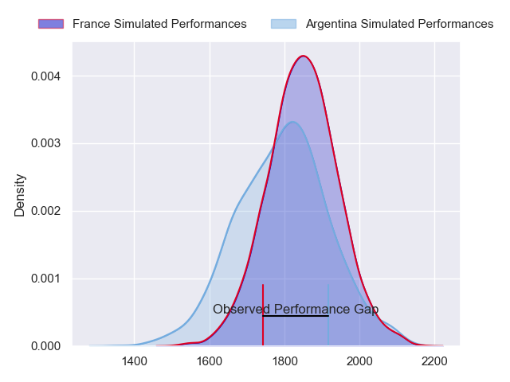
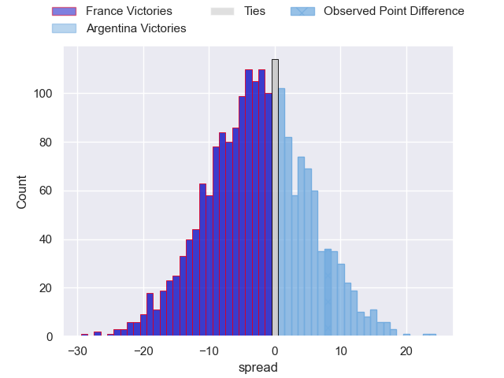
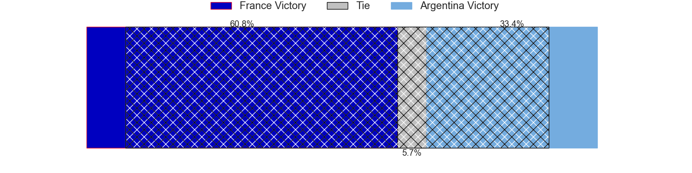
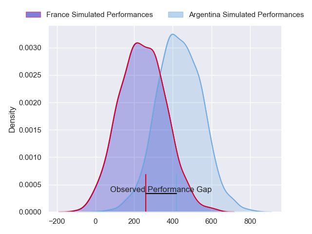
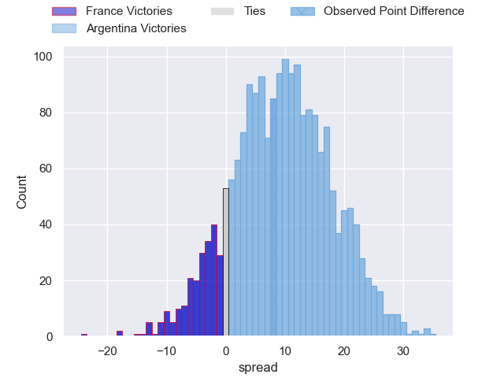
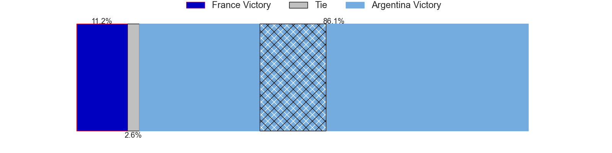

---  
layout: page  
title: France at Argentina; 25-33  
date: 2024-07-12 18:00:00 -0500  
categories: "International Test Match 2024" match review  
---
# France at Argentina; 25-33

# Club Level Predictions

The first set of predictions treats a club as the smallest object, as the club develops its members, organizes a gameplan, and deploys its players as needed for each match. This club model has a prediction of 0.427, which translates to predicting France to win by 2.7.

Our Over/Under is 50.5 - and combined with the spread above, we have a predicted scoreline of 27 to 24

Each club has a rating and a rating deviation (similar to a Glicko rating), and expected performances can be generated. This allows for simulated matches and spreads like the ones below.
## Projected Performances - Club Model

## Projected Spreads - Club Model

## Projected Results - Club Model

# Player Level Predictions

Treating teams instead as an entity made up of the currently active players, I have ratings for each player in an altogether different system. These can be combined to form team ratings once teamsheets are announced, weighting starters a bit higher than the reserves. After the match is played, players can be weighted by their minutes on the field, allowing for an accurate measure of the team's composition. With these compiled team ratings, we can make predictions, measure inaccuracy, and update the individual player ratings.
## Prediction without Player Minutes: Argentina by 8.4

Argentina by 4.9 on a neutral pitch

## Projected Performances - Player Model

## Projected Spreads - Player Model

## Projected Results - Player Model

|   Away Minutes | Away Player           |   Away Percentile |   Number |   Home Percentile | Home Player         |   Home Minutes |
|---------------:|:----------------------|------------------:|---------:|------------------:|:--------------------|---------------:|
|             57 | Jean-Baptiste Gros    |             98.7  |        1 |              5.59 | Mayco Vivas         |             41 |
|             68 | Gaetan Barlot         |             92.44 |        2 |             91.68 | Julian Montoya      |             21 |
|             65 | Georges-Henri Colombe |              2.3  |        3 |              0.15 | Eduardo Bello       |             49 |
|             63 | Mickael Guillard      |             81.52 |        4 |             34.52 | Franco Molina       |             49 |
|             41 | Baptiste Pesenti      |             77.39 |        5 |             14.73 | Lucas Paulos        |             57 |
|             80 | Lenni Nouchi          |             85.38 |        6 |             98.8  | Pablo Matera        |             80 |
|             80 | Judicael Cancoriet    |             27.29 |        7 |             85.2  | Marcos Kremer       |             80 |
|             41 | Jordan Joseph         |             85.52 |        8 |             77.98 | Joaquin Oviedo      |             80 |
|             68 | Baptiste Serin        |             98.36 |        9 |             41.94 | Lautaro Bazan Velez |             47 |
|             80 | Antoine Hastoy        |             79.09 |       10 |             81.37 | Santiago Carreras   |             72 |
|             80 | Lester Etien          |             91.17 |       11 |             24.57 | Mateo Carreras      |             80 |
|             80 | Antoine Frisch        |             95.01 |       12 |             37.99 | Santiago Chocobares |             80 |
|             80 | Emilien Gailleton     |             84.15 |       13 |             98.5  | Matias Moroni       |             80 |
|             80 | Theo Attissogbe       |             56.32 |       14 |             88.44 | Bautista Delguy     |             57 |
|             80 | Leo Barre             |             76.25 |       15 |             95.61 | Santiago Cordero    |             80 |
|             17 | Teddy Baubigny        |             78.52 |       16 |             89.26 | Ignacio Ruiz        |             59 |
|             23 | Sebastien Taofifenua  |             17.39 |       17 |             89.43 | Thomas Gallo        |             39 |
|             15 | Demba Bamba           |             93.56 |       18 |             96.17 | Lucio Sordoni       |             31 |
|             34 | Posolo Tuilagi        |             20.54 |       19 |             75.14 | Matias Alemanno     |             31 |
|             39 | Romain Briatte        |             61.33 |       20 |             13.78 | Pedro Rubiolo       |             23 |
|             12 | Killian Tixeront      |             68.06 |       21 |             59.54 | Gonzalo Bertranou   |             33 |
|             12 | Baptiste Jauneau      |             73.36 |       22 |             86.5  | Tomas Albornoz      |             23 |
|              0 | Leo Berdeu            |             81.94 |       23 |             18.94 | Matias Orlando      |              8 |

