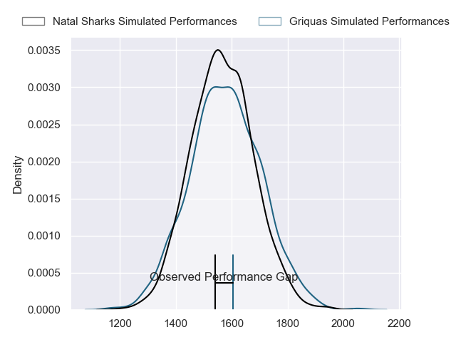
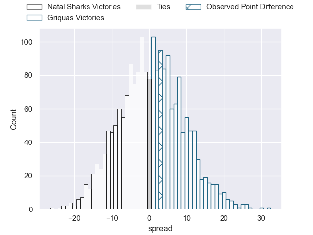
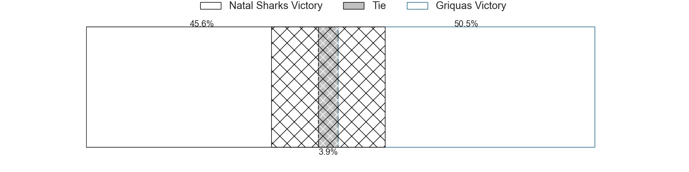
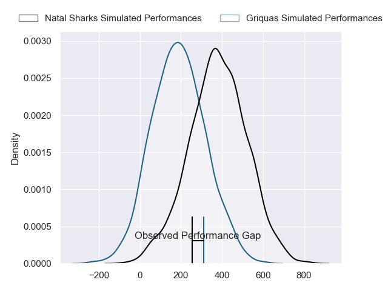
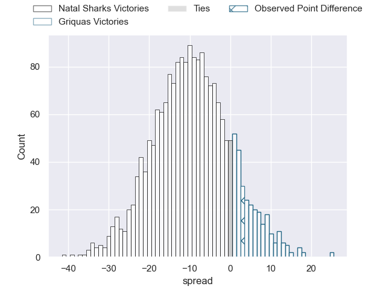
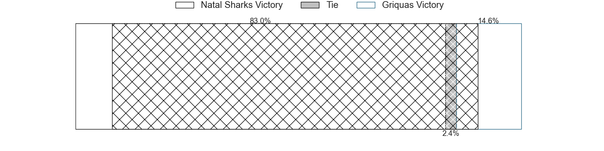

---  
layout: page  
title: Natal Sharks at Griquas; 31-34  
date: 2024-07-12 18:00:00 -0500  
categories: "Currie Cup 2024" match review  
---
# Natal Sharks at Griquas; 31-34

# Club Level Predictions

The first set of predictions treats a club as the smallest object, as the club develops its members, organizes a gameplan, and deploys its players as needed for each match. This club model has a prediction of 0.52, which translates to predicting Griquas to win by 0.7.

Our Over/Under is 57.5 - and combined with the spread above, we have a predicted scoreline of 28 to 29

Each club has a rating and a rating deviation (similar to a Glicko rating), and expected performances can be generated. This allows for simulated matches and spreads like the ones below.
## Projected Performances - Club Model

## Projected Spreads - Club Model

## Projected Results - Club Model

# Player Level Predictions

Treating teams instead as an entity made up of the currently active players, I have ratings for each player in an altogether different system. These can be combined to form team ratings once teamsheets are announced, weighting starters a bit higher than the reserves. After the match is played, players can be weighted by their minutes on the field, allowing for an accurate measure of the team's composition. With these compiled team ratings, we can make predictions, measure inaccuracy, and update the individual player ratings.
## Prediction without Player Minutes: Natal Sharks by 8.0

Natal Sharks by 11.5 on a neutral pitch

## Projected Performances - Player Model

## Projected Spreads - Player Model

## Projected Results - Player Model

|   Away Minutes | Away Player                 |   Away Percentile |   Number |   Home Percentile | Home Player                      |   Home Minutes |
|---------------:|:----------------------------|------------------:|---------:|------------------:|:---------------------------------|---------------:|
|             80 | Ntuthuko Mchunu             |             28.63 |        1 |             17.46 | Leon Lyons                       |             80 |
|             80 | Dan Jooste                  |             15.34 |        2 |             61.35 | Janco Uys                        |             80 |
|             80 | Trevor Nyakane              |             74.26 |        3 |             68.94 | Janu Botha                       |             80 |
|             80 | Coetzee Le Roux             |             26.63 |        4 |             13.22 | Athenkosi Ernest (Dave) Khethani |             80 |
|             80 | Reniel Hugo                 |             96.65 |        5 |              3.45 | Albert Liebenberg                |             80 |
|             80 | Tinotenda Mavesere          |             68.54 |        6 |             24.17 | Stephan Smit                     |             80 |
|             80 | Phepsi Buthelezi            |             63.84 |        7 |             50    | Marco De Witt                    |             80 |
|             80 | Nick Hatton                 |             24.45 |        8 |             94.04 | Hanru Sirgel                     |             80 |
|             80 | Bradley Davids              |             37.32 |        9 |             19.31 | Thomas Bursey                    |             80 |
|             80 | Lionel Cronje               |             94.12 |       10 |             59.01 | Lubabalo Dobela                  |             80 |
|             80 | Makazole Mapimpi            |             99.64 |       11 |             17.58 | Sakoyisa Makata                  |             80 |
|             80 | Andre Esterhuizen           |             97.82 |       12 |             31.45 | Mnombo Zwelendaba                |             80 |
|             80 | Hillegard Muller du Plessis |             28.78 |       13 |             29.97 | Sango (Saida) Xamlashe           |             80 |
|             80 | Yaw Penxe                   |              3.79 |       14 |             36.07 | Marcqiewn Titus                  |             80 |
|             80 | Aphelele Fassi              |             90.51 |       15 |             57.11 | Cameron Hufke                    |             80 |
|              0 | Kerron van Vuuren           |             24.21 |       16 |            nan    | Gustav Du Rand                   |              0 |
|              0 | Braam Reyneke               |             33.33 |       17 |            nan    | Edward Davids                    |              0 |
|              0 | Khwezi Mona                 |             65.98 |       18 |            nan    | Cebolenkosi Dlamini              |              0 |
|              0 | Renier Viljoen              |            nan    |       19 |             35.47 | Dylan Sjoblom                    |              0 |
|              0 | Jannes Potgieter            |             34.32 |       20 |            nan    | Derrick Pretorius                |              0 |
|              0 | Tiaan Fourie                |            nan    |       21 |            nan    | Carl Els                         |              0 |
|              0 | Murray Koster               |             49.55 |       22 |            nan    | Bobby Alexander                  |              0 |
|              0 | Eduan Keyter                |             16.68 |       23 |            nan    | Zinedine Robinson                |              0 |

