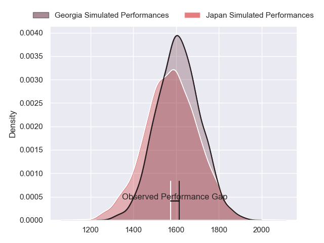
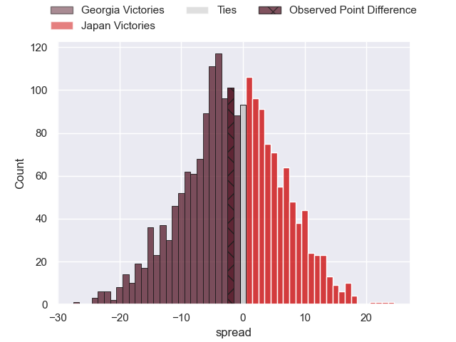
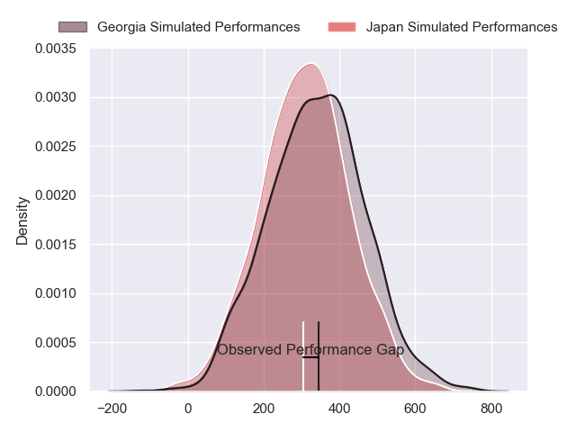
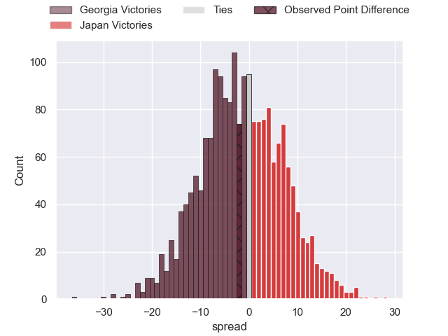

---  
layout: page  
title: Georgia at Japan; 25-23  
date: 2024-07-12 18:00:00 -0500  
categories: "International Test Match 2024" match review  
---
# Georgia at Japan; 25-23

# Club Level Predictions

The first set of predictions treats a club as the smallest object, as the club develops its members, organizes a gameplan, and deploys its players as needed for each match. This club model has a prediction of 0.462, which translates to predicting Georgia to win by 1.4.

Our Over/Under is 46.5 - and combined with the spread above, we have a predicted scoreline of 24 to 22

Each club has a rating and a rating deviation (similar to a Glicko rating), and expected performances can be generated. This allows for simulated matches and spreads like the ones below.
## Projected Performances - Club Model

## Projected Spreads - Club Model

## Projected Results - Club Model

# Player Level Predictions

Treating teams instead as an entity made up of the currently active players, I have ratings for each player in an altogether different system. These can be combined to form team ratings once teamsheets are announced, weighting starters a bit higher than the reserves. After the match is played, players can be weighted by their minutes on the field, allowing for an accurate measure of the team's composition. With these compiled team ratings, we can make predictions, measure inaccuracy, and update the individual player ratings.
## Prediction without Player Minutes: Georgia by 0.3

Georgia by 3.1 on a neutral pitch

## Projected Performances - Player Model

## Projected Spreads - Player Model

## Projected Results - Player Model

|   Away Minutes | Away Player          |   Away Percentile |   Number |   Home Percentile | Home Player      |   Home Minutes |
|---------------:|:---------------------|------------------:|---------:|------------------:|:-----------------|---------------:|
|             50 | Giorgi Akhaladze     |             32.12 |        1 |             33.41 | Takayoshi Mohara |             48 |
|             56 | Vano Karkadze        |             80.6  |        2 |             54.89 | Mamoru Harada    |             65 |
|             64 | Irakli Aptsiauri     |             28.47 |        3 |             56.57 | Shuhei Takeuchi  |             75 |
|             56 | Lado Chachanidze     |             29.89 |        4 |             97.39 | Michael Leitch   |             80 |
|             80 | Giorgi Javakhia      |             33.05 |        5 |             93.67 | Warner Dearns    |             65 |
|             47 | Giorgi Tsutskiridze  |             82.93 |        6 |             93.17 | Faulua Makisi    |             80 |
|             64 | Beka Saghinadze      |             82.01 |        7 |             81.27 | Kanji Shimokawa  |             80 |
|             80 | Beka Gorgadze        |             76.94 |        8 |             89.07 | Tevita Tatafu    |             48 |
|             47 | Mikheil Alania       |             48.77 |        9 |             14.89 | Naoto Saito      |             68 |
|             80 | Luka Matkava         |             84.63 |       10 |              6.07 | Seungsin Lee     |             65 |
|             80 | Sandro Todua         |             91.7  |       11 |             80.43 | Tomoki Osada     |             80 |
|             80 | Giorgi Kveseladze    |             94.07 |       12 |             51.53 | Samisoni Tua     |             80 |
|             80 | Demur Tapladze       |             82.69 |       13 |             98.42 | Dylan Riley      |             80 |
|             80 | Aka Tabutsadze       |             88.64 |       14 |             73.49 | Jone Naikabula   |             68 |
|             80 | Davit Niniashvili    |             82.41 |       15 |             50.99 | Yoshitaka Yazaki |             80 |
|             24 | Luka Nioradze        |            nan    |       16 |             92.33 | Atsushi Sakate   |             15 |
|             30 | Luka Goginava        |            nan    |       17 |            nan    | Takato Okabe     |             32 |
|             16 | Giorgi Dzmanashvili  |            nan    |       18 |            nan    | Keijiro Tamefusa |              5 |
|             24 | Mikheil Babunashvili |             29.42 |       19 |             72.63 | Sanaila Waqa     |             32 |
|             33 | Luka Ivanishvili     |             74.82 |       20 |             32.93 | Tiennan Costley  |             15 |
|             16 | Tornike Jalagonia    |             34.79 |       21 |            nan    | Taiki Koyama     |             12 |
|             33 | Vasil Lobzhanidze    |             10.8  |       22 |             95.85 | Takuya Yamasawa  |             15 |
|              0 | Tedo Abzhandadze     |             61.1  |       23 |             54.01 | Koga Nezuka      |             12 |

