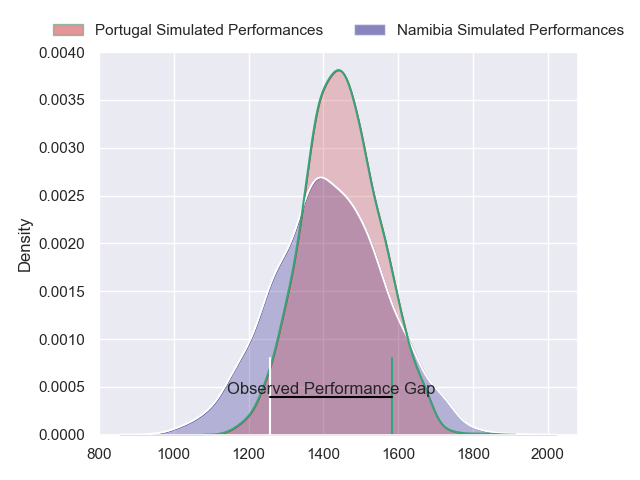
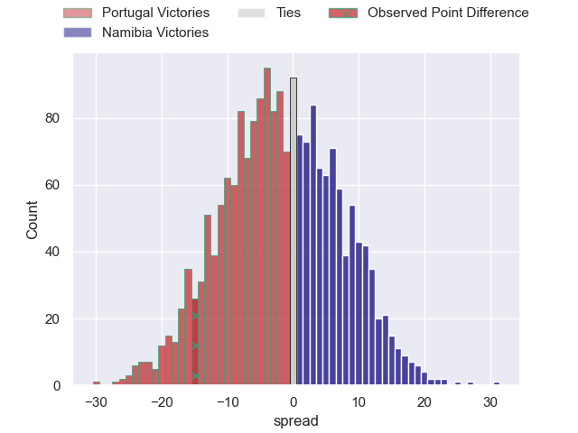
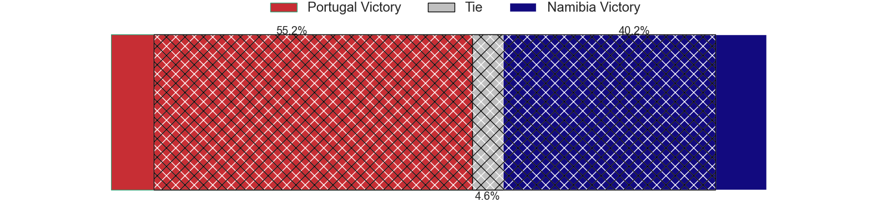
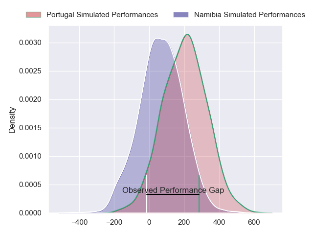
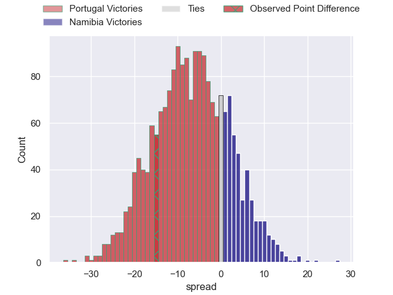
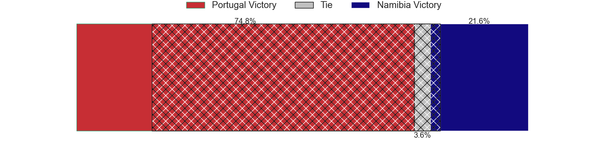

---  
layout: page  
title: Portugal at Namibia; 37-22  
date: 2024-07-12 18:00:00 -0500  
categories: "International Test Match 2024" match review  
---
# Portugal at Namibia; 37-22

# Club Level Predictions

The first set of predictions treats a club as the smallest object, as the club develops its members, organizes a gameplan, and deploys its players as needed for each match. This club model has a prediction of 0.449, which translates to predicting Portugal to win by 1.9.

Our Over/Under is 62.5 - and combined with the spread above, we have a predicted scoreline of 32 to 30

Each club has a rating and a rating deviation (similar to a Glicko rating), and expected performances can be generated. This allows for simulated matches and spreads like the ones below.
## Projected Performances - Club Model

## Projected Spreads - Club Model

## Projected Results - Club Model

# Player Level Predictions

Treating teams instead as an entity made up of the currently active players, I have ratings for each player in an altogether different system. These can be combined to form team ratings once teamsheets are announced, weighting starters a bit higher than the reserves. After the match is played, players can be weighted by their minutes on the field, allowing for an accurate measure of the team's composition. With these compiled team ratings, we can make predictions, measure inaccuracy, and update the individual player ratings.
## Prediction without Player Minutes: Portugal by 6.9

Portugal by 9.3 on a neutral pitch

## Projected Performances - Player Model

## Projected Spreads - Player Model

## Projected Results - Player Model

|   Away Minutes | Away Player            |   Away Percentile |   Number |   Home Percentile | Home Player         |   Home Minutes |
|---------------:|:-----------------------|------------------:|---------:|------------------:|:--------------------|---------------:|
|             55 | Francisco Fernandes    |              8.81 |        1 |              2.61 | Jason Benade        |             69 |
|             59 | Luka Begic             |             52.65 |        2 |              8.32 | Obert Nortje        |             65 |
|             62 | Diogo Hasse Ferreira   |              8.2  |        3 |             38.7  | Haitembu Shikufa    |             52 |
|             80 | Antonio Rebelo Andrade |             56.04 |        4 |             18.74 | Adriaan Ludick      |             65 |
|             80 | Duarte Torgal          |             83.41 |        5 |             24.37 | Johan Retief        |             80 |
|             80 | Jose Madeira           |             92.51 |        6 |             15.82 | Prince Gaoseb       |             80 |
|             62 | Nicolas Martins        |             90.29 |        7 |             18.87 | Max Katjijeko       |             80 |
|             55 | Joao Granate           |             82.34 |        8 |              0.79 | Adriaan Booysen     |             80 |
|             55 | Hugo Gomes Camacho     |             52.14 |        9 |             31.41 | Jacques Theron      |             78 |
|             75 | Domingos Cabral        |             51.33 |       10 |             72.24 | Tiaan Swanepoel     |             80 |
|             80 | Rodrigo Marta          |             89.36 |       11 |             35.68 | Lloyd Jacobs        |             80 |
|             80 | Tomas Appleton         |             74.13 |       12 |             57.61 | Danco Burger        |             80 |
|             59 | Jose Lima              |             85.07 |       13 |              7.86 | Alcino Izaacs       |             78 |
|             80 | Jose Paiva dos Santos  |             54.82 |       14 |             35.68 | Quiren Madjiedt     |             80 |
|             80 | Manuel Cardoso Pinto   |             22.11 |       15 |             29.28 | Jay-Cee Nel         |             78 |
|             25 | Cody Thomas            |            nan    |       16 |            nan    | Armand Combrinck    |             15 |
|             21 | Pedro Vicente          |            nan    |       17 |             14.25 | Des Sethie          |             15 |
|             18 | Antonio Prim           |            nan    |       18 |            nan    | Chemigan Beukes     |             24 |
|             18 | Diego Pinheiro Ruiz    |            nan    |       19 |              5.62 | Ruan Ludick         |             15 |
|             25 | Vasco Baptista         |            nan    |       20 |            nan    | Peter Diergaardt    |              0 |
|             25 | Pedro Lucas            |            nan    |       21 |            nan    | AJ Kearns           |              2 |
|              5 | Manuel Vareiro         |            nan    |       22 |            nan    | Denzo Joelle Bruwer |              2 |
|             21 | Simao Bento            |            nan    |       23 |            nan    | Hillian Beukes      |              2 |

