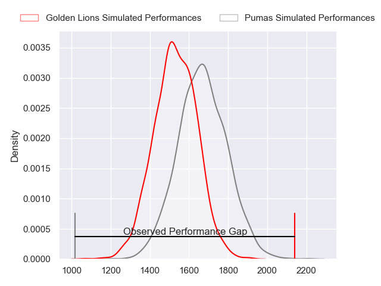
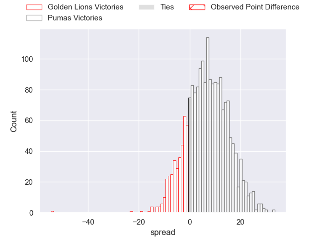
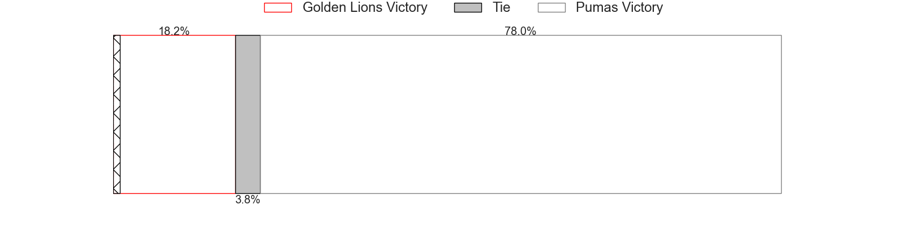
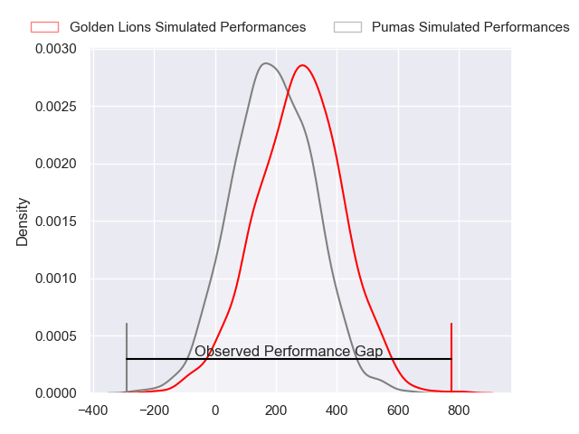
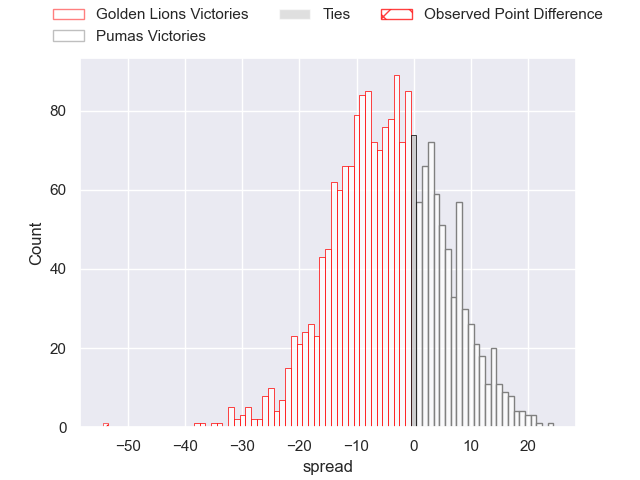
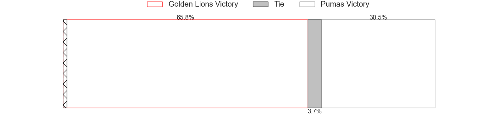

---  
layout: page  
title: Golden Lions at Pumas; 75-21  
date: 2024-07-12 18:00:00 -0500  
categories: "Currie Cup 2024" match review  
---
# Golden Lions at Pumas; 75-21

# Club Level Predictions

The first set of predictions treats a club as the smallest object, as the club develops its members, organizes a gameplan, and deploys its players as needed for each match. This club model has a prediction of 0.664, which translates to predicting Pumas to win by 6.3.

Our Over/Under is 52.5 - and combined with the spread above, we have a predicted scoreline of 23 to 29

Each club has a rating and a rating deviation (similar to a Glicko rating), and expected performances can be generated. This allows for simulated matches and spreads like the ones below.
## Projected Performances - Club Model

## Projected Spreads - Club Model

## Projected Results - Club Model

# Player Level Predictions

Treating teams instead as an entity made up of the currently active players, I have ratings for each player in an altogether different system. These can be combined to form team ratings once teamsheets are announced, weighting starters a bit higher than the reserves. After the match is played, players can be weighted by their minutes on the field, allowing for an accurate measure of the team's composition. With these compiled team ratings, we can make predictions, measure inaccuracy, and update the individual player ratings.
## Prediction without Player Minutes: Golden Lions by 3.2

Golden Lions by 6.6 on a neutral pitch

## Projected Performances - Player Model

## Projected Spreads - Player Model

## Projected Results - Player Model

|   Away Minutes | Away Player          |   Away Percentile |   Number |   Home Percentile | Home Player              |   Home Minutes |
|---------------:|:---------------------|------------------:|---------:|------------------:|:-------------------------|---------------:|
|             80 | Morgan Naude         |             79.42 |        1 |             75.47 | Etienne Janeke           |             80 |
|             80 | Jaco Visagie         |             88.12 |        2 |             79.4  | Eduan Swart              |             80 |
|             80 | RF Schoeman          |             75.09 |        3 |             68.11 | Sampie Swiegers          |             80 |
|             80 | Raynard Roets        |             83.61 |        4 |             42.55 | Malembe Mpofu            |             80 |
|             80 | Ruben Schoeman       |             96.74 |        5 |             90.41 | Shane Monro Kirkwood     |             80 |
|             80 | Jarod Cairns         |             18.45 |        6 |             32.1  | Ntsinka Fisanti          |             80 |
|             80 | Ruan Venter          |             95.3  |        7 |             30.72 | Ruwald Van der Merwe     |             80 |
|             80 | Izan Esterhuizen     |             65.81 |        8 |             80.12 | Kwanda Dimaza            |             80 |
|             80 | Nico Steyn           |             76.43 |        9 |             39.28 | Ross Braude              |             80 |
|             80 | Sam Francis          |             61.29 |       10 |             28.84 | Clinton Swart            |             80 |
|             80 | Rabz Maxwane         |             91.79 |       11 |             37.6  | Phiko Sobahle            |             80 |
|             80 | Rynardt Jonker       |             84.97 |       12 |             29.18 | Wian van Niekerk         |             80 |
|             80 | Manuel Rass          |             51.63 |       13 |             54.4  | De-An Deneille Ackermann |             80 |
|             80 | Edwill van der Merwe |             96.84 |       14 |             15.42 | Kabelo Mokoena           |             80 |
|             80 | Gianni Lombard       |             87.35 |       15 |             42.49 | Stefan Coetzee           |             80 |
|              0 | Jacques du Toit      |            nan    |       16 |            nan    | Darnell Osowagu          |              0 |
|              0 | SJ Kotze             |            nan    |       17 |            nan    | Dewald Maritz            |              0 |
|              0 | Conraad Van Vuuren   |             50.87 |       18 |            nan    | Nash Mhere               |              0 |
|              0 | Sibabalo Qoma        |            nan    |       19 |             87.34 | Deon Slabbert            |              0 |
|              0 | Ruhan Straeuli       |             72.32 |       20 |            nan    | Marvelous Mashimbyi      |              0 |
|              0 | Renzo du Plessis     |            nan    |       21 |            nan    | Richman Gora             |              0 |
|              0 | Morne van den Berg   |             92.8  |       22 |            nan    | Danrich Zynodene Visagie |              0 |
|              0 | Tapiwa Mafura        |             61.07 |       23 |            nan    | Tino Swanepoel           |              0 |

