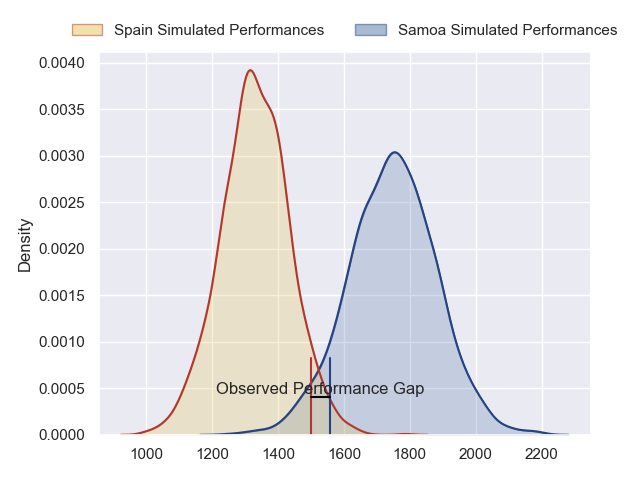
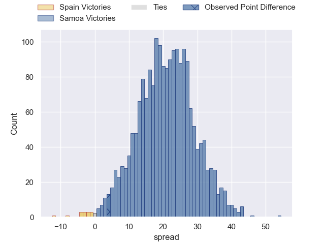
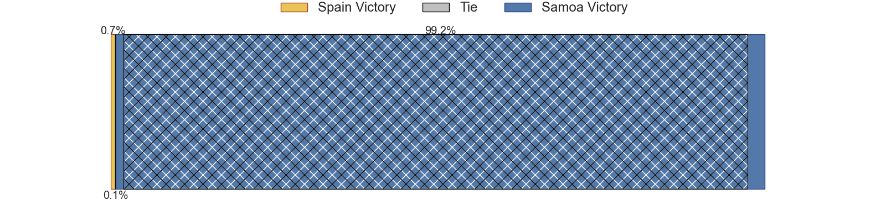
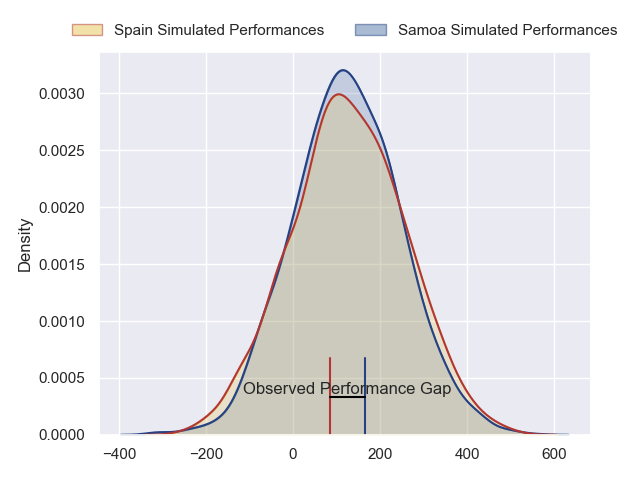
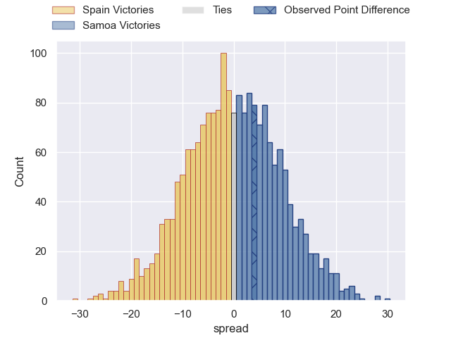

---  
layout: page  
title: Spain at Samoa; 30-34  
date: 2024-07-12 18:00:00 -0500  
categories: "Tests Matchs 2023" match review  
---
# Spain at Samoa; 30-34

# Club Level Predictions

The first set of predictions treats a club as the smallest object, as the club develops its members, organizes a gameplan, and deploys its players as needed for each match. This club model has a prediction of 0.906, which translates to predicting Samoa to win by 20.8.

Our Over/Under is 50.5 - and combined with the spread above, we have a predicted scoreline of 15 to 36

Each club has a rating and a rating deviation (similar to a Glicko rating), and expected performances can be generated. This allows for simulated matches and spreads like the ones below.
## Projected Performances - Club Model

## Projected Spreads - Club Model

## Projected Results - Club Model

# Player Level Predictions

Treating teams instead as an entity made up of the currently active players, I have ratings for each player in an altogether different system. These can be combined to form team ratings once teamsheets are announced, weighting starters a bit higher than the reserves. After the match is played, players can be weighted by their minutes on the field, allowing for an accurate measure of the team's composition. With these compiled team ratings, we can make predictions, measure inaccuracy, and update the individual player ratings.
## Prediction without Player Minutes: Samoa by 0.1

Spain by 2.5 on a neutral pitch

## Projected Performances - Player Model

## Projected Spreads - Player Model

## Projected Results - Player Model

|   Away Minutes | Away Player           |   Away Percentile |   Number |   Home Percentile | Home Player        |   Home Minutes |
|---------------:|:----------------------|------------------:|---------:|------------------:|:-------------------|---------------:|
|             48 | Bernardo Vázquez      |             41    |        1 |             23.39 | Aki Seiuli         |             68 |
|             62 | Santiago Ovejero      |             66.02 |        2 |             72.93 | Sama Malolo        |             68 |
|             48 | Lucas Santamaria      |             45.56 |        3 |             77.37 | Marco Fepulea'i    |             80 |
|             80 | Ignacio Piñeiro       |             74.86 |        4 |             72.44 | Ben Nee Nee        |             61 |
|             68 | Asier Usarraga        |             71.97 |        5 |             19.37 | Sam Slade          |             80 |
|             80 | Mario Pichardi Garcia |             70.11 |        6 |             60.24 | Theo McFarland     |             80 |
|             57 | Raphaël Nieto         |             60.04 |        7 |             50.18 | Murphy Taramai     |             80 |
|             80 | Ekain Imaz            |             75.15 |        8 |             66.6  | OJ Noa             |             53 |
|             76 | Estanislao Bay        |             61.37 |        9 |             47.14 | Melani Matavao     |             46 |
|             80 | Gonzalo Vinuesa       |             45.16 |       10 |             30.17 | D'Angelo Leuila    |             80 |
|             71 | Pau Aira              |             42.2  |       11 |             84.4  | Nigel Ah Wong      |             80 |
|             80 | Inaki Mateu Spuches   |             10.88 |       12 |             11.77 | Danny Toala        |             80 |
|             80 | Alejandro Alonso      |             59.94 |       13 |             87.04 | Stacey Ili         |             80 |
|             77 | Gauthier Minguillon   |             65.19 |       14 |             51.58 | Owen Niue          |             79 |
|             80 | John Wessel Bell      |             67.19 |       15 |             89.13 | Duncan Paia'aua    |             80 |
|             18 | Álvaro Garcia         |             73.23 |       16 |            nan    | Andrew Tuala       |             12 |
|             32 | Titi Futeu Youtcheu   |             21.79 |       17 |            nan    | Tietie Tuimauga    |             25 |
|             32 | Hugo Pirlet           |             56.42 |       18 |            nan    | Lolani Faleiva     |             12 |
|             12 | Alex Suarez           |             26.72 |       19 |             79.61 | Michael Curry      |             19 |
|             23 | Vicente Boronat       |            nan    |       20 |            nan    | Iakopo Petelo Mapu |             27 |
|              4 | Pablo Pérez           |            nan    |       21 |              2.62 | Ere Enari          |             34 |
|              9 | Bautista Guemes       |             72.87 |       22 |            nan    | Afa Moleli         |              1 |
|              3 | Facundo Lopez         |            nan    |       23 |            nan    | Pisi Leilua        |             23 |

