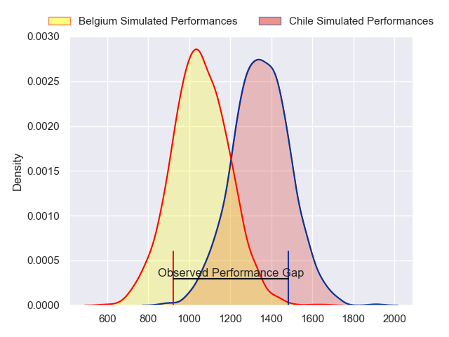
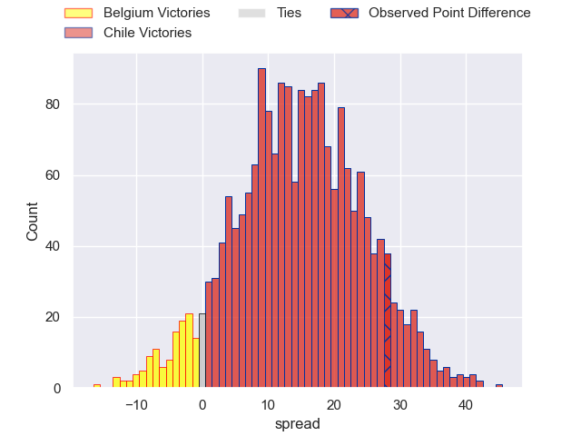
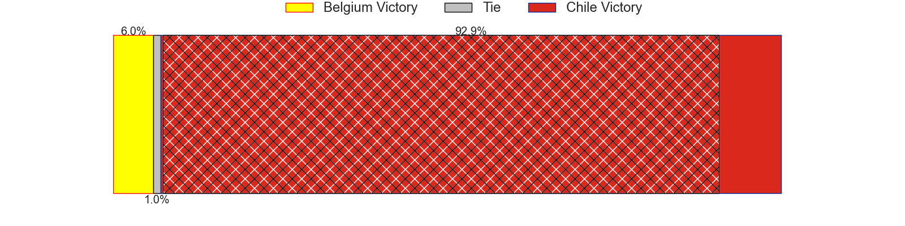
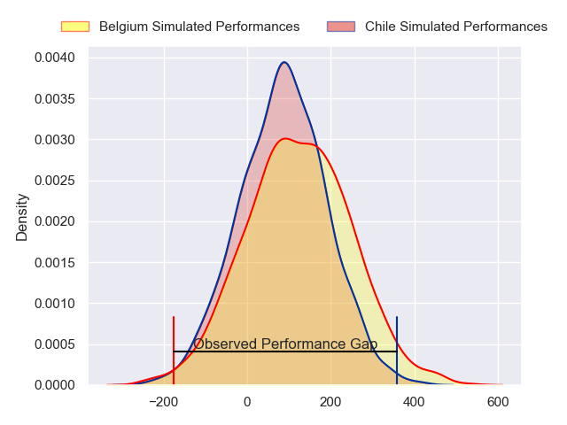
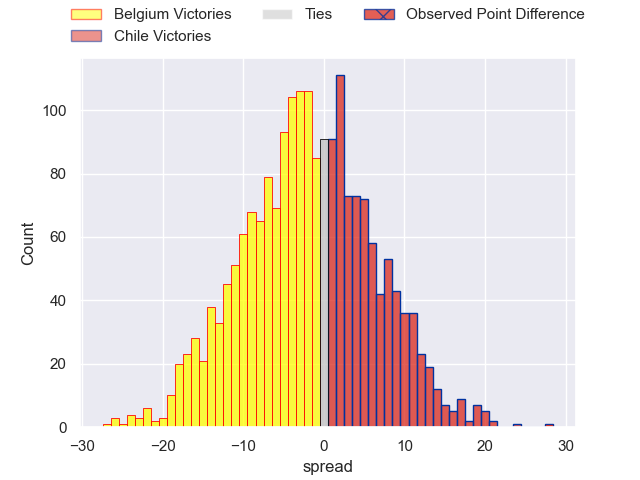
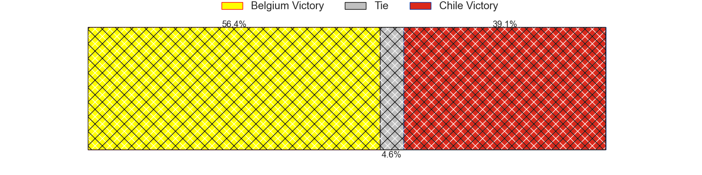

---  
layout: page  
title: Belgium at Chile; 5-33  
date: 2024-07-13 18:00:00 -0500  
categories: "Tests Matchs 2023" match review  
---
# Belgium at Chile; 5-33

# Club Level Predictions

The first set of predictions treats a club as the smallest object, as the club develops its members, organizes a gameplan, and deploys its players as needed for each match. This club model has a prediction of 0.824, which translates to predicting Chile to win by 14.6.

Our Over/Under is 53.5 - and combined with the spread above, we have a predicted scoreline of 20 to 34

Each club has a rating and a rating deviation (similar to a Glicko rating), and expected performances can be generated. This allows for simulated matches and spreads like the ones below.
## Projected Performances - Club Model

## Projected Spreads - Club Model

## Projected Results - Club Model

# Player Level Predictions

Treating teams instead as an entity made up of the currently active players, I have ratings for each player in an altogether different system. These can be combined to form team ratings once teamsheets are announced, weighting starters a bit higher than the reserves. After the match is played, players can be weighted by their minutes on the field, allowing for an accurate measure of the team's composition. With these compiled team ratings, we can make predictions, measure inaccuracy, and update the individual player ratings.
## Prediction without Player Minutes: Belgium by 2.5

Belgium by 4.9 on a neutral pitch

## Projected Performances - Player Model

## Projected Spreads - Player Model

## Projected Results - Player Model

|   Away Minutes | Away Player          |   Away Percentile |   Number |   Home Percentile | Home Player             |   Home Minutes |
|---------------:|:---------------------|------------------:|---------:|------------------:|:------------------------|---------------:|
|             14 | Bruno Vliegen        |             47.15 |        1 |             68.19 | Javier Carrasco         |           58   |
|             72 | Alexandre Raynier    |             27.82 |        2 |             80.75 | Augusto Bohme           |           40   |
|             36 | Basile Van Parys     |             30.45 |        3 |             42.82 | Iñaki Gurruchaga        |           40   |
|             56 | Gillian Benoy        |             21.04 |        4 |             24.49 | Clemente Saavedra       |           34.5 |
|             80 | Maximilien Hendrickx |             16.48 |        5 |              2.89 | Javier Eissmann         |           66   |
|             72 | Toon Deceuninck      |             30.44 |        6 |             81    | Martin Sigren           |           80   |
|             80 | Jérémie Brasseur     |             12.08 |        7 |             14.94 | Raimundo Martinez       |           72   |
|             80 | Lucas Rassinfosse    |             12.13 |        8 |             34.39 | Alfonso Escobar         |           26   |
|             72 | Julien Berger        |             32.08 |        9 |              3.27 | Marcelo Torrealba       |           55   |
|             80 | Hugo De Francq       |             35.48 |       10 |             65.65 | Tomás Salas             |           80   |
|             80 | Dazzy Cornez         |             15.87 |       11 |             89    | Nicolas Garafulic Schar |           80   |
|             80 | Jens Torfs           |             28.29 |       12 |             29.08 | Santiago Videla         |            5.5 |
|             28 | Florian Remue        |             31.06 |       13 |             56.58 | Domingo Saavedra        |           34.5 |
|             31 | Florian Remue        |             31.06 |       13 |             56.58 | Domingo Saavedra        |           34.5 |
|             80 | Thomas Wallraf       |             56.27 |       14 |             67.36 | Cristobal Game          |           80   |
|             28 | Matias Remue         |             29.05 |       15 |             63.44 | Luca Strabucchi         |           80   |
|             31 | Matias Remue         |             29.05 |       15 |             63.44 | Luca Strabucchi         |           80   |
|             58 | Rémi De-Wolf         |            nan    |       16 |             76.84 | Diego Escobar           |           26   |
|              8 | Malcolm Huppermans   |            nan    |       17 |             24.6  | Salvador Lues           |           22   |
|             52 | Samuel Opsomer       |             32.04 |       18 |             23.99 | Matias Dittus           |           40   |
|             24 | Dries De Keyser      |             53.72 |       19 |             54.66 | Santiago Pedrero        |           14   |
|              8 | Arthur Smeets        |            nan    |       20 |             27.44 | Joaquin Milesi          |           14   |
|              8 | Timothé Rifon        |             27.82 |       21 |            nan    | Inti Ubeda              |            8   |
|             18 | Viktor Pazgrat       |             24.33 |       22 |             34.86 | Benjamin Videla         |            5.5 |
|             24 | Siméon Soenen        |             14.62 |       23 |            nan    | Lucas Berti             |           25   |

