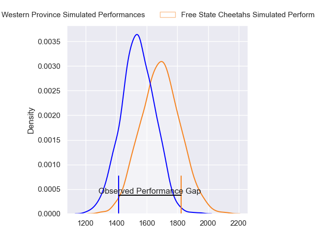
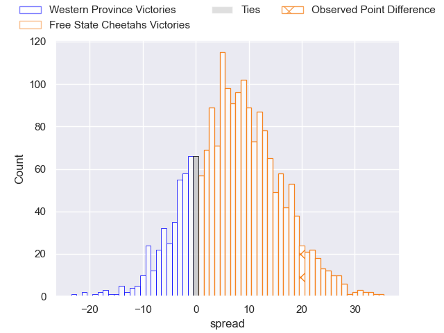
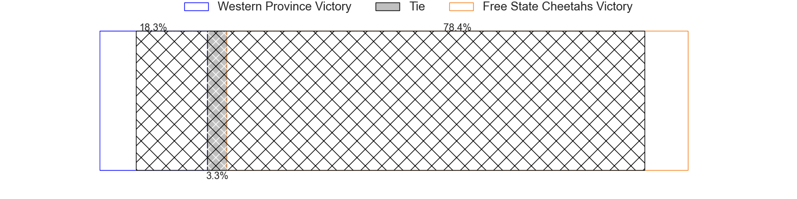
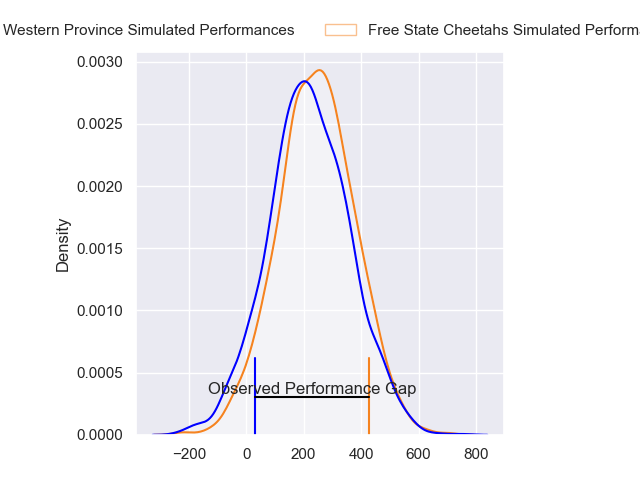
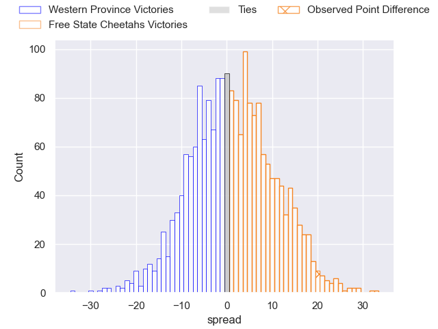
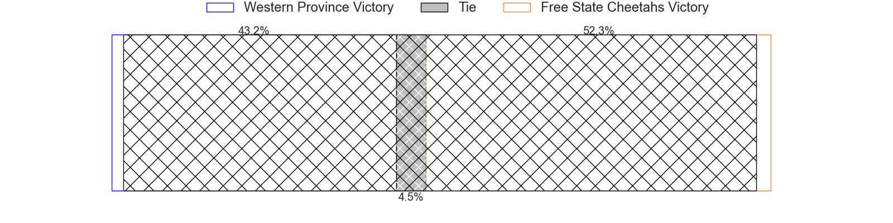

---  
layout: page  
title: Western Province at Free State Cheetahs; 17-37  
date: 2024-07-13 18:00:00 -0500  
categories: "Currie Cup 2024" match review  
---
# Western Province at Free State Cheetahs; 17-37

# Club Level Predictions

The first set of predictions treats a club as the smallest object, as the club develops its members, organizes a gameplan, and deploys its players as needed for each match. This club model has a prediction of 0.692, which translates to predicting Free State Cheetahs to win by 7.5.

Our Over/Under is 56.5 - and combined with the spread above, we have a predicted scoreline of 24 to 32

Each club has a rating and a rating deviation (similar to a Glicko rating), and expected performances can be generated. This allows for simulated matches and spreads like the ones below.
## Projected Performances - Club Model

## Projected Spreads - Club Model

## Projected Results - Club Model

# Player Level Predictions

Treating teams instead as an entity made up of the currently active players, I have ratings for each player in an altogether different system. These can be combined to form team ratings once teamsheets are announced, weighting starters a bit higher than the reserves. After the match is played, players can be weighted by their minutes on the field, allowing for an accurate measure of the team's composition. With these compiled team ratings, we can make predictions, measure inaccuracy, and update the individual player ratings.
## Prediction without Player Minutes: Free State Cheetahs by 1.5

Western Province by 1.9 on a neutral pitch

## Projected Performances - Player Model

## Projected Spreads - Player Model

## Projected Results - Player Model

|   Away Minutes | Away Player               |   Away Percentile |   Number |   Home Percentile | Home Player                    |   Home Minutes |
|---------------:|:--------------------------|------------------:|---------:|------------------:|:-------------------------------|---------------:|
|             80 | Lizo Gqoboka              |              4.63 |        1 |             16.86 | Schalk Ferreira                |             80 |
|             80 | JJ Kotze                  |              3.76 |        2 |             88.87 | Marko Louis Janse van Rensburg |             80 |
|             80 | Sazi Sandi                |             21.72 |        3 |             46.55 | Aranos Coetzee                 |             80 |
|             80 | Connor Evans              |             11.55 |        4 |             49.72 | Mzwanele Zito                  |             80 |
|             80 | Gary Porter               |             12.94 |        5 |             86.31 | Victor Sekekete                |             80 |
|             80 | Paul De Villiers          |              6.18 |        6 |             94.83 | Gideon van der Merwe           |             80 |
|             80 | Hendre Stassen            |             11.07 |        7 |             51.57 | Aidon Davis                    |             80 |
|             80 | Willie Engelbrecht        |             65.61 |        8 |             75.35 | Jeandre Rudolph                |             80 |
|             80 | Imad Khan                 |              7.04 |        9 |             93.29 | Rewan Kruger                   |             80 |
|             80 | Jurie Matthee             |             28.27 |       10 |             68.69 | Ethan SJ Wentzel               |             80 |
|             80 | Angelo Davids             |             94.14 |       11 |             94.95 | Daniel Kasende                 |             80 |
|             80 | Jean-Luc du Plessis       |             53.81 |       12 |             72.4  | Ali Mgijima                    |             80 |
|             80 | Wandisile Simelane        |             79.13 |       13 |             86.75 | Munier Hartzenberg             |             80 |
|             80 | Courtnall Skosan          |             95.58 |       14 |             70.33 | Sbu Nkosi                      |             80 |
|             80 | Luke John Burger          |             41.7  |       15 |             64.23 | Litha Nkula                    |             80 |
|              0 | Scarra Ntubeni            |             98.05 |       16 |            nan    | Vernon Paulo                   |              0 |
|              0 | Vernon Matongo            |            nan    |       17 |              3.72 | Cameron Dawson                 |              0 |
|              0 | Corne Weilbach            |            nan    |       18 |            nan    | Robert Hunt                    |              0 |
|              0 | Andre-Hugo Venter         |             81.95 |       19 |             41.25 | Carl Wegner                    |              0 |
|              0 | CJ Velleman               |             24.45 |       20 |             10.89 | Oupa Mohoje                    |              0 |
|              0 | Louw Nel                  |            nan    |       21 |            nan    | Neels Volschenk                |              0 |
|              0 | Moegamat Labib Kannemeyer |            nan    |       22 |            nan    | Marco Jansen van Vuren         |              0 |
|              0 | Damian Markus             |            nan    |       23 |             80.71 | Andell Loubser                 |              0 |

