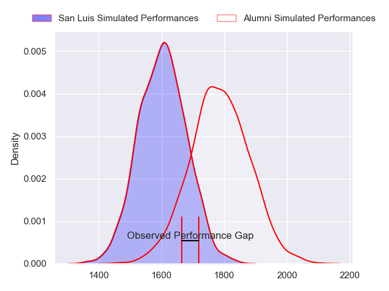
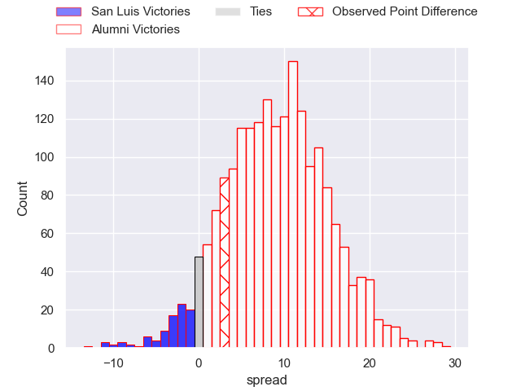
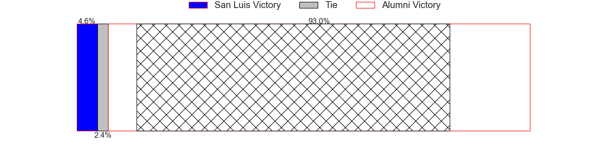
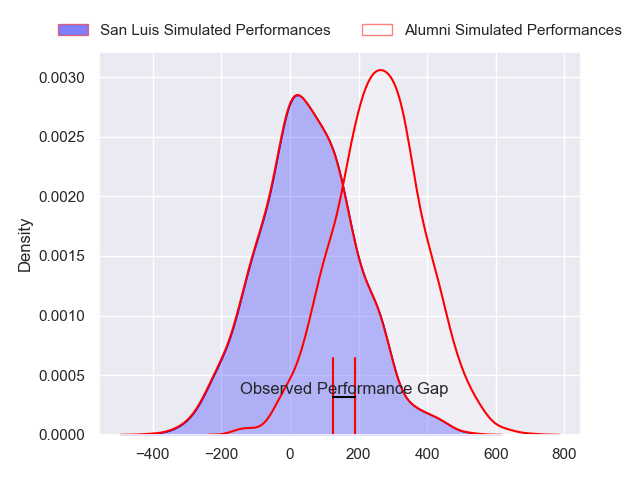
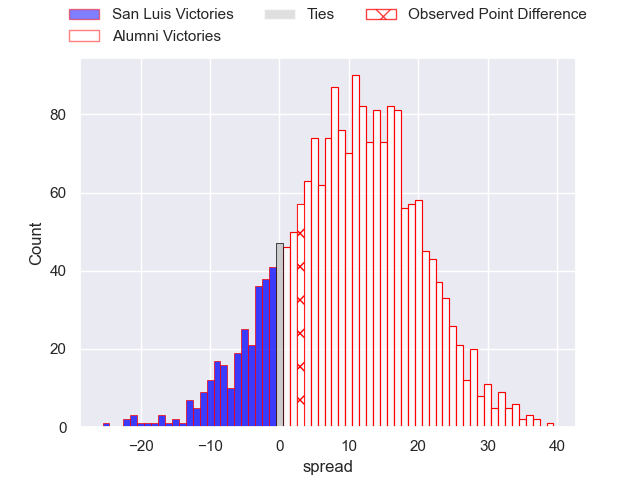
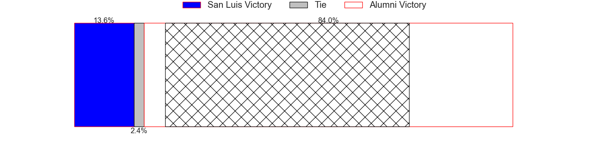

---  
layout: page  
title: San Luis at Alumni; 16-19  
date: 2024-07-14 18:00:00 -0500  
categories: "URBA Top 12 2024" match review  
---
# San Luis at Alumni; 16-19

# Club Level Predictions

The first set of predictions treats a club as the smallest object, as the club develops its members, organizes a gameplan, and deploys its players as needed for each match. This club model has a prediction of 0.729, which translates to predicting Alumni to win by 8.9.

Our Over/Under is 55.5 - and combined with the spread above, we have a predicted scoreline of 23 to 32

Each club has a rating and a rating deviation (similar to a Glicko rating), and expected performances can be generated. This allows for simulated matches and spreads like the ones below.
## Projected Performances - Club Model

## Projected Spreads - Club Model

## Projected Results - Club Model

# Player Level Predictions

Treating teams instead as an entity made up of the currently active players, I have ratings for each player in an altogether different system. These can be combined to form team ratings once teamsheets are announced, weighting starters a bit higher than the reserves. After the match is played, players can be weighted by their minutes on the field, allowing for an accurate measure of the team's composition. With these compiled team ratings, we can make predictions, measure inaccuracy, and update the individual player ratings.
## Prediction without Player Minutes: Alumni by 10.2

Alumni by 6.0 on a neutral pitch

## Projected Performances - Player Model

## Projected Spreads - Player Model

## Projected Results - Player Model

|   Away Minutes | Away Player                |   Away Percentile |   Number |   Home Percentile | Home Player                |   Home Minutes |
|---------------:|:---------------------------|------------------:|---------:|------------------:|:---------------------------|---------------:|
|             80 | Santiago Bonavento         |             52.87 |        1 |             60.84 | Federico Lucca             |             80 |
|             80 | Agustin Fitzsimons Herrera |             47.35 |        2 |             37.37 | Maximo Lamelas             |             80 |
|             80 | Alexis Uvieda              |             80.69 |        3 |             78.16 | Bautista Vidal             |             80 |
|             80 | Ramiro Bruni               |             57.97 |        4 |             61.35 | Manuel Mora                |             80 |
|             80 | Santiago Canal             |             59.1  |        5 |             62.38 | Santiago Alduncin          |             80 |
|             80 | Facundo Alvarez Amado      |             45.79 |        6 |             58.28 | Ignacio Cubilla            |             80 |
|             80 | Franco Gnecco              |             64.85 |        7 |             73.45 | Juan Anderson              |             80 |
|             80 | Agustin Torello            |             49.8  |        8 |             49.6  | Santiago Montagner         |             80 |
|             80 | Juan Vaca                  |             71.38 |        9 |             58.88 | Tomas Passerotti           |             80 |
|             80 | Felipe Campodonico         |             61.6  |       10 |             79.85 | Joaquin Luzzi              |             80 |
|             80 | Eduardo Ruesta             |             46.13 |       11 |             62.69 | Ramon Fuentes              |             80 |
|             80 | Segundo Fresco             |             66    |       12 |             54.04 | Franco Battezzati          |             80 |
|             80 | Benjamin Marban            |             52.94 |       13 |             55.63 | Alejo Chavez               |             80 |
|             80 | Wilmer Ramirez             |             61.24 |       14 |             35.94 | Franco Sabato              |             80 |
|             80 | Valentino Quattrocchi      |             39.32 |       15 |             47.7  | Santiago Pernas            |             80 |
|              0 | Mateo Caffaro              |            nan    |       16 |            nan    | Maximo Castillo            |              0 |
|              0 | Alejo Garcia               |             28.35 |       17 |             67.17 | Tomas Bivort               |              0 |
|              0 | Mateo Calistro             |             36.17 |       18 |            nan    | Francisco Bottoni          |              0 |
|              0 | Santiago Gibert            |            nan    |       19 |             27.39 | Federico Canovas           |              0 |
|              0 | Isidro Lazzarini           |             34.98 |       20 |             44.65 | Nicolas Promanzio          |              0 |
|              0 | Luka Gullo                 |            nan    |       21 |            nan    | Santiago Ambroa            |              0 |
|              0 | Manuel Gnecco              |             66.14 |       22 |             36.73 | Santiago Gonzalez Iglesias |              0 |
|              0 | Segundo Galan              |             25.66 |       23 |             74.7  | Luca Sabato                |              0 |

