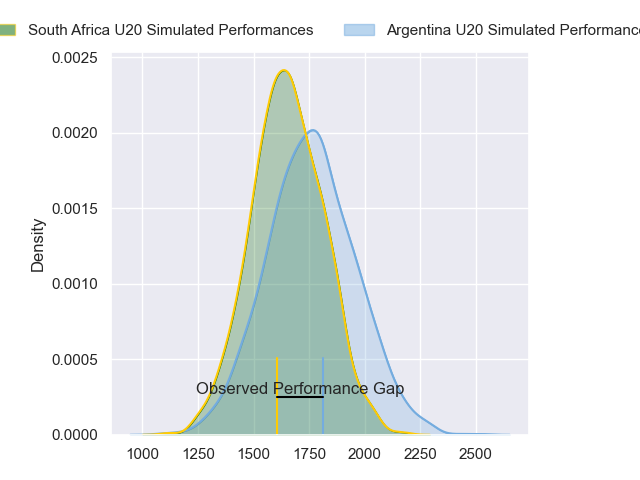
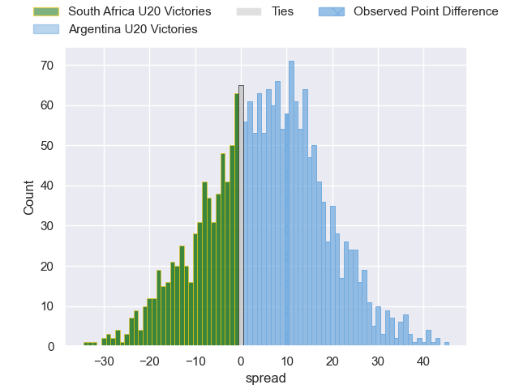
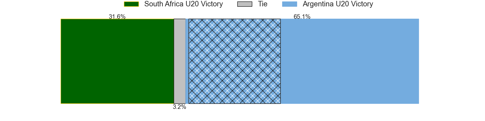
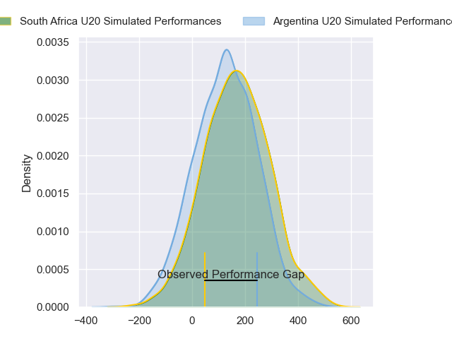
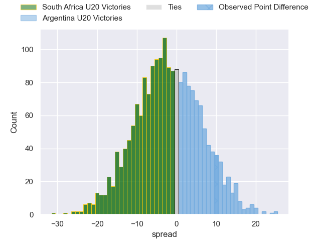
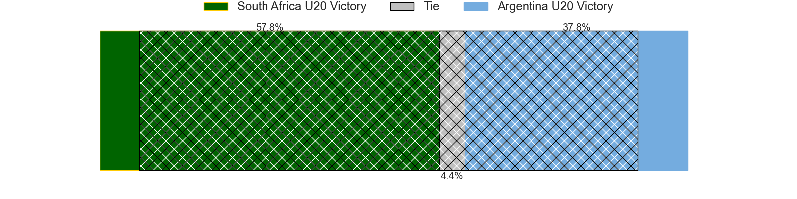

---  
layout: page  
title: South Africa U20 at Argentina U20; 24-34  
date: 2024-07-14 18:00:00 -0500  
categories: "World Rugby U20 Championship 2024" match review  
---
# South Africa U20 at Argentina U20; 24-34

# Club Level Predictions

The first set of predictions treats a club as the smallest object, as the club develops its members, organizes a gameplan, and deploys its players as needed for each match. This club model has a prediction of 0.642, which translates to predicting Argentina U20 to win by 5.7.

Our Over/Under is 49.5 - and combined with the spread above, we have a predicted scoreline of 22 to 27

Each club has a rating and a rating deviation (similar to a Glicko rating), and expected performances can be generated. This allows for simulated matches and spreads like the ones below.
## Projected Performances - Club Model

## Projected Spreads - Club Model

## Projected Results - Club Model

# Player Level Predictions

Treating teams instead as an entity made up of the currently active players, I have ratings for each player in an altogether different system. These can be combined to form team ratings once teamsheets are announced, weighting starters a bit higher than the reserves. After the match is played, players can be weighted by their minutes on the field, allowing for an accurate measure of the team's composition. With these compiled team ratings, we can make predictions, measure inaccuracy, and update the individual player ratings.
## Prediction without Player Minutes: South Africa U20 by 2.4

South Africa U20 by 4.6 on a neutral pitch

## Projected Performances - Player Model

## Projected Spreads - Player Model

## Projected Results - Player Model

|   Away Minutes | Away Player               |   Away Percentile |   Number |   Home Percentile | Home Player                  |   Home Minutes |
|---------------:|:--------------------------|------------------:|---------:|------------------:|:-----------------------------|---------------:|
|             57 | Ruan Swart                |             37.01 |        1 |             81.46 | Diego Correa                 |             53 |
|             35 | Ethan Bester              |             23.75 |        2 |             78.67 | Juan Ignacio Greising Revol  |             52 |
|             74 | Zachary Porthen           |             18.85 |        3 |             71.34 | Emir Gael Galvan             |             53 |
|             40 | Thomas Dyer               |             19.42 |        4 |             94.09 | Efrain Elias                 |             80 |
|             80 | Jaco Grobbelaar           |             22.05 |        5 |             54.97 | Alvaro Garcia Iandolino      |             52 |
|             80 | Sibabalwe Mahashe         |             36.45 |        6 |             78.45 | Juan Penoucos                |             60 |
|             80 | JF van Heerden            |             23.68 |        7 |             74.75 | Santos Fernandez De Oliveira |             80 |
|             40 | Tiaan Jacobs              |             37.1  |        8 |             66.07 | Juan Pedro Bernasconi        |             69 |
|             80 | Asad Moos                 |             21.38 |        9 |             65.79 | Jeronimo Llorens Villanueva  |             47 |
|             57 | Tylor Sefoor              |             36.12 |       10 |             60.84 | Santino Di Lucca             |             80 |
|             80 | Lili Bester               |             22.75 |       11 |             52.59 | Gregorio Perez Pardo         |             60 |
|             80 | Philip-Albert Van Niekerk |             13.16 |       12 |             74.88 | Felipe Ledesma               |             80 |
|             80 | Jurenzo Julius            |             22.93 |       13 |             46.36 | Tomas Bocco                  |             80 |
|             69 | Joel Leotlela             |             30.12 |       14 |             73.89 | Timoteo Silva                |             80 |
|             80 | Michail Damon             |             33.33 |       15 |             58.88 | Benjamin Elizalde            |             80 |
|             31 | Ezekiel Ngobeni           |             47.37 |       16 |             62.17 | Tomas Di Biase               |             33 |
|             40 | Batho Hlekani             |             26.92 |       17 |             55.22 | Juan Manuel Vivas            |             28 |
|             40 | Divan Fuller              |            nan    |       18 |             74.95 | Felipe Bruno                 |             28 |
|             23 | Casper Badenhorst         |             32.41 |       19 |            nan    | Marcos Camerlinckx           |             27 |
|             23 | Bruce Sherwood            |              8.98 |       20 |            nan    | Joaquin Yakiche              |             27 |
|             14 | Juan Smal                 |             45.23 |       21 |             62.35 | Agustin Sarelli              |             20 |
|             11 | Hassiem Pead              |            nan    |       22 |             66.6  | Tomas Medina                 |             20 |
|              6 | Liyema Ntshanga           |            nan    |       23 |            nan    | Julian Rossi                 |             11 |

