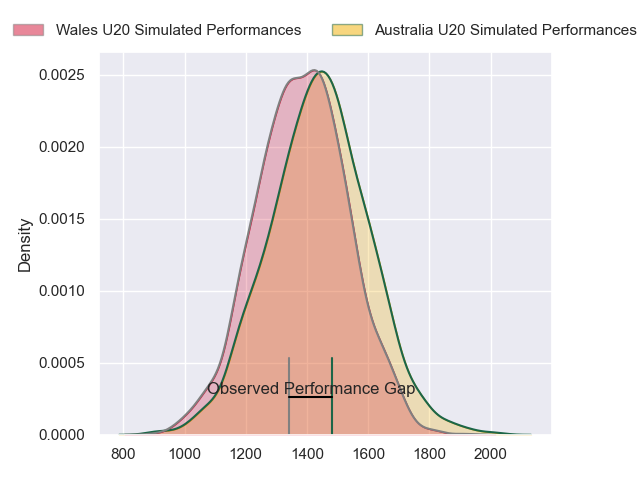
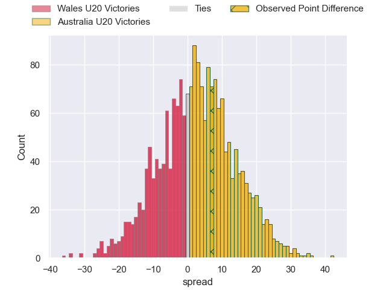
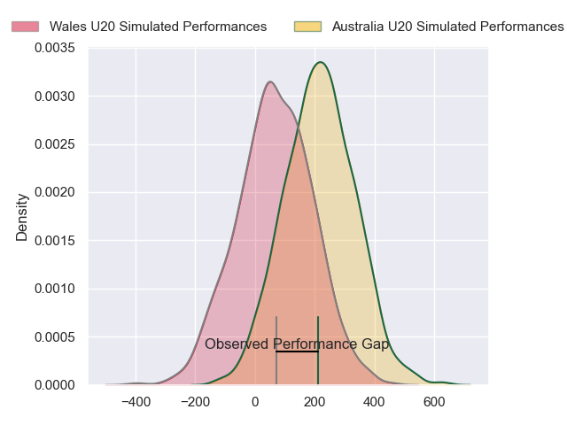
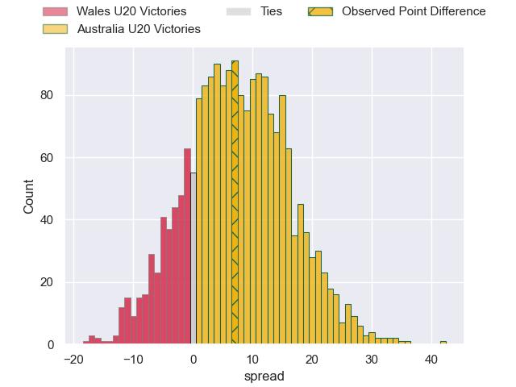
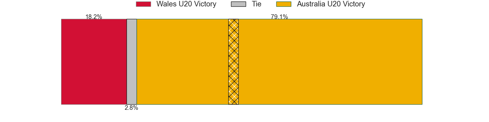

---  
layout: page  
title: Wales U20 at Australia U20; 29-36  
date: 2024-07-14 18:00:00 -0500  
categories: "World Rugby U20 Championship 2024" match review  
---
# Wales U20 at Australia U20; 29-36

# Club Level Predictions

The first set of predictions treats a club as the smallest object, as the club develops its members, organizes a gameplan, and deploys its players as needed for each match. This club model has a prediction of 0.567, which translates to predicting Australia U20 to win by 2.6.

Our Over/Under is 53.5 - and combined with the spread above, we have a predicted scoreline of 25 to 28

Each club has a rating and a rating deviation (similar to a Glicko rating), and expected performances can be generated. This allows for simulated matches and spreads like the ones below.
## Projected Performances - Club Model

## Projected Spreads - Club Model

## Projected Results - Club Model

# Player Level Predictions

Treating teams instead as an entity made up of the currently active players, I have ratings for each player in an altogether different system. These can be combined to form team ratings once teamsheets are announced, weighting starters a bit higher than the reserves. After the match is played, players can be weighted by their minutes on the field, allowing for an accurate measure of the team's composition. With these compiled team ratings, we can make predictions, measure inaccuracy, and update the individual player ratings.
## Prediction without Player Minutes: Australia U20 by 7.8

Australia U20 by 5.6 on a neutral pitch

## Projected Performances - Player Model

## Projected Spreads - Player Model

## Projected Results - Player Model

|   Away Minutes | Away Player     |   Away Percentile |   Number |   Home Percentile | Home Player               |   Home Minutes |
|---------------:|:----------------|------------------:|---------:|------------------:|:--------------------------|---------------:|
|             40 | Jordan Morris   |             44.67 |        1 |             29.35 | Lington Ieli              |             49 |
|             64 | Isaac Young     |             30.26 |        2 |             43.27 | Ottavio Tuipulotu         |             49 |
|             51 | Sam Scott       |             36.4  |        3 |             54.18 | Nick Bloomfield           |             49 |
|             80 | Jonny Green     |              9    |        4 |             56.51 | Toby McPherson            |             69 |
|             80 | Nick Thomas     |             56.98 |        5 |             58.11 | Harvey Cordukes           |             80 |
|             80 | Ryan Woodman    |             30.43 |        6 |             51.9  | Aden Ekanayake            |             80 |
|             49 | Haari Beddall   |             28.49 |        7 |             51.43 | Dane Sawers               |             61 |
|             80 | Morgan Morse    |             58.33 |        8 |             45.24 | Jack Harley               |             51 |
|             64 | Rhodri Lewis    |             52.96 |        9 |             53.12 | Daniel Nelson             |             80 |
|             49 | Harri Wilde     |             36.5  |       10 |             65.97 | Harry McLaughlin-Phillips |             80 |
|             80 | Aidan Boschoff  |             27.64 |       11 |             66.18 | Archer Saunders           |             80 |
|             80 | Louie Hennessey |             30.25 |       12 |             48.26 | Jarrah McLeod             |             64 |
|             80 | Macs Page       |             25.07 |       13 |             43.68 | Kadin Pritchard           |             80 |
|             64 | Kodie Stone     |             61    |       14 |             68.36 | Ronan Leahy               |             80 |
|             80 | Matty Young     |             47.21 |       15 |             46.41 | Shane Wilcox              |             80 |
|             40 | Gethyn Cannon   |            nan    |       16 |             38.01 | Trevor King               |             31 |
|             31 | Lucas De la Rua |             19.8  |       17 |             60.67 | Bryn Edwards              |             31 |
|             31 | Harri Ford      |             46.2  |       18 |            nan    | Nate Tiitii               |             31 |
|             29 | Kian Hire       |             53.87 |       19 |            nan    | Eamon Doyle               |             29 |
|             16 | Steffan Emanuel |             46.17 |       20 |            nan    | Austin Durbridge          |             19 |
|             16 | Lucca Setaro    |            nan    |       21 |            nan    | Boston Fakafanua          |             16 |
|             16 | Wills Austin    |            nan    |       22 |             35.8  | Ollie McCrea              |             11 |

